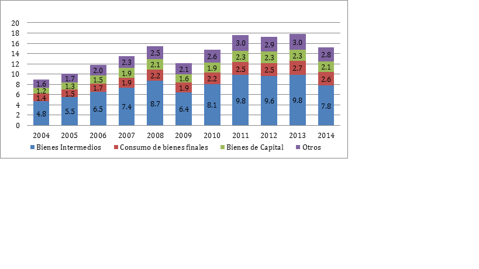
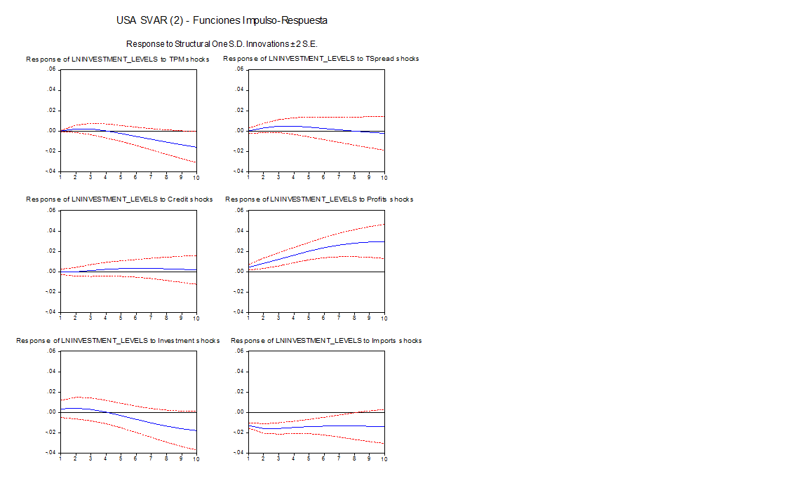
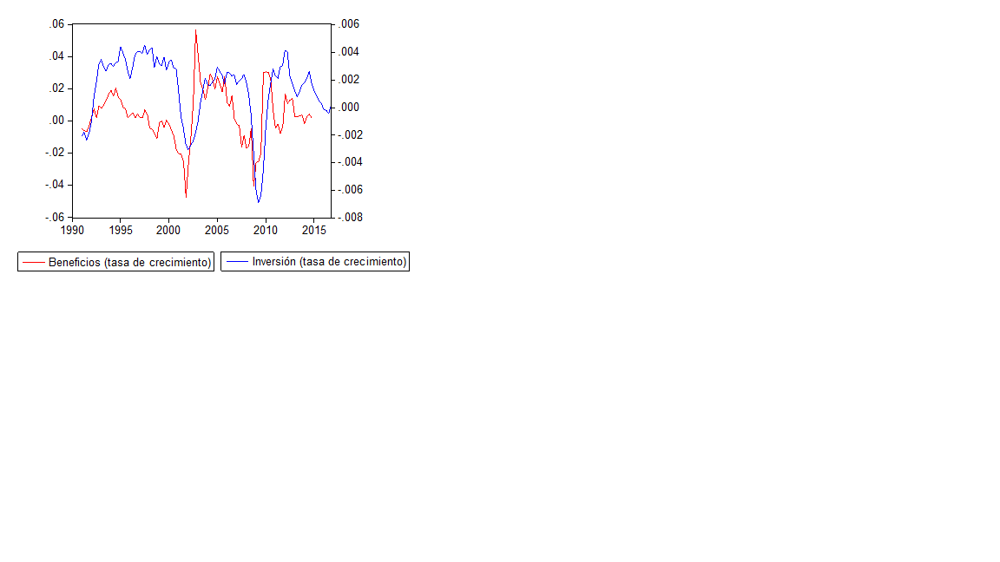
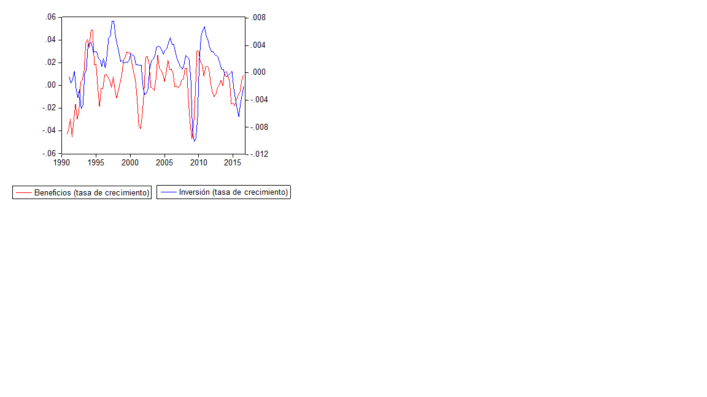
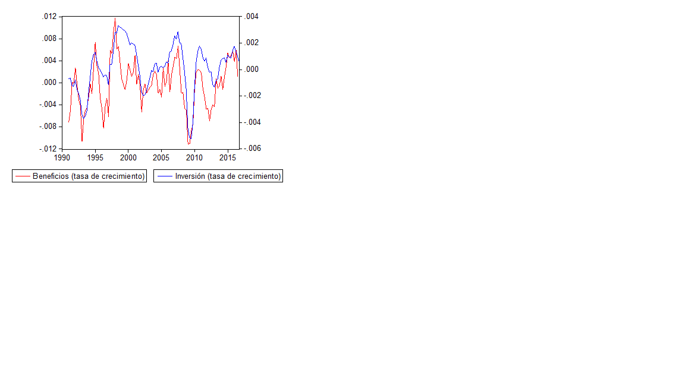

```{r setup, include=FALSE}
knitr::opts_chunk$set(echo = FALSE)
library(printr)
```

```{r, load_libraries, include=FALSE}
library(dplyr) # use dplyr::first and dplyr::last
library(ggplot2)
library(xts) # use xts::first and xts::last
library(tidyr)
library(lubridate)
library(tibble)
library(tidyquant)
library(ggthemes)
library(knitr)
library(kableExtra)
library(countrycode)
library(readxl)


source("../functions/funcs_for_new_normal.R")

```

```{r load_principal_data,  include=FALSE, cache=TRUE}
load("../produced_data/WEOApr2017_cepal_and_others" )

# what variables are available  (not the same for countries and groups of countries!) and what are their codes

subject_dict_co <- WEOApr2017cepal18_others_long %>% 
  filter(iso == "CHL" & year == 2000) %>% 
  select(-c(value, iso, country, country_series_specific_notes ,
            weo_country_code, estimates_start_after, scale, year))

subject_dict_wo <- WEOApr2017cepal18_others_long  %>% 
  filter(country == "World" & year == 2000) %>% 
  select(-c(value, iso,  country_series_specific_notes,
            weo_country_code, estimates_start_after, scale, year) ) 


load("../produced_data/cepal_18_countries")
load("../produced_data/cepal_33_countries")

weo_country_names_lac_18 <- countrycode(cepal_18_countries[["iso3c"]], "iso3c", "country.name.en")
weo_country_names_lac_18[2] <- "Bolivia"
weo_country_names_lac_18[18] <- "Venezuela"

weo_country_names_lac_17 <- weo_country_names_lac_18[1:17]

weo_country_names_cardm <- c("Costa Rica", "Dominican Republic", "El Salvador" ,"Honduras", "Nicaragua", "Mexico", "Guatemala" , "Panama")

weo_country_names_card <- c("Costa Rica", "Dominican Republic", "El Salvador" ,"Honduras", "Nicaragua",  "Guatemala" , "Panama")

weo_country_names_sa <- c("Argentina", "Bolivia", "Brazil", "Chile",
                           "Colombia", "Ecuador", "Paraguay", "Peru",
                           "Uruguay", "Venezuela")

weo_country_names_sa_notven <- c("Argentina", "Bolivia", "Brazil", "Chile",
                           "Colombia", "Ecuador", "Paraguay", "Peru",
                           "Uruguay") 

cepal_17_countries <- cepal_18_countries %>% 
  filter(iso3c != "VEN")

cardm_countries <- cepal_18_countries %>% 
  filter(iso3c %in% c("CRI", "HND", "MEX", "DOM", "GTM", "SLV", "PAN", "NIC")  )

card_countries <- cepal_18_countries %>% 
  filter(iso3c %in% c("CRI", "HND", "DOM", "GTM", "SLV", "PAN", "NIC")  )

sa_countries <- cepal_18_countries %>% 
  filter(iso3c %in% c("ARG", "BOL", "BRA", "CHL", "COL", "ECU", "PER",
                      "PRY", "URY", "VEN")  )

sa_countries_notven <- cepal_18_countries %>% 
  filter(iso3c != "VEN"  )

load("../produced_data/selected_oecd_vars")
load("../produced_data/ted_productivity_2016_nov")
```

```{r calculate_gdp_gaps_trends, include=FALSE, cache=TRUE}

weo_gdp <- WEOApr2017cepal18_others_long %>% 
  select(iso, country, year, weo_subject_code, value) %>% 
  filter(weo_subject_code %in% c("NGDP_R", "NGDP_RPCH", "NGAP_NPGDP")) 

real_gdp_long <- weo_gdp %>% 
  filter(weo_subject_code %in% c("NGDP_R")) %>% 
  mutate(date =  ymd(paste0(year,  "-12-31"))) 

# foo <- add_ts_filters(real_gdp_long , date_colname = "date", value_colname = "value", country_colname = "iso")

real_gdp_hp <- add_ts_filters(real_gdp_long) %>% arrange(country, date) %>% 
  group_by(country) %>% 
  mutate(trend_growth_pct = 100*(hp_trend / dplyr::lag(hp_trend)-1)) %>% 
  ungroup()

trend_growth_list_all <- real_gdp_hp %>% 
  rename(date_id = date,
         eco_id = country,
         voi = hp_trend) %>% 
  growth_report(end2 = 2016)

trend_growth_list_lac <- real_gdp_hp %>%
  filter(country %in% weo_country_names_lac_18) %>% 
  rename(date_id = date,
         eco_id = country,
         voi = hp_trend) %>% 
  growth_report(end2 = 2016)
trend_growth_list_lac$group_averages["region_name"] <- "LAC-18"


trend_growth_list_lac_17 <- real_gdp_hp %>%
  filter(country %in% weo_country_names_lac_17) %>% 
  rename(date_id = date,
         eco_id = country,
         voi = hp_trend) %>% 
  growth_report(end2 = 2016)
trend_growth_list_lac_17$group_averages["region_name"] <- "LAC-17"

trend_growth_list_cardm <- real_gdp_hp %>%
  filter(country %in% weo_country_names_cardm) %>% 
  rename(date_id = date,
         eco_id = country,
         voi = hp_trend) %>% 
  growth_report(end2 = 2016)
trend_growth_list_cardm$group_averages["region_name"] <- "CARDM"


trend_growth_list_sa <- real_gdp_hp %>%
  filter(country %in% weo_country_names_sa) %>% 
  rename(date_id = date,
         eco_id = country,
         voi = hp_trend) %>% 
  growth_report(end2 = 2016)
trend_growth_list_sa$group_averages["region_name"] <- "South America"

trend_growth_list_sa_notven <- real_gdp_hp %>%
  filter(country %in% weo_country_names_sa_notven) %>% 
  rename(date_id = date,
         eco_id = country,
         voi = hp_trend) %>% 
  growth_report(end2 = 2016)
trend_growth_list_sa_notven$group_averages["region_name"] <- "South America w.o. Ven"

other_weo_economies = c(c("China", "United States"), 
                        c("Major advanced economies (G7)",
                          "Euro area " , "Advanced economies"))

trend_growth_list_other <- real_gdp_hp %>%
  filter(country %in% other_weo_economies) %>% 
  rename(date_id = date,
         eco_id = country,
         voi = hp_trend) %>% 
  growth_report(end2 = 2016)

trend_growth_list_china <- real_gdp_hp %>%
  filter(country == "China") %>% 
  rename(date_id = date,
         eco_id = country,
         voi = hp_trend) %>% 
  growth_report(end2 = 2016)


# real_gdp_country_wide <- real_gdp_long %>% 
#   spread(key = country, value=value)
# 
# real_gdp_growth_long <- weo_gdp %>% 
#   filter(weo_subject_code %in% c("NGDP_RPCH"))

weo_few <- WEOApr2017cepal18_others_long %>% 
  select(iso, country, year, weo_subject_code, value) %>% 
  filter(weo_subject_code %in% c("NGDP_R", "NGDP_RPCH", "NGAP_NPGDP")) 

weo_long_EU_AE_G7_USA <- subset(weo_few , 
                country %in% c("United States", "Major advanced economies (G7)",
                               "Euro area " , "Advanced economies")) %>% 
  select(-iso) %>% arrange(country, year)

weo_cwide_EU_AE_G7_USA <- weo_long_EU_AE_G7_USA %>% spread(weo_subject_code, value) %>% 
  group_by(country) %>% 
  mutate(gross_gap = 1 + NGAP_NPGDP/100,
         gross_rate_gdp = 1 + NGDP_RPCH/100,
         gross_rate_potential_gdp = gross_rate_gdp*dplyr::lag(gross_gap)/gross_gap,
         growth_potential_pct = 100*(gross_rate_potential_gdp-1))

weo_pot_list_EU_AE_G7_USA <- weo_cwide_EU_AE_G7_USA %>%
  mutate(date = ymd(paste0(year,  "-12-31"))) %>% 
    rename(date_id = date,
         eco_id = country,
         voi = gross_rate_potential_gdp) %>% 
  growth_report(input_type = "gross_rates",  end2 = 2016)
  

avgs_china_usa_ez_g7 <- bind_rows(weo_pot_list_EU_AE_G7_USA$avgs_df,
                                  trend_growth_list_china$avgs_df)
```

```{r productivity_gr, cache=TRUE}

oecd_lab_prod_for_report <- selection_oecd_eo_nov_2016 %>% 
  filter(VARIABLE == "PDTY" & FREQUENCY == "A") %>% 
  mutate(date_id = ymd(paste0(obsTime,  "-12-31"))) %>% 
  rename(eco_id = LOCATION, 
         voi = obsValue) %>% 
  select(eco_id, date_id, voi)

#new periods
oecd_lab_prod_avg_03_08_10_15 <- oecd_lab_prod_for_report %>% 
  growth_report(end2 = 2016)

#esteban periods
oecd_lab_prod_avg_90_95_96_00 <- oecd_lab_prod_for_report %>% 
  growth_report(start1 = 1990, end1 = 1995, start2 = 1996, end2 = 2000)

oecd_lab_prod_avg_01_06_07_09 <- oecd_lab_prod_for_report %>% 
  growth_report(start1 = 2001, end1 = 2006, start2 = 2007, end2 = 2009)

oecd_lab_prod_avg_07_09_10_16 <- oecd_lab_prod_for_report %>% 
  growth_report(start1 = 2007, end1 = 2009, start2 = 2010, end2 = 2016)

ted_lab_prod_employed_regions <- ted_nov_2016_regions %>% 
  filter(INDICATOR == "LP_L_g") %>% 
  select(-c(MEASURE, INDICATOR)) %>% 
  gather(key = "year", value = "net_rate", -c(REGION)) %>% 
  mutate(gross_rate_of_growth = net_rate/100 + 1)

ted_prod_regions_for_report <- ted_lab_prod_employed_regions %>% 
  mutate(date_id = ymd(paste0(year,  "-12-31"))) %>% 
  rename(eco_id = REGION, 
         voi = gross_rate_of_growth) %>% 
  select(eco_id, date_id, voi)


ted_lab_prod_employed_countries <- ted_nov_2016_countries %>% 
  filter(INDICATOR == "LP_L_g") %>% 
  select(-c(MEASURE, INDICATOR)) %>% 
  gather(key = "year", value = "net_rate", -c(REGION, COUNTRY)) %>% 
  mutate(gross_rate_of_growth = net_rate/100 + 1)

ted_prod_countries_for_report <- ted_lab_prod_employed_countries %>% 
  mutate(date_id = ymd(paste0(year,  "-12-31"))) %>% 
  rename(eco_id = COUNTRY, 
         voi = gross_rate_of_growth) %>% 
  select(eco_id, date_id, voi)

ted_prod_lac18 <- ted_prod_countries_for_report %>% 
  filter(eco_id %in% weo_country_names_lac_18)
  
ted_prod_lac17 <- ted_prod_countries_for_report %>% 
  filter(eco_id %in% weo_country_names_lac_17)

ted_prod_cardm <- ted_prod_countries_for_report %>% 
  filter(eco_id %in% weo_country_names_cardm)

ted_prod_card <- ted_prod_countries_for_report %>% 
  filter(eco_id %in% weo_country_names_card)

ted_prod_sa <- ted_prod_countries_for_report %>% 
  filter(eco_id %in% weo_country_names_sa)

ted_prod_sa_notven <- ted_prod_countries_for_report %>% 
  filter(eco_id %in% weo_country_names_sa_notven)


ted_emplo_prod_avg_90_95_96_00 <- ted_prod_regions_for_report %>% 
  growth_report(start1 = 1990, end1 = 1995, start2 = 1996, end2 = 2000,
                input_type = "gross_rates")

ted_emplo_prod_avg_01_06_07_09 <- ted_prod_regions_for_report %>% 
  growth_report(start1 = 2001, end1 = 2006, start2 = 2007, end2 = 2009,
                input_type = "gross_rates")

ted_emplo_prod_avg_07_09_10_16 <- ted_prod_regions_for_report %>% 
  growth_report(start1 = 2007, end1 = 2009, start2 = 2010, end2 = 2016,
                input_type = "gross_rates")


ted_emplo_prod_avg_lac18_90_95_96_00 <- ted_prod_lac18 %>% 
  growth_report(start1 = 1990, end1 = 1995, start2 = 1996, end2 = 2000,
                input_type = "gross_rates")
ted_emplo_prod_avg_lac18_90_95_96_00$group_averages["region_name"] <- "LAC-18"

ted_emplo_prod_avg_lac18_01_06_07_09 <- ted_prod_lac18 %>% 
  growth_report(start1 = 2001, end1 = 2006, start2 = 2007, end2 = 2009,
                input_type = "gross_rates")
ted_emplo_prod_avg_lac18_01_06_07_09$group_averages["region_name"] <- "LAC-18"

ted_emplo_prod_avg_lac18_07_09_10_16 <- ted_prod_lac18 %>% 
  growth_report(start1 = 2007, end1 = 2009, start2 = 2010, end2 = 2016,
                input_type = "gross_rates")
ted_emplo_prod_avg_lac18_07_09_10_16$group_averages["region_name"] <- "LAC-18"


ted_emplo_prod_avg_cardm_90_95_96_00 <- ted_prod_cardm %>% 
  growth_report(start1 = 1990, end1 = 1995, start2 = 1996, end2 = 2000,
                input_type = "gross_rates")
ted_emplo_prod_avg_cardm_90_95_96_00$group_averages["region_name"] <- "CARDM"

ted_emplo_prod_avg_cardm_01_06_07_09 <- ted_prod_cardm %>% 
  growth_report(start1 = 2001, end1 = 2006, start2 = 2007, end2 = 2009,
                input_type = "gross_rates")
ted_emplo_prod_avg_cardm_01_06_07_09$group_averages["region_name"] <- "CARDM"

ted_emplo_prod_avg_cardm_07_09_10_16 <- ted_prod_cardm %>% 
  growth_report(start1 = 2007, end1 = 2009, start2 = 2010, end2 = 2016,
                input_type = "gross_rates")
ted_emplo_prod_avg_cardm_07_09_10_16$group_averages["region_name"] <- "CARDM"


ted_emplo_prod_avg_sa_90_95_96_00 <- ted_prod_sa %>% 
  growth_report(start1 = 1990, end1 = 1995, start2 = 1996, end2 = 2000,
                input_type = "gross_rates")
ted_emplo_prod_avg_sa_90_95_96_00$group_averages["region_name"] <- "SA"

ted_emplo_prod_avg_sa_01_06_07_09 <- ted_prod_sa %>% 
  growth_report(start1 = 2001, end1 = 2006, start2 = 2007, end2 = 2009,
                input_type = "gross_rates")
ted_emplo_prod_avg_sa_01_06_07_09$group_averages["region_name"] <- "SA"

ted_emplo_prod_avg_sa_07_09_10_16 <- ted_prod_sa %>% 
  growth_report(start1 = 2007, end1 = 2009, start2 = 2010, end2 = 2016,
                input_type = "gross_rates")
ted_emplo_prod_avg_sa_07_09_10_16$group_averages["region_name"] <- "SA"


```

```{r fbc, warning=FALSE, cache=TRUE}
load("../produced_data/cs_fbcf_ratio_pib")
load("../produced_data/gfcf_wb_data")

weo_gfcf_aspct_gdp <- WEOApr2017cepal18_others_long %>% 
  select(iso, country, year, weo_subject_code, value) %>% 
  filter(weo_subject_code %in% c("NID_NGDP")) %>% 
  mutate(date = ymd(paste0(year,  "-12-31")))


weo_regions_names <- c("World", "Advanced economies", "Emerging market and developing economies",
                       "Other advanced economies (Advanced economies excluding G7 and euro area)",
                       "Major advanced economies (G7)", "Euro area",
                       "Latin America and the Caribbean", "Middle East and North Africa")

weo_gfcf_aspct_gdp_regions <- weo_gfcf_aspct_gdp %>% 
  filter(country %in% weo_regions_names)  %>% 
  select(country, date, value) %>% 
  rename(date_id = date, voi = value, eco_id = country)

weo_gfcf_to_gdp_regions_90_95_96_00 <- weo_gfcf_aspct_gdp_regions %>% 
  growth_report(start1 = 1991, end1 = 1995, start2 = 1996, end2 = 2000)

weo_gfcf_to_gdp_regions_01_06_07_09 <- weo_gfcf_aspct_gdp_regions %>% 
  growth_report(start1 = 2001, end1 = 2006, start2 = 2007, end2 = 2009)

weo_gfcf_to_gdp_regions_07_09_10_16 <- weo_gfcf_aspct_gdp_regions %>% 
  growth_report(start1 = 2007, end1 = 2009, start2 = 2010, end2 = 2016)


weo_gfcf_aspct_gdp_lac18 <- weo_gfcf_aspct_gdp %>% 
  filter(country %in% weo_country_names_lac_18)  %>% 
  select(country, date, value) %>% 
  rename(date_id = date, voi = value, eco_id = country)

weo_gfcf_aspct_gdp_lac17 <- weo_gfcf_aspct_gdp %>% 
  filter(country %in% weo_country_names_lac_17)  %>% 
  select(country, date, value) %>% 
  rename(date_id = date, voi = value, eco_id = country)

weo_gfcf_aspct_gdp_cardm <- weo_gfcf_aspct_gdp %>% 
  filter(country %in% weo_country_names_cardm)  %>% 
  select(country, date, value) %>% 
  rename(date_id = date, voi = value, eco_id = country)

weo_gfcf_aspct_gdp_card <- weo_gfcf_aspct_gdp %>% 
  filter(country %in% weo_country_names_card)  %>% 
  select(country, date, value) %>% 
  rename(date_id = date, voi = value, eco_id = country)

weo_gfcf_aspct_gdp_sa <- weo_gfcf_aspct_gdp %>% 
  filter(country %in% weo_country_names_sa)  %>% 
  select(country, date, value) %>% 
  rename(date_id = date, voi = value, eco_id = country)

weo_gfcf_aspct_gdp_sa_notven <- weo_gfcf_aspct_gdp %>% 
  filter(country %in% weo_country_names_sa_notven)  %>% 
  select(country, date, value) %>% 
  rename(date_id = date, voi = value, eco_id = country)


weo_gfcf_aspct_gdp_lac18_91_95_96_00 <- weo_gfcf_aspct_gdp_lac18 %>% 
  growth_report(start1 = 1991, end1 = 1995, start2 = 1996, end2 = 2000)
weo_gfcf_aspct_gdp_lac18_91_95_96_00$group_averages["region_name"] <- "LAC-18"

weo_gfcf_aspct_gdp_lac18_01_06_07_09 <- weo_gfcf_aspct_gdp_lac18 %>% 
  growth_report(start1 = 2001, end1 = 2006, start2 = 2007, end2 = 2009)
weo_gfcf_aspct_gdp_lac18_01_06_07_09$group_averages["region_name"] <- "LAC-18"

weo_gfcf_aspct_gdp_lac18_07_09_10_16 <- weo_gfcf_aspct_gdp_lac18 %>% 
  growth_report(start1 = 2007, end1 = 2009, start2 = 2010, end2 = 2016)
weo_gfcf_aspct_gdp_lac18_07_09_10_16$group_averages["region_name"] <- "LAC-18"


weo_gfcf_aspct_gdp_cardm_91_95_96_00 <- weo_gfcf_aspct_gdp_cardm %>% 
  growth_report(start1 = 1991, end1 = 1995, start2 = 1996, end2 = 2000)
weo_gfcf_aspct_gdp_cardm_91_95_96_00$group_averages["region_name"] <- "CARDM"

weo_gfcf_aspct_gdp_cardm_01_06_07_09 <- weo_gfcf_aspct_gdp_cardm %>% 
  growth_report(start1 = 2001, end1 = 2006, start2 = 2007, end2 = 2009)
weo_gfcf_aspct_gdp_cardm_01_06_07_09$group_averages["region_name"] <- "CARDM"

weo_gfcf_aspct_gdp_cardm_07_09_10_16 <- weo_gfcf_aspct_gdp_cardm %>% 
  growth_report(start1 = 2007, end1 = 2009, start2 = 2010, end2 = 2016)
weo_gfcf_aspct_gdp_cardm_07_09_10_16$group_averages["region_name"] <- "CARDM"


weo_gfcf_aspct_gdp_sa_91_95_96_00 <- weo_gfcf_aspct_gdp_sa %>% 
  growth_report(start1 = 1991, end1 = 1995, start2 = 1996, end2 = 2000)
weo_gfcf_aspct_gdp_sa_91_95_96_00$group_averages["region_name"] <- "SA"

weo_gfcf_aspct_gdp_sa_01_06_07_09 <- weo_gfcf_aspct_gdp_sa %>% 
  growth_report(start1 = 2001, end1 = 2006, start2 = 2007, end2 = 2009)
weo_gfcf_aspct_gdp_sa_01_06_07_09$group_averages["region_name"] <- "SA"

weo_gfcf_aspct_gdp_sa_07_09_10_16 <- weo_gfcf_aspct_gdp_sa %>% 
  growth_report(start1 = 2007, end1 = 2009, start2 = 2010, end2 = 2016)
weo_gfcf_aspct_gdp_sa_07_09_10_16$group_averages["region_name"] <- "SA"


gfcf_lac_list <- gfcf_to_coLCU %>% 
  filter(iso2c %in% cepal_18_countries[["iso2c"]]) %>% 
  mutate(date =  ymd(paste0(date,  "-12-31"))) %>% 
  rename(eco_id = iso2c,
         date_id = date,
         voi = value) %>% 
  growth_report()

not_cepal_countries <- c("USA", "CHN", "RUS", "JPN", "IND", "DEU", "GBR") 
aggregates_codes <-  c("WLD", "LCN", "OED", "EMU", "EUU", "LAC", "LCN", "LCR", "HIC")
other_iso2c <- countrycode(c(not_cepal_countries,aggregates_codes),
                           "iso3c", "iso2c")


gfcf_other_list <- gfcf_to_coLCU %>% 
  filter(iso2c %in% other_iso2c) %>% 
  mutate(date =  ymd(paste0(date,  "-12-31"))) %>% 
  rename(eco_id = iso2c,
         date_id = date,
         voi = value) %>% 
  growth_report()

cgr <- cs_fbcf_ratio_pib %>% 
  select(iso3c, fbc_gr, fbcf_gr, year)

cf_gr_03_08 <- cgr %>% 
  select(-fbc_gr) %>% 
  filter(year >= 2003 & year <= 2008) %>% 
  group_by(iso3c) %>% 
  summarise(avg_03_08 = mean(fbcf_gr, na.rm = TRUE))

cf_gr_10_16 <- cgr %>% 
  select(-fbc_gr) %>% 
  filter(year >= 2010 & year <= 2016) %>% 
  group_by(iso3c) %>% 
  summarise(avg_10_16 = mean(fbcf_gr, na.rm = TRUE))

fbcf_avg_gr_03_08_10_16 <- left_join(cf_gr_03_08,
                                     cf_gr_10_16,
                                         by = "iso3c" ) %>% 
  mutate(cambio = avg_10_16 - avg_03_08)

```

```{r avg_gr_trade_x_m, include=FALSE, cache=TRUE}

# "TM_RPCH": Volume of imports of goods and services, Percent change 
# "TMG_RPCH": Volume of Imports of goods, Percent change 
# "TX_RPCH": Volume of exports of goods and services Percent change 
# "TXG_RPCH": Volume of exports of goods, Percent change 
# "BCA_NGDPD": Current account balance, Percentage of GDP
# TRADEPCH	World	Trade volume of goods and services		Percent change

weo_trade_pct_ch <- WEOApr2017cepal18_others_long %>% 
  select(country, year, weo_subject_code, value) %>% 
  filter(weo_subject_code %in% c("TRADEPCH")) %>% 
  filter(country == "World") %>% 
  mutate(date_id =  ymd(paste0(year,  "-12-31")),
         gross_gr = value/100 + 1) %>% 
  rename(voi = gross_gr,
         eco_id = country) %>% 
  select(-c(weo_subject_code, value)) 
  

weo_x_pct_ch <- WEOApr2017cepal18_others_long %>% 
  select(country, year, weo_subject_code, value) %>% 
  filter(weo_subject_code %in% c("TX_RPCH")) %>% 
  mutate(date_id =  ymd(paste0(year,  "-12-31")),
         gross_gr = value/100 + 1) %>% 
  rename(voi = gross_gr,
         eco_id = country) %>% 
  select(-c(weo_subject_code, value)) 


weo_m_pct_ch <- WEOApr2017cepal18_others_long %>% 
  select(country, year, weo_subject_code, value) %>% 
  filter(weo_subject_code %in% c("TM_RPCH")) %>% 
  mutate(date_id =  ymd(paste0(year,  "-12-31")),
         gross_gr = value/100 + 1) %>% 
  rename(voi = gross_gr,
         eco_id = country) %>% 
  select(-c(weo_subject_code, value)) 

region_names_desa <- c("United States", "Japan", "Advanced economies",
                  "Other advanced economies (Advanced economies excluding G7 and euro area)")

region_names_emerg <- c("Emerging and developing Asia", 
                        "Emerging market and developing economies" ,
                  "Latin America and the Caribbean", "Middle East and North Africa")


weo_x_pct_ch_world <- weo_x_pct_ch %>% 
  filter(eco_id == "World")

weo_x_pct_ch_china <- weo_x_pct_ch %>% 
  filter(eco_id == "China")

weo_x_pct_ch_desa <- weo_x_pct_ch %>% 
  filter(eco_id %in% region_names_desa)

weo_x_pct_ch_emerg <- weo_x_pct_ch %>% 
  filter(eco_id %in% region_names_emerg)

weo_x_pct_ch_lac18 <- weo_x_pct_ch %>% 
  filter(eco_id %in% weo_country_names_lac_18)

weo_x_pct_ch_lac17 <- weo_x_pct_ch %>% 
  filter(eco_id %in% weo_country_names_lac_17)

weo_x_pct_ch_cardm <- weo_x_pct_ch %>% 
  filter(eco_id %in% weo_country_names_cardm)

weo_x_pct_ch_card <- weo_x_pct_ch %>% 
  filter(eco_id %in% weo_country_names_card)

weo_x_pct_ch_sa <- weo_x_pct_ch %>% 
  filter(eco_id %in% weo_country_names_sa)

weo_x_pct_ch_sa_notven <- weo_x_pct_ch %>% 
  filter(eco_id %in% weo_country_names_sa_notven)

weo_trade_pct_ch_world_92_95_96_00 <-  weo_trade_pct_ch %>% 
  growth_report(input_type = "gross_rates", start1 = 1992, end1 = 1995, start2 = 1996, end2 = 2000)
weo_trade_pct_ch_world_01_07_08_11 <-  weo_trade_pct_ch %>% 
  growth_report(input_type = "gross_rates", start1 = 2001, end1 = 2007, start2 = 2008, end2 = 2011)
weo_trade_pct_ch_world_92_00_01_16 <-  weo_trade_pct_ch %>% 
  growth_report(input_type = "gross_rates", start1 = 1992, end1 = 2000, start2 = 2001, end2 = 2016)


weo_x_pct_ch_world_92_95_96_00 <-  weo_x_pct_ch_world %>% 
  growth_report(input_type = "gross_rates", start1 = 1992, end1 = 1995, start2 = 1996, end2 = 2000)
weo_x_pct_ch_world_01_07_08_11 <-  weo_x_pct_ch_world %>% 
  growth_report(input_type = "gross_rates", start1 = 2001, end1 = 2007, start2 = 2008, end2 = 2011)
weo_x_pct_ch_world_92_00_01_16 <-  weo_x_pct_ch_world %>% 
  growth_report(input_type = "gross_rates", start1 = 1992, end1 = 2000, start2 = 2001, end2 = 2016)


weo_x_pct_ch_desa_92_95_96_00 <-  weo_x_pct_ch_desa %>% 
  growth_report(input_type = "gross_rates", start1 = 1992, end1 = 1995, start2 = 1996, end2 = 2000)
weo_x_pct_ch_desa_01_07_08_11 <-  weo_x_pct_ch_desa %>% 
  growth_report(input_type = "gross_rates", start1 = 2001, end1 = 2007, start2 = 2008, end2 = 2011)
weo_x_pct_ch_desa_92_00_01_16 <-  weo_x_pct_ch_desa %>% 
  growth_report(input_type = "gross_rates", start1 = 1992, end1 = 2000, start2 = 2001, end2 = 2016)


weo_x_pct_ch_emerg_92_95_96_00 <-  weo_x_pct_ch_emerg %>% 
  growth_report(input_type = "gross_rates", start1 = 1992, end1 = 1995, start2 = 1996, end2 = 2000)
weo_x_pct_ch_emerg_01_07_08_11 <-  weo_x_pct_ch_emerg %>% 
  growth_report(input_type = "gross_rates", start1 = 2001, end1 = 2007, start2 = 2008, end2 = 2011)
weo_x_pct_ch_emerg_92_00_01_16 <-  weo_x_pct_ch_emerg %>% 
  growth_report(input_type = "gross_rates", start1 = 1992, end1 = 2000, start2 = 2001, end2 = 2016)


weo_x_pct_ch_china_95_95_96_00 <-  weo_x_pct_ch_china %>% 
  growth_report(input_type = "gross_rates", start1 = 1995, end1 = 1995, start2 = 1996, end2 = 2000, this_region_name = "China")
weo_x_pct_ch_china_01_07_08_11 <-  weo_x_pct_ch_china %>% 
  growth_report(input_type = "gross_rates", start1 = 2001, end1 = 2007, start2 = 2008, end2 = 2011, this_region_name = "China")
weo_x_pct_ch_china_98_00_01_16 <-  weo_x_pct_ch_china %>% 
  growth_report(input_type = "gross_rates", start1 = 1998, end1 = 2000, start2 = 2001, end2 = 2016, this_region_name = "China")


weo_x_pct_ch_lac18_92_95_96_00 <-  weo_x_pct_ch_lac18 %>% 
  growth_report(input_type = "gross_rates", start1 = 1992, end1 = 1995, start2 = 1996, end2 = 2000)
weo_x_pct_ch_lac18_92_95_96_00$group_averages["region_name"] <- "LAC-18"

weo_x_pct_ch_lac18_01_07_08_11 <-  weo_x_pct_ch_lac18 %>% 
  growth_report(input_type = "gross_rates", start1 = 2001, end1 = 2007, start2 = 2008, end2 = 2011)
weo_x_pct_ch_lac18_01_07_08_11$group_averages["region_name"] <- "LAC-18"

weo_x_pct_ch_lac18_92_00_01_16 <-  weo_x_pct_ch_lac18 %>% 
  growth_report(input_type = "gross_rates", start1 = 1992, end1 = 2000, start2 = 2001, end2 = 2016)
weo_x_pct_ch_lac18_92_00_01_16$group_averages["region_name"] <- "LAC-18"


weo_x_pct_ch_lac18_notnic <- weo_x_pct_ch_lac18 %>%
  filter(eco_id != "Nicaragua")
weo_x_pct_ch_lac18_notnic_92_95_96_00 <-  weo_x_pct_ch_lac18_notnic %>% 
  growth_report(input_type = "gross_rates", start1 = 1992, end1 = 1995, start2 = 1996, end2 = 2000)
weo_x_pct_ch_lac18_notnic_92_95_96_00$group_averages["region_name"] <- "LAC-18_notnic"

weo_x_pct_ch_lac18_notnic_01_07_08_11 <-  weo_x_pct_ch_lac18_notnic %>% 
  growth_report(input_type = "gross_rates", start1 = 2001, end1 = 2007, start2 = 2008, end2 = 2011)
weo_x_pct_ch_lac18_notnic_01_07_08_11$group_averages["region_name"] <- "LAC-18_notnic"

weo_x_pct_ch_lac18_notnic_92_00_01_16 <-  weo_x_pct_ch_lac18_notnic %>% 
  growth_report(input_type = "gross_rates", start1 = 1992, end1 = 2000, start2 = 2001, end2 = 2016)
weo_x_pct_ch_lac18_notnic_92_00_01_16$group_averages["region_name"] <- "LAC-18_notnic"


weo_x_pct_ch_cardm_92_95_96_00 <-  weo_x_pct_ch_cardm %>% 
  growth_report(input_type = "gross_rates", start1 = 1993, end1 = 1995, start2 = 1996, end2 = 2000)
weo_x_pct_ch_cardm_92_95_96_00$group_averages["region_name"] <- "CARDM"

weo_x_pct_ch_cardm_01_07_08_11 <-  weo_x_pct_ch_cardm %>% 
  growth_report(input_type = "gross_rates", start1 = 2001, end1 = 2007, start2 = 2008, end2 = 2011)
weo_x_pct_ch_cardm_01_07_08_11$group_averages["region_name"] <- "CARDM"

weo_x_pct_ch_cardm_92_00_01_16 <-  weo_x_pct_ch_cardm %>% 
  growth_report(input_type = "gross_rates", start1 = 1993, end1 = 2000, start2 = 2001, end2 = 2016)
weo_x_pct_ch_cardm_92_00_01_16$group_averages["region_name"] <- "CARDM"


weo_x_pct_ch_cardm_notnic <- weo_x_pct_ch_cardm %>% 
  filter(eco_id != "Nicaragua")
weo_x_pct_ch_cardm_notnic_92_95_96_00 <-  weo_x_pct_ch_cardm_notnic %>% 
  growth_report(input_type = "gross_rates", start1 = 1993, end1 = 1995, start2 = 1996, end2 = 2000)
weo_x_pct_ch_cardm_notnic_92_95_96_00$group_averages["region_name"] <- "CARDM_notNic"

weo_x_pct_ch_cardm_notnic_01_07_08_11 <-  weo_x_pct_ch_cardm_notnic %>% 
  growth_report(input_type = "gross_rates", start1 = 2001, end1 = 2007, start2 = 2008, end2 = 2011)
weo_x_pct_ch_cardm_notnic_01_07_08_11$group_averages["region_name"] <- "CARDM_notNic"

weo_x_pct_ch_cardm_notnic_92_00_01_16 <-  weo_x_pct_ch_cardm_notnic %>% 
  growth_report(input_type = "gross_rates", start1 = 1993, end1 = 2000, start2 = 2001, end2 = 2016)
weo_x_pct_ch_cardm_notnic_92_00_01_16$group_averages["region_name"] <- "CARDM_notNic"


weo_x_pct_ch_sa_92_95_96_00 <-  weo_x_pct_ch_sa %>% 
  growth_report(input_type = "gross_rates", start1 = 1992, end1 = 1995, start2 = 1996, end2 = 2000)
weo_x_pct_ch_sa_92_95_96_00$group_averages["region_name"] <- "South America"

weo_x_pct_ch_sa_01_07_08_11 <-  weo_x_pct_ch_sa %>% 
  growth_report(input_type = "gross_rates", start1 = 2001, end1 = 2007, start2 = 2008, end2 = 2011)
weo_x_pct_ch_sa_01_07_08_11$group_averages["region_name"] <- "South America"

weo_x_pct_ch_sa_92_00_01_16 <-  weo_x_pct_ch_sa %>% 
  growth_report(input_type = "gross_rates", start1 = 1992, end1 = 2000, start2 = 2001, end2 = 2016)
weo_x_pct_ch_sa_92_00_01_16$group_averages["region_name"] <- "South America"

```

```{r labor_produc_dfs}

load("../produced_data/gdp_employ_pop_wb_pwt_ted")
gdp_hrs_worked_ppp_oecd <- read_excel("../raw_data/gdp_hrs_worked_ppp_oecd.xlsx")


not_cepal_countries <- c("USA", "CHN", "RUS", "JPN", "IND", "DEU", "GBR") 
aggregates_codes <-  c("WLD", "LCN", "OED", "EMU", "EUU", "LAC", "LCN", "LCR", "HIC")
this_selection_18 <- c(cepal_18_countries[["iso3c"]], not_cepal_countries, aggregates_codes)

wb_agg_cnames = c("World", "High Income", "OECD members", "Euro area", 
                  "Latin America & Caribbean" )

gdp_emp_lac_list <- pwt_gdp_per_employed %>% 
  select(isocode, country, year, gdp_to_emp_pwt) %>% 
  filter(isocode %in% cepal_18_countries[["iso3c"]]) %>% 
  mutate(date =  ymd(paste0(year,  "-12-31"))) %>% 
  rename(eco_id = isocode,
         date_id = date,
         voi = gdp_to_emp_pwt) %>% 
  growth_report()

  
gdp_emp_other_list <- pwt_gdp_per_employed %>% 
  select(isocode, country, year, gdp_to_emp_pwt) %>% 
  filter(isocode %in% c(not_cepal_countries, aggregates_codes)) %>% 
  mutate(date =  ymd(paste0(year,  "-12-31"))) %>% 
  rename(eco_id = isocode,
         date_id = date,
         voi = gdp_to_emp_pwt) %>% 
  growth_report()

from_wb <- gdp_per_employed %>% 
  ungroup() %>% 
  select(iso3c, country, date, growth_gdp_per_pop, growth_gdp_per_emp) %>% 
  rename(year = date) %>% 
  mutate(iso3c = factor(iso3c),
         year = as.integer(year)) %>% 
  filter(year >= 1990)

from_ted <- ted_gracc_data

```


```{r credit_gdp_levels_and_gr}

load("../produced_data/wb_credit_to_gdp_dfs")
load("../produced_data/bis_tidy")

not_lac_country_names <- c("World", "Euro area", "China", "United States",
                           "Middle East & North Africa", "Middle East & North Africa", "Japan")

wb_privcred2gdp_not_lac <- dom_credit_to_priv_sec_to_gdp %>% 
  filter((country %in% not_lac_country_names) & date >= 1989 ) %>% 
   mutate(date =  ymd(paste0(date,  "-12-31"))) 

wb_privcred2gdp_regions <- wb_privcred2gdp_not_lac   %>% 
  select(country, date, value) %>% 
  rename(date_id = date, voi = value, eco_id = country)

wb_privcred2gdp_regions_90_99_00_06 <- wb_privcred2gdp_regions %>% 
  growth_report(start1 = 1990, end1 = 1999, start2 = 2000, end2 = 2006)


wb_privcred2gdp_regions_07_09_10_15 <- wb_privcred2gdp_regions %>% 
  growth_report(start1 = 2007, end1 = 2009, start2 = 2010, end2 = 2015)
                                                                                     

                                     

# Q:CL:P:A:M:770:A
bis_pri_nfs_alls_gdp <- tc_qs_long %>% 
  filter(str_detect(code, ":P:A:M:770:A"))

bis_not_lac_country_names <- c("euro_area", "advanced_economies", "G20", "emerging_markets",
                               "China", "United States of America" , "Japan", 
                               "all_reporting_economies")

bis_pri_nfs_alls_gdp_region <- bis_pri_nfs_alls_gdp %>% 
  filter(country_name %in% bis_not_lac_country_names) %>% 
  select(country_name, date, value) %>% 
  rename(date_id = date, voi = value, eco_id = country_name)

# demonios, son trimestrales
# wb_prinfs2gdp_regions_90_99_00_06 <- bis_pri_nfs_alls_gdp_region %>% 
#   growth_report(start1 = 1990, end1 = 1999, start2 = 2000, end2 = 2006)
# 
# wb_prinfs2gdp_regions_07_09_10_15 <- bis_pri_nfs_alls_gdp_region %>% 
#   growth_report(start1 = 2007, end1 = 2009, start2 = 2010, end2 = 2015)

bis_gap_other_country_names <- c("euro_area", "China", "United States of America" , "Japan", 
                               "United Kingdom of Great Britain and Northern Ireland")

bis_credit_gdp_gap_notlac <- cr_gap_bis_gapval %>% 
  filter(country_name %in% bis_gap_other_country_names) %>% 
  select(-code) %>% 
  rename(date_id = date, voi = value, eco_id = country_name)

bis_cr_gap_notlac_avg_lvl_90_99_00_06 <- bis_credit_gdp_gap_notlac %>% 
   means_report(start1 = 1990, end1 = 1999, start2 = 2000, end2 = 2006)
  
bis_cr_gap_notlac_avg_lvl_07_09_10_15 <- bis_credit_gdp_gap_notlac %>% 
   means_report(start1 = 2007, end1 = 2009, start2 = 2010, end2 = 2015)

wb_credit_lac_18 <- dom_credit_to_priv_sec_to_gdp %>% 
  filter(iso2c %in% cepal_18_countries[["iso2c"]]) %>% 
  mutate(date =  ymd(paste0(date,  "-12-31"))) %>%
  select(iso2c, date, value) %>% 
  rename(date_id = date, voi = value, eco_id = iso2c)

wb_credit_cardm <- wb_credit_lac_18 %>% 
  filter(eco_id %in% c("GT", "HN", "MX", "NI", "SV", "PA", "CR", "DO" ))

wb_credit_sa <- wb_credit_lac_18 %>% 
  filter(eco_id %in% c("AR", "BO", "BR", "CL", "CO", "EC", "PE", "PY", "UY",
                       "VE"))


wb_credit_lac18_90_99_00_06 <- wb_credit_lac_18 %>% 
  growth_report(start1 = 1990, end1 = 1999, start2 = 2000, end2 = 2006)
wb_credit_lac18_90_99_00_06$group_averages["region_name"] <- "LAC-18"

wb_credit_lac18_07_09_10_15 <- wb_credit_lac_18 %>% 
  growth_report(start1 = 2007, end1 = 2009, start2 = 2010, end2 = 2015)
wb_credit_lac18_07_09_10_15$group_averages["region_name"] <- "LAC-18"


wb_credit_cardm_90_99_00_06 <- wb_credit_cardm %>% 
  growth_report(start1 = 1990, end1 = 1999, start2 = 2000, end2 = 2006)
wb_credit_cardm_90_99_00_06$group_averages["region_name"] <- "América Central y México"

wb_credit_cardm_07_09_10_15 <- wb_credit_cardm %>% 
  growth_report(start1 = 2007, end1 = 2009, start2 = 2010, end2 = 2015)
wb_credit_cardm_07_09_10_15$group_averages["region_name"] <- "América Central y México"

wb_credit_sa_90_99_00_06 <- wb_credit_sa %>% 
  growth_report(start1 = 1990, end1 = 1999, start2 = 2000, end2 = 2006)
wb_credit_sa_90_99_00_06$group_averages["region_name"] <- "América del Sur"

wb_credit_sa_07_09_10_15 <- wb_credit_sa %>% 
  growth_report(start1 = 2007, end1 = 2009, start2 = 2010, end2 = 2015)
wb_credit_sa_07_09_10_15$group_averages["region_name"] <- "América del Sur"


bis_gap_lac_country_names <- c("Argentina", "Brazil", "Chile", "Colombia", "Mexico")

bis_credit_gdp_gap_lac <- cr_gap_bis_gapval %>% 
  filter(country_name %in% bis_gap_lac_country_names) %>% 
  select(-code) %>% 
  rename(date_id = date, voi = value, eco_id = country_name) %>% 
  filter(year(date_id) >= 1990 )

# bis_cr_gap_notlac_avg_lvl_90_99_00_06 <- bis_credit_gdp_gap_notlac %>% 
#    means_report(start1 = 1990, end1 = 1999, start2 = 2000, end2 = 2006)
#   
# bis_cr_gap_notlac_avg_lvl_07_09_10_15 <- bis_credit_gdp_gap_notlac %>% 
#    means_report(start1 = 2007, end1 = 2009, start2 = 2010, end2 = 2015)


```


## Un nuevo "patrón de comportamiento" en el mundo desarrollado


El ciclo actual que vive la región (Capítulo I) y sus características responde, en parte, a los cambios acaecidos en la economía internacional y a la  manera, en vista de estos cambios,  en la cual se transmiten los impulsos desde los países más avanzados hacia las economías en desarrollo.

A partir de la crisis global financiera, las economías desarrolladas han experimentado importantes cambios que afectan sobre todo a la esfera real de la actividad económica. Estos cambios en el entorno en que se inserta la region incluyen, por una parte, un menor dinamismo de la producción, reflejado en una menor tasa de crecimiento del PIB tendencial de las economías desarrolladas, el estancamiento de la formación de capital fijo, la caída abruta del dinamismo del comercio y un aumento sin precedentes en la desigualdad. Estos cambios configuran, en efecto, un nuevo patrón de comportamiento de las economías avanzadas. Para la región esto significa que en el mediano plazo el foco de los posibles riesgos pasan del sector financiero al real.

Revisemos algunos datos que ilustran estos cambios. 

En primer lugar tenemos el ralentizamiento general de la actividad económica, que puede resumirse en el comportamiento de los PIB tendeciales. En el período anterior a la gran crisis financiera global, caracterizado por un rápido incremento del precio de los commodities, es decir el quinquenio 2003-2008, la tasa de crecimiento promedio del PIB tendencial de las economías avazadas era 50% mayor al promedio que han mostrado desde el 2010 al 2016 (Ver cuadro 1) y algo muy similar ocurrió al crecimiento promedio con Estados Unidos y China, cuyas tasas de crecimiento cayeron de 2,4% a 1,5% y de 9,4% a 6,6%, respectivamete. 


```{r table_avg_tg_others, cache=TRUE}
table_avg_tg_others_data <- avgs_china_usa_ez_g7 %>% 
  mutate(change_geo_pct = 100 * change_geo/geo_mean_gr_per1) %>% 
  select(eco_id, geo_mean_gr_per1, geo_mean_gr_per2, change_geo_pct) %>% 
  filter(!str_detect(eco_id, "Major") )

tg_others_colnames <- c("Región"," 2003-2008 ", " 2010-2016 ", "Caída (%)")
  
tbl_be_caption = "Tasas de crecimiento de las economías a nivel mundial (% anual del PIB tendencial)"

foo <- knitr::kable(table_avg_tg_others_data, digits = 1, col.names = tg_others_colnames, caption = tbl_be_caption) %>%
  add_footnote("Fuente: CEPAL sobre datos IMF, WEO, Abril 2017") 

foo
```


Íntimamente ligados a este resultado tenemos un virtual estancamiento de la inversión y de la productividad en los países desarrollados. Por ejemplo, si tomamos el caso de los Estados Unidos vemos que la productividad media del trabajo aumentó en la década de los noventa. Esta pasó de  1.7% y 3.1% en promedio para 1990-1995 y 1996-2000 para luego disminuir por debajo de 1% en la década de los noventa y mantenerse en torno a 1% entre 2010-2015. Por su parte tanto la Zona Euro como el resto de las economías industrializadas registran una clara disminución en la tasa de crecimiento de la productividad en los noventa (Cuadro  2).

A  nivel más específico del sector manufacturero también se nota una pérdida de productividad en las economías más desarrolladas. La tasa de crecimiento anual del producto por hora para un conjunto de economías desarrolladas baja de 4.8%  a 1.5% entre 1998-2006 y 2010-2014. Una evolución similar se registra para el producto por trabajador: 4.7% y 1.4% para el mismo periodo. 


En cambio en el caso de las economías en desarrollo se nota un claro aumento de la productividad entre la década de los noventa y los 2000. Este aumento se explica, en gran medida, por el desempeño de China e India. China e India más que duplicaron el crecimiento de la productividad entre la segunda mitad de la década de los noventa y los 2000. Por su parte Asia en desarrollo (sin China e India), Medio Oriente y África del Norte y América Latina mostraron un estancamiento en el crecimiento de la productividad.


```{r tbl_productividad_eco_desa, cache=TRUE}
tbl_prod_world_data <- ted_emplo_prod_avg_90_95_96_00$avgs_df %>% 
  select(eco_id, geo_mean_gr_per1, geo_mean_gr_per2) %>% 
  rename("1990-1995" = geo_mean_gr_per1, 
         "1996-2000" = geo_mean_gr_per2) %>% 
  left_join(ted_emplo_prod_avg_01_06_07_09$avgs_df, by = "eco_id") %>% 
  select(1:3, geo_mean_gr_per1, geo_mean_gr_per2) %>% 
  rename("2001-2006" = geo_mean_gr_per1, 
         "2007-2009" = geo_mean_gr_per2) %>% 
  left_join(ted_emplo_prod_avg_07_09_10_16$avgs_df, by = "eco_id") %>% 
  select(1:5,  geo_mean_gr_per2) %>% 
  rename("2010-2016" = geo_mean_gr_per2)

period_esteban_colnames <- c("Región", "1990-1995 ", "1996-2000",
                            "2001-2006", "2007-2009", "2010-2016")

eco_desa_id <- c("Euro Area", "United States", "Other Mature Economies")

tbl_prod_eco_desa_data <- tbl_prod_world_data %>% 
  filter(eco_id %in% eco_desa_id)

tbl_eco_desa_caption = "Crecimiento de la productividad, economías desarrolladas"

tbl_eco_desa <- knitr::kable(tbl_prod_eco_desa_data, digits = 1,
             col.names = period_esteban_colnames , caption = tbl_eco_desa_caption) %>% 
  add_footnote("Fuente: CEPAL sobre datos Conference Board, 2016")

tbl_eco_desa
```


```{r tbl_productividad_eco_emerg}
eco_emerg_id <- c("China", "India", "Emerging Markets and Developing Economies",
                  "Latin America", "Other Developing Asia",
                  "Middle East & North Africa" , "Sub-Saharan Africa",
                  "Russia, Central Asia and Southeast Europe")

tbl_prod_eco_emerg_data <- tbl_prod_world_data %>% 
  filter(eco_id %in% eco_emerg_id)

tbl_eco_emerg_caption = "Crecimiento de la productividad, economías emergentes"
tbl_eco_emerg <- knitr::kable(tbl_prod_eco_emerg_data, digits = 1,
             col.names = period_esteban_colnames , caption = tbl_eco_emerg_caption) %>% 
  add_footnote("Fuente: CEPAL sobre datos Conference Board, 2016")

tbl_eco_emerg
```


El estancamiento de la inversión en esta década se resume en que la razón Inversión/Producto, a nivel del agregado mundial,  apenas aumentó 0,5% al año en este nuevo período, prácticamente la mitad de lo que aumentó en el quinquenio 2001-2006, fenómeno que se repite en el conjunto de las economías avanzadas. Peor es la situación de la zona del conjunto de las economías emergentes y en desarrollo, que no pudieron manter su tasa de crecimiento anterior y la situación de la zoa del Euro y de América Latina y el Caribe, que no han podido mantener ya no la tasa de crecimiento si no si siquiera los niveles de Inversión/PIB. Otro fenómeno interesante que exhibe la formación de capital en este período y que se discute con mayor detalle  en el Box.1, se refiere al papel que juegan sus determinantes:  son los beneficios económicos los que  juegan un papel clave en el corto plazo y más heterogeneamente en el largo plazo, con mayor intensidad al efecto que puedan tener las políticas monetarias que influencian la tasa de interés real. Finalmente, otro antecedente importante al respecto lo aporta el cambio de largo plazo que ha tomado en el mundo la composición del ahorro y que parece continuar o al menos estabilizarse en este período: desde los años ochentas el ahorro ha ido pasando de ser un fenómeno de los hogares a uno de las empresas. En efecto, mientras el ahorro total como fracción del PIB no ha variado mucho desde 1980, en aquel entonces la mayoría provenía de los hogares, mientras que a partir del 2010 dos terceras partes del ahorro proviene de las empresas, son los nuevos acreedores netos, ahorro que en una buena proporción no se tradujo en formación de capital fijo si no en compra de activos financieros, notablemente en efectivo y en recompras accionarias (Peter Chen, Loukas Karabarbounis, and Brent Neiman, 2017). Un fenómeno relacionado con esta tendencia es la mayor participación del capital y la correspodiente caída de la porción del ingreso que percibe el factor trabajo, cambio distributivo  que ayuda a explicar el aumento en la desigualdad de ingresos totales a las que nos referimos más abajo.

En efecto, otra tendencia de mediano o largo plazo que se ha profundizado en este nuevo período es el aumento en la desigualdad en el mundo desarrollado, que comienza en los 1970s pero que toma fuerza en las últimas dos décadas, especialmente en las economías avanzadas anglosajonas (Estados Unidos, Reino Unido, Canadá y Australia). Respecto a las dinámicas de distribución del ingreso, Zucman y Alvaredo ( AER 2017, Papers and Proceedings) usando datos de la World Wealth and Income Database, calculan  que la fracción del ingreso nacional que percibe el 1% de ingresos más altos de Estados Unidos se duplicó entre 1978 y 2014 (de 11% a 20%) al tiempo que la participación en el ingreso del 50% más pobre caía casi a la mitad en igual período (de 20% de a 12%). China, en el mismo período, muestra una tendencia similar, donde el 1% más de ingresos más altos  más que duplica su participación (pasa de 6% a 13% del ingreso nacional) mientras que las participación del 50% más pobre cae a dos tercios de su nivel de 1978, desde un  28%  a un 15%: si antes como grupo superaba cuatro veces al 1% más rico, ahora están prácticamente empatados. Francia, por su parte, que de acuerdo a Zucman y Alvaredo es en términos gruesos de Europa continental occidental, tiene un aumento más leve de la desigualdad porque por un lado la fracción que se lleva el 50% más pobre no ha caído y la fracción que se lleva el 1% más rico si bien ha aumentado, el aumento es mucho menor al que se observa en China y Estados Unidos: el grupo de ingresos más altos eleva su participación del 8% al 11%, y el grupo de ingresos más bajos se mantiene alrededor del 22%.


```{r tbl_weo_gfcf_gr_regions}

tbl_weo_gfcf_gr_regions_data <- weo_gfcf_to_gdp_regions_90_95_96_00$avgs_df %>% 
  select(eco_id, geo_mean_gr_per1, geo_mean_gr_per2) %>% 
  rename("1991-1995" = geo_mean_gr_per1, 
         "1996-2000" = geo_mean_gr_per2) %>% 
  left_join(weo_gfcf_to_gdp_regions_01_06_07_09$avgs_df, by = "eco_id") %>% 
  select(1:3, geo_mean_gr_per1, geo_mean_gr_per2) %>% 
  rename("2001-2006" = geo_mean_gr_per1, 
         "2007-2009" = geo_mean_gr_per2) %>% 
  left_join(weo_gfcf_to_gdp_regions_07_09_10_16$avgs_df, by = "eco_id") %>% 
  select(1:5,  geo_mean_gr_per2) %>% 
  rename("2010-2016" = geo_mean_gr_per2) %>% 
  filter(eco_id %in% c("World", "Advanced economies", "Emerging market and developing economies",
                       "Latin America and the Caribbean", "Euro area"))

weo_gfcf_regions_colnames <- c("Región", "1991-1995 ", "1996-2000",
                            "2001-2006", "2007-2009", "2010-2016")

weo_gfcf_regions_caption = "Tasa de crecimiento anual de Formación de capital/PIB"

table_weo_gfcf_gr_regions <- knitr::kable(tbl_weo_gfcf_gr_regions_data , digits = 1,
             col.names = weo_gfcf_regions_colnames,
             caption = weo_gfcf_regions_caption) %>% 
  add_footnote("Fuente: IMF, Abril, 2017")

table_weo_gfcf_gr_regions

```


A diferencia del declive tendencial que muestra la tasa de crecimiento del producto y de la inversión a partir de la década de los setenta, el comercio mantuvo hasta el inicio de la Crisis Global Financiera (2007-2009) un elevado dinamismo.   No obstante desde entonces también ha mostrado señales de desaceleración. La evidencia disponible desde 1990 hasta  2016 muestra que la tasa de crecimiento del comercio a nivel mundial pasó, en promedio, de  7.3% en la década de los noventa a  4.5% en los 2000. 


La desaceleración del comercio afecta sobre todo a las economías avanzadas y en menor medida al mundo en desarrollo. En su conjunto las exportaciones para las economías industrializadas han disminuido en promedio de 6%-7% en la década de los 90 a  menos de 4% en la década de los 2000. La desaceleración del comercio afecta con una intensidad similar a la mayor parte de las economías avanzadas.


Contrariamente, en el caso de las economías en desarrollo la intensidad de la desaceleración es heterogénea. La desaceleración del comercio se concentra en América Latina y el Caribe y África y Medio Oriente más que en Asia   (me falta el dato de Europa del Este y Asia Central) (Cuadro 5)


```{r tbl_trade_x_eco_desa}

tbl_trade_gr_data_world <- weo_trade_pct_ch_world_92_95_96_00$avgs_df %>% 
  select(eco_id, geo_mean_gr_per1, geo_mean_gr_per2) %>% 
  rename("1992-1995" = geo_mean_gr_per1, 
         "1996-2000" = geo_mean_gr_per2) %>% 
  left_join(weo_trade_pct_ch_world_01_07_08_11$avgs_df, by = "eco_id") %>% 
  select(1:3, geo_mean_gr_per1, geo_mean_gr_per2) %>% 
  rename("2001-2007" = geo_mean_gr_per1, 
         "2008-2011" = geo_mean_gr_per2) %>% 
  left_join(weo_trade_pct_ch_world_92_00_01_16$avgs_df, by = "eco_id") %>% 
  select(1:5, geo_mean_gr_per1, geo_mean_gr_per2) %>% 
  rename("1992-2000" = geo_mean_gr_per1, 
         "2001-2016" = geo_mean_gr_per2) %>% 
  mutate(eco_id = recode(eco_id, "World" = "Comercio mundial"))


tbl_x_gr_data_world <- weo_x_pct_ch_world_92_95_96_00$avgs_df %>% 
  select(eco_id, geo_mean_gr_per1, geo_mean_gr_per2) %>% 
  rename("1992-1995" = geo_mean_gr_per1, 
         "1996-2000" = geo_mean_gr_per2) %>% 
  left_join(weo_x_pct_ch_world_01_07_08_11$avgs_df, by = "eco_id") %>% 
  select(1:3, geo_mean_gr_per1, geo_mean_gr_per2) %>% 
  rename("2001-2007" = geo_mean_gr_per1, 
         "2008-2011" = geo_mean_gr_per2) %>% 
  left_join(weo_x_pct_ch_world_92_00_01_16$avgs_df, by = "eco_id") %>% 
  select(1:5, geo_mean_gr_per1, geo_mean_gr_per2) %>% 
  rename("1992-2000" = geo_mean_gr_per1, 
         "2001-2016" = geo_mean_gr_per2) %>% 
  mutate(eco_id = recode(eco_id, "World" = "Exportaciones mundiales"))


tbl_x_gr_data_eco_desa <- weo_x_pct_ch_desa_92_95_96_00$avgs_df %>% 
  select(eco_id, geo_mean_gr_per1, geo_mean_gr_per2) %>% 
  rename("1992-1995" = geo_mean_gr_per1, 
         "1996-2000" = geo_mean_gr_per2) %>% 
  left_join(weo_x_pct_ch_desa_01_07_08_11$avgs_df, by = "eco_id") %>% 
  select(1:3, geo_mean_gr_per1, geo_mean_gr_per2) %>% 
  rename("2001-2007" = geo_mean_gr_per1, 
         "2008-2011" = geo_mean_gr_per2) %>% 
  left_join(weo_x_pct_ch_desa_92_00_01_16$avgs_df, by = "eco_id") %>% 
  select(1:5, geo_mean_gr_per1, geo_mean_gr_per2) %>% 
  rename("1992-2000" = geo_mean_gr_per1, 
         "2001-2016" = geo_mean_gr_per2) %>% 
  mutate(eco_id = recode(eco_id, 
                         "Japan" = "Japón",
                         "Advanced economies" = "Economías avanzadas",
                         "United States" = "Estados Unidos",
                         "Other advanced economies (Advanced economies excluding G7 and euro area)" = "Otras economías avanzadas"))


tbl_x_gr_data_eco_emerg <- weo_x_pct_ch_emerg_92_95_96_00$avgs_df %>% 
  select(eco_id, geo_mean_gr_per1, geo_mean_gr_per2) %>% 
  rename("1992-1995" = geo_mean_gr_per1, 
         "1996-2000" = geo_mean_gr_per2) %>% 
  left_join(weo_x_pct_ch_emerg_01_07_08_11$avgs_df, by = "eco_id") %>% 
  select(1:3, geo_mean_gr_per1, geo_mean_gr_per2) %>% 
  rename("2001-2007" = geo_mean_gr_per1, 
         "2008-2011" = geo_mean_gr_per2) %>% 
  left_join(weo_x_pct_ch_emerg_92_00_01_16$avgs_df, by = "eco_id") %>% 
  select(1:5, geo_mean_gr_per1, geo_mean_gr_per2) %>% 
  rename("1992-2000" = geo_mean_gr_per1, 
         "2001-2016" = geo_mean_gr_per2) %>% 
  mutate(eco_id = recode(eco_id, 
                         "Latin America and the Caribbean" = "América Latina y el Caribe",
                         "Emerging market and developing economies" = "Economías emergentes y en desarrollo",
                         "Emerging and developing Asia" = "Asia emergente y en desarrollo",
                         "Middle East and North Africa" = "Medio Oriente y Norte de África"))

big_trade_x_table_data <- tbl_trade_gr_data_world %>% 
  bind_rows(tbl_x_gr_data_world) %>% 
  bind_rows(tbl_x_gr_data_eco_desa) %>% 
  bind_rows(tbl_x_gr_data_eco_emerg) %>% 
  filter(!eco_id %in% c("Japón", "Otras economías avanzadas"))


  
trade_x_colnames <- c("", "1992-1995", "1996-2000", "2001-2007", "2008-2011", "1992-2000", "2001-2016")

tbl_trade_x_caption = "Crecimiento de las exportaciones, regiones seleccionadas"

tbl_trade_x <- knitr::kable(big_trade_x_table_data, digits = 1,
             col.names = trade_x_colnames , caption = tbl_trade_x_caption) %>% 
  add_footnote("Fuente: CEPAL sobre datos IMF, Abril, 2017")

tbl_trade_x 

```

La desaceleración del comercio responde en parte a factores de carácter cíclico pero también se explica por razones de carácter estructural tal y como lo indica el hecho que el comercio se ha vuelto menos sensible a los cambios en el ingreso. Esto se ejemplifica la disminución de la elasticidad de largo plazo de las exportaciones global con respecto a la producción mundial. 

La evidencia disponible para el periodo 1990-2015 muestra que la elasticidad de largo plazo del índice de volumen de las exportaciones respecto a la producción industrial del mundo disminuyó de 2 entre 1991-2000 a 1.7 entre 2002-2008 a 1.0 entre el 2010 y el 2015 (Figura 7). A nivel regional se produce el mismo fenómeno. Las estimaciones para la elasticidad ingreso de las exportaciones de América Latina con respecto al ingreso de las economías avanzadas y Asia emergente también muestra una disminución en el periodo 1991-2015.

Estimaciones de la descomposición de la elasticidad a nivel de grupos de producto muestra que la caída de la elasticidad se explica por la disminución de la elasticidad de manufacturas. La elasticidad de importaciones de largo plazo para las manufacturas disminuyó de 2.6 entre 1986-2000 a 0.8 para el periodo 2001-2013 ^[Nota: Las elasticidades del volumen de importaciones y exportaciones respecto al índice de producción industrial ponderado por producción fueron obtenidas mediante el test de cointegración de Johansen, siendo las series mencionadas integradas del mismo orden.  La fuente de los datos fueron las series trimestralizadas de CPB World Trade Monitor (incluyendo dato de abril 2015).  Los números de rezagos óptimos de los modelos fueron escogidos en función de los criterios de información Akaike y Schwarz. .* Datos al primer trimestre.
Fuente: CEPAL en base a CPB World Trade Monitor		
]

Figura: XYZ


Figura: XYZ2


La caída de la elasticidad del comercio con respecto al ingreso responde a dos conjuntos de factores. En primer lugar, cabe destacar el cambio en la composición de la demanda agregada mundial y los determinantes del crecimiento global. Los distintos componentes de la demanda agregada mundial tienen distintas intensidades comerciales. Tanto en cuanto la disminución de la tasa de crecimiento a nivel mundial se explica por los componentes de la demanda agregada con un mayor contenido de comercio como es el caso de la inversión, una baja en el PIB mundial tendrá un mayor efecto en el comercio que una baja en el los componentes de la demanda agregada que son menos intensivos en comercio. 


En segundo lugar se ha producido una ralentización del crecimiento de las cadenas de valor a nivel mundial. La evidencia disponible muestra que la razón del valor añadido externo al valor añadido interno para las exportaciones mundiales aumentó en 8.4 puntos porcentuales entre 1995-2005 y en sólo 2.5 puntos porcentuales para el periodo 2005-2012.  Una forma alternativa de medir esto es a través del crecimiento del comercio de bienes intermedios que según las últimas estimaciones disponibles se ha estancado (Figura 11).




Dado que la elasticidad de nuestras exportaciones ante cambios en el  producto mundial no ha aumentado y que  el crecimiento externo potencial se visto notablemente enlentecido, un aumento veloz del producto regional vía exportaciones, aparece como improbable en esta nueva normalidad.


#### Box 1. Determinantes de la inversión real: el papel de los beneficios

Este ejercicio empírico estima el impacto de distintas variables macro-económicas sobre la inversión en Estados Unidos, Francia y Canadá, utilizando  vectores auto-regresivos estructurales sobre datos trimestrales expresados en logaritmo ^[Las variables de tasas de interés se dejaron expresadas como porcentaje y las importaciones de bienes de capital se dejaron como índice (2009=100).] . Adicionalmente, se estimó la relación de causalidad a largo plazo entre inversión y beneficios mediante un modelo de corrección de errores. Dada la restricción que impone la disponibilidad de información, la presente estimación comprende el periodo que va desde el primer trimestre de 1990 (1990-Q1) al cuarto trimestre de 2014 (2014-Q4) para Estados Unidos, desde el tercer trimestre de 1992 (1992-Q3) al segundo trimestre de 2016 (2016-Q2) para Canadá, y desde el primer trimestre de 1999 (1999-Q1) al primer trimestre de 2015 (2015-Q1) para Francia.

Las variables utilizadas en el modelo fueron seis, cuatro de ellas (‘’Term Spread’’ (diferencial entre tasas cortas y largas), ‘’Investment’’ (formación bruta de capital fijo no residencial), ‘’Profits’’ (beneficios operacionales no financieros) y ‘’Credit’’ (crédito total a entidades no financieras)) siguen la estructura del artículo de Banjeree et. al (2015), mientras que las otras dos (Tasa de política monetaria (TPM) – Tasa de interés interbancaria para el caso de Francia – e importación de bienes de capital (Imports)) son adiciones de la presente estimación. Para Estados Unidos, estas dos últimas fueron obtenidas del International Finance Statistics (IMF) y el Federal Reserve Bank of St. Louis ^[Para Estados Unidos, las importaciones consideradas son bienes de capital (excepto del sector automotor) – de acuerdo al criterio del FRED; expresados en un índice – no en logaritmo – donde 2009 = 100. La serie es trimestral y desestacionalizada.] , respectivamente. Para Canadá, la importación de bienes de capital se construyó consultando a Statistics Canada ^[Para Canadá, las importaciones que se consideraron como bienes de capital fueron obtenidas del sistema de clasificación NAPCS (North American Product Classification System), en valores reales. Lamentablemente no se encontró la tabla BEC que realiza la separación directa entre bienes de capital y consumo, al menos no para datos trimestrales ni mensuales. Tampoco se encontraron tablas de equivalencia entre el sistema BEC y NAPCS, sin embargo, se utilizó la equivalencia BEC - HS para aproximarse a dicha separación y realizarla manualmente en base al sistema NAPCS.] , y para Francia, la Federal Reserve Bank of St. Louis (FRED) y Eurostat  ^[Para Francia, las importaciones consideradas son bienes de capital y bienes intermedios – de acuerdo al criterio de Eurostat (NACE rev. 2); expresados en un índice – no en logaritmo – donde 2010 = 100. La serie original es mensual y no desestacionalizada, por lo que se tomó el promedio simple de cada tres meses para transformarla a una serie trimestral. ] se utilizaron como fuentes para ambas variables. 

Guiándonos por las funciones de impulso-respuesta, encontramos –para los tres países analizados-- un impacto positivo de las utilidades sobre el nivel de inversión. Por el contrario, la política monetaria, por medio de la Tasa de Política Monetaria o la diferencia entre las tasas cortas y largas (‘’Term Spread’’), al igual que el acceso al crédito, no encuentran un efecto estadísticamente significativo sobre los niveles de inversión. Francia, por su parte, muestra un resultado contra intuitivo, en el que la tasa de interés interbancaria es la única variable de tasa de interés que parece influir sobre la inversión, pero de forma positiva y recién desde el segundo periodo ^[Una posible explicación es que el modelo SVAR no logre distinguir la doble causalidad entre ambas variables.] .

Finalmente, encontramos un efecto negativo de los choques a las importaciones de bienes de capital sobre la inversión para el caso de Estados Unidos y Francia, pero positivo para Canadá.  

En cuanto a la relación entre inversión y beneficios a largo plazo, observamos que el modelo de vector de corrección de errores nos entrega una relación de causalidad temporal unidireccional, desde beneficios hacia inversión para Estados Unidos, mientras que para el caso de Francia y Canadá la relación causal de largo plazo es inversa: esta va de inversión a beneficios. 

En conclusión, la evidencia se inclina por un efecto positivo y significativo por parte de los beneficios sobre la inversión, al menos en el corto plazo. Las variables de política monetaria y el acceso al crédito, por otro lado, no presentan un impacto significativo sobre la inversión, al menos no para el periodo analizado. Finalmente, dado el efecto negativo de las importaciones sobre la inversión para los casos de Estados Unidos y Francia, podríamos pensar que la importación de bienes de capital sustituye a la inversión bruta de capital fijo en estos países, mientras que en Canadá podría darse el caso de una posible complementariedad entre ambas.

USA:



Canadá:


Francia:


USA:



Canadá:



Francia:



```{r correlation_matrices_from_esteban}

cor_tasas_crec_usa = data.frame( inversion = c(1, 0.275365029), 
                                 beneficios = c(0.275365029, 1), 
                                 row.names = c("inversion", "beneficios") )

cor_tasas_crec_canada = data.frame( inversion = c(1, 0.414469), 
                                 beneficios = c(0.414469, 1), 
                                 row.names = c("inversion", "beneficios") )


cor_tasas_crec_francia = data.frame( inversion = c(1, 0.73079889), 
                                 beneficios = c(0.73079889, 1), 
                                 row.names = c("inversion", "beneficios") )


correlations_i_b <- data.frame( Estados_Unidos = c(0.275365029), 
                                Canada = c(0.414469), 
                                Francia = c(0.73079889) ,
                                row.names = c("crecimiento inversión vs. crecimiento beneficios"))

correlations_i_b
```


xxxxxxxxxx

xxxxxxxxxx

xxxxxxxxxx


## Mecansimos de transmisión hacia la región y el papel de la estructura productiva) . (aka. El nuevo normal de la región: menor dinamismo con heterogeneidad acotada).


Este nuevo contexto ha incidido en el desempeño de la región esencialmente a través de canales ligados a variables reales como las  exportaciones y los términos de intercambio, repercutiendo además en la distribución del ingreso. Estas variables que son parte de la estructura productiva de cada economía, están heterogénemente conformadas dentro de la región por los que los efectos del cambio de escenario internacional han sido consecuentemete heterogéneo. Por ejemplo, los países que exportan mayoritariamente manufacturas y tienen como principal socio comercial a Estados Unidos, han experimentado un shock de demanda externa menor y se han desacelerado relativamente poco porque, como vimos en la sección anterior, su recesión ha sido menos intensa que la experimentada por Europa y el cambio de tendencia en sus importaciones ha sido menor al de China. Como la mayoría de estos países se ubican al norte de Colombia, la performance promedio de América Central y México es mejor a la del promedio sudamericano, ya sea en niveles o experimentando menores deterioros en estas variables, ver cuadro XYZ1. Un resumen estadístico de las disimíles trayectorias de las sub regiones, es la tasa promedio de crecimiento de los PIB tendenciales, que en el caso de América Central y México, cae muy poco (de 3,6% en 2003-2008 a 3,4% en 2010-2016) y bastante más en América del Sur (de 4,2% a 2,3% en iguales períodos), inviertiendo de paso el ranking de crecimiento entre ambas. 

En el caso de las exportaciones podemos apreciar con mayor detalle el impacto diferenciado de choque real de demanda externa, cuando vemos la tabla con las exportaciones por países y notamos que los únicos países que lograron acelerar sus exportaciones en este nuevo período son la República Dominicana(48% a USA, oro, insumos medicos, camisetas, cables), México (exporta partes de vehiculos, vehiculos, 74% a USA) y Honduras (58 a USA, textiles, cafe, cables). Y entre las que se desaceleraron, las que menos se desaceleraron fueron Guatemala, EL Salvador, Costa Rica y Panamá, que hoy mantienen altas tasas de crecimiento, a lo que habría que agregar Bolivia como la excepción sudamericana (12% USA, 5% a China, 27% Brasil, 16% Argentina), que practicamente mantuvo su ritmo algo lento pero estable de crecimiento exportador. Por otro lado, todas las economías de América del Sur presentan lás caídas más altas en su crecimiento exportador, dejando a los países con alto porcentaje de comercio con china o exportadores de commodities metálicos o agrícolas entre las con peor performance exportadora,  siendo esta vez Nicaragua la excepción centroamericana.


+  En este ciclo no se han detectado como en ciclos anteriores choques financeros importantes, denominado sudden stops.

+  Existen elementos para hablar de un boom de crédito y endeudamiento (especialmente Brasil y Chile)

+ Un análisis de la inversión en la región.


El contexto más restrictivo ha incidido en el desempeño de la región. En primer lugar la mayor parte de los países registra una clara pérdida de dinamismo de su crecimiento de largo plazo (15 de 18 países) y en casi la mitad el promedio anual de crecimiento tendencial cae más de 100 puntos bases.


La evidencia muestra que en ambas subregiones la mayoría de los países han perdido impulso en sus productos tendenciales, pero la pérdida de dinamismo es mucho mayor para América del Sur. Mientras la principal economía de la subregión norte, México, mantuvo su ritmo moderado,  las dos economías principales de América del Sur, Brasil y Argentina, tuvieron los frenos más pronunciados de la región, sólo superadas por Venezuela. 

Interesantemente, las cuatro excepciones a este freno (Bolivia, Paraguay, Nicaragua y México) están repartidas entre ambas subregiones geográficas, tienen productos de exportación distintos (hidrocarburos, alimentos y manufacturas) y socios comerciales principales distintos (China y Estados Unidos), por lo que el fenómeno de desaceleración se resiste a un corte demasiado simple en términos geográficos, estructurales o comerciales. Dicho esto, en el caso de México y Nicaragua, es sin duda un factor importante el que Estados Unidos haya padecido una desaceleración menos pronunciada que China o la Unión Europea.


**Párrafo con deudas de hogares**

La evidencia dispoible muestra signos de un boom de crédito en varios países de la región. Específicamente en Chile y en Brasil ha tenido lugar un rápido y masivo aumento del nivel de 
deudas de los hogares. En el caso de Brasil la deuda promedio de los hogares, como porcentaje de su ingreso disponible, se duplicó en diez años, con un 21% en el 2006 y 42% en el 2016, con el serivio de la deuda consumiendo un 22% del ingreso disponible. Aunque no hay de momento un fenómeno extendido de morosidad, si se anotó durante el 2016 un pequeño aumento en la cartera vencida de grupos específicos de deudores. Por su lado en Chile, el Banco Central nota que en el los últimos años el endeudamiento de los hogares ha aumentado moderada pero persistentemente de un 50% en el 2006 a 65% en el 2016 y que la razón por la cual el servicio de la deuda, estabilizado en un 15% durante el mismo período, no ha generado mayores tensiones financieras es que las condiciones de interés han sido hasta ahora muy favorables. La contínua falta de dinamismo del ingreso y el prospecto de tasa de interés de largo plazo más altas han puesto en alerta a la autoridad monetaria sobre futuros problemas de morosidad.
Menos intenso es el panoramo en Colombia y México. Durante el 2016, la deuda promedio de los hogares, como porcentaje de su ingreso disponible , de 28% a 32% en Colombia y el servicio promedio de la deuda aumentó ligeramete de 9% a 9.5% del ingreso dispoible. Los datos dispobibles para México, en tanto, señalan que en 2016 la deuda de los hogares alcanzó un 22% de su igreso disponible.

La situación de la deuda corporativa es bastante similar a la de los hogares, con Brasil mostrando una mayor preocupación por el nivel de apalancamiento y vulnerabilidad financiera de su sector corporativo. En Chile la deuda corporativa promedio como porcentaje del patrimonio ha crecido de 64% a 73% desde el año 2009, en tanto como porcentaje del PIB la deuda no bancaria total alcanza 119%, el nivel más alto por lejos de los países para lso cuales se tienen datos consistentes. Colombia tiene una deuda corporativa moderada, equivalente al 45% de su PIB el 2016, pero es de todos modos un aumento sustantivo desde 30% en el año 2004, cuando comienza una tendencia al alza.


### deuda hogares to merge with credit
2.	Deuda de hogares en LAC
La evidencia disponible, reciente y para relativamente pocos países,  muestra  elevados niveles de endeudamiento de los hogares en Chile y Brasil, que han venido al alza al menos desde el año 2006, tendencia al aumento que es compartida por México y Colombia, aunque en estos últimos los niveles de deuda son relativamente bajos.
 En Brasil (ver IMF 2016, Article IV Consultation) la deuda promedio de los hogares, como porcentaje de su ingreso disponible, se duplicó en diez años, desde 21% en el 2006 a 42% en el 2016, mientras que el servicio de la deuda del hogar promedio aumentó de 15% a 22% de su ingreso disponible. Aunque no hay de momento un fenómeno extendido de morosidad, si se anotó durante el 2016 un pequeño aumento en la cartera vencida de grupos específicos de deudores. En el caso de  Chile, el Banco Central nota que  en los últimos años el endeudamiento de los hogares ha aumentado moderada pero persistentemente, desde representar en promedio un 50% del ingreso disponible en el 2006 a un 65% en el 2016. El servicio promedio de la deuda se ha estabilizado en torno a un  15% del ingreso durante el mismo período, lo no ha generado mayores tensiones financieras, pero advierte que esta relativamente baja carga financiera está influída por las inusualmente bajas tasas de interés vigentes en el último lustro. 
Menos intenso es el panorama en Colombia y México. Durante el 2015, la deuda promedio de los hogares, como porcentaje de su ingreso disponible, pasó de 28% a 32% en Colombia y el servicio promedio de la deuda aumentó ligeramente de 9% a 9.5% del ingreso disponible. Finalmente, para México, los datos disponibles señalan que en entre el 2010 y  el 2015 la deuda promedio de los hogares pasó de representar  un 18,4% del ingreso disponible a un 21,7%. Para el 2016  no habían datos comparable, pero en términos de fracción del PIB la deuda, a Junio del 2016,  había aumentado  desde 15%  a 16% (IMF country report 16/361, Fig 4a).
.


### Nuevo 2: terms of trade

```{r tot_cepal}
load("../produced_data/tot_cepal_b2000")


cstats_tot_lac18 <- term_inter_bs_serv_base_2000_tidy %>% 
  filter(iso3c %in% cepal_18_countries[["iso3c"]])

cstats_tot_cardm <- term_inter_bs_serv_base_2000_tidy %>% 
  filter(iso3c %in% cardm_countries[["iso3c"]])

cstats_tot_sa <- term_inter_bs_serv_base_2000_tidy %>% 
  filter(iso3c %in% sa_countries[["iso3c"]])


cstats_tot_cardm_avgs <- cstats_tot_cardm %>%
  mutate(date =  ymd(paste0(year,  "-12-31"))) %>% 
  rename(date_id = date,
         eco_id = Pais,
         voi = tot_2000) %>% 
  growth_report(end2 = 2014, this_region_name = "CARDM")
  

cstats_tot_sa_avgs <- cstats_tot_sa %>%
  mutate(date =  ymd(paste0(year,  "-12-31"))) %>% 
  rename(date_id = date,
         eco_id = Pais,
         voi = tot_2000) %>% 
  growth_report(end2 = 2014, this_region_name = "SA")


cstats_tot_cardm_avgs_03_11_14 <- cstats_tot_cardm %>%
  mutate(date =  ymd(paste0(year,  "-12-31"))) %>% 
  rename(date_id = date,
         eco_id = Pais,
         voi = tot_2000) %>% 
  growth_report(end1 =  2011, start2 = 2011, end2 = 2014, this_region_name = "CARDM")
  

cstats_tot_sa_avgs_03_11_14 <- cstats_tot_sa %>%
  mutate(date =  ymd(paste0(year,  "-12-31"))) %>% 
  rename(date_id = date,
         eco_id = Pais,
         voi = tot_2000) %>% 
  growth_report(end1 =  2011, start2 = 2011, end2 = 2014, this_region_name = "SA")


```


```{r tot_wb}
load("../produced_data/tot_wb_data")

wb_tot_lac18 <- wb_tot_y2000_100 %>% 
  filter(iso2c %in% cepal_18_countries[["iso2c"]])

wb_tot_cardm <- wb_tot_y2000_100  %>% 
  filter(iso2c %in% cardm_countries[["iso2c"]])

wb_tot_sa <- wb_tot_y2000_100  %>% 
  filter(iso2c %in% sa_countries[["iso2c"]])


wb_tot_cardm_avgs <- wb_tot_cardm %>%
  mutate(date =  ymd(paste0(date,  "-12-31"))) %>% 
  rename(date_id = date,
         eco_id = country,
         voi = value) %>% 
  growth_report(end2 = 2015, this_region_name = "CARDM")
  

wb_tot_sa_avgs <- wb_tot_sa %>%
  mutate(date =  ymd(paste0(date,  "-12-31"))) %>% 
  rename(date_id = date,
         eco_id = country,
         voi = value) %>% 
  growth_report(end2 = 2015, this_region_name = "SA")

wb_tot_cardm_avgs_03_11_14 <- wb_tot_cardm %>%
  mutate(date =  ymd(paste0(date,  "-12-31"))) %>% 
  rename(date_id = date,
         eco_id = country,
         voi = value) %>% 
  growth_report(end1 =  2011, start2 = 2011, end2 = 2015, this_region_name = "CARDM")
  

wb_tot_sa_avgs_03_11_14 <- wb_tot_sa %>%
  mutate(date =  ymd(paste0(date,  "-12-31"))) %>% 
  rename(date_id = date,
         eco_id = country,
         voi = value) %>% 
  growth_report(end1 =  2011, start2 = 2011, end2 = 2015, this_region_name = "SA")
  
  
```


```{r plot_tot_cepal}
plot_tot_cepal_sa <-  cstats_tot_sa %>% 
  filter(year >= 2000) %>% 
    ggplot(aes(x = year, y = tot_2000)) +
    geom_line(aes(group = iso2c, color = iso2c))
  
plot_tot_cepal_cardm <-  cstats_tot_cardm %>% 
  filter(year >= 2000) %>% 
    ggplot(aes(x = year, y = tot_2000)) +
    geom_line(aes(group = iso2c, color = iso2c))
  
plot_tot_cepal_sa
plot_tot_cepal_cardm
  
```


```{r plot_tot_wb}
plot_tot_wb_sa <-  wb_tot_sa %>% 
  filter(date >= 2000) %>% 
    ggplot(aes(x = date, y = value)) +
    geom_line(aes(group = iso2c, color = iso2c))
  
plot_tot_wb_cardm <-  wb_tot_cardm %>% 
  filter(date >= 2000) %>% 
    ggplot(aes(x = date, y = value)) +
    geom_line(aes(group = iso2c, color = iso2c))
  
plot_tot_wb_sa
plot_tot_wb_cardm
  
```

```{r table_tot_cepal_countries}

table_tot_cepal_sa_countries_data <- cstats_tot_sa_avgs$avgs_df %>% 
   select(eco_id, geo_mean_gr_per1, geo_mean_gr_per2) %>% 
  rename("2003-2008" = geo_mean_gr_per1, 
         "2010-2014" = geo_mean_gr_per2) 

table_tot_cepal_cardm_countries_data <-cstats_tot_cardm_avgs$avgs_df %>% 
   select(eco_id, geo_mean_gr_per1, geo_mean_gr_per2) %>% 
  rename("2003-2008" = geo_mean_gr_per1, 
         "2010-2014" = geo_mean_gr_per2) 

table_tot_cepal_sa_group <- cstats_tot_sa_avgs$group_averages %>% 
   select(region_name, geo_mean_gr_per1, geo_mean_gr_per2)

table_tot_cepal_cardm_group <- cstats_tot_cardm_avgs$group_averages %>% 
   select(region_name, geo_mean_gr_per1, geo_mean_gr_per2)

table_tot_cepal_sa_card_groups <- table_tot_cepal_cardm_group %>% 
  bind_rows(table_tot_cepal_sa_group) %>% 
  rename("2003-2008" = geo_mean_gr_per1, 
         "2010-2014" = geo_mean_gr_per2) 


table_tot_cepal_sa_group_03_11_14 <- cstats_tot_sa_avgs_03_11_14$group_averages %>% 
   select(region_name, geo_mean_gr_per1, geo_mean_gr_per2)

table_tot_cepal_cardm_group_03_11_14  <- cstats_tot_cardm_avgs_03_11_14$group_averages %>% 
   select(region_name, geo_mean_gr_per1, geo_mean_gr_per2)

table_tot_cepal_sa_card_groups_03_11_14  <- table_tot_cepal_cardm_group_03_11_14 %>% 
  bind_rows(table_tot_cepal_sa_group_03_11_14) %>% 
  rename("2003-2011" = geo_mean_gr_per1, 
         "2011-2014" = geo_mean_gr_per2) 

table_tot_cepal_sa_card_groups
table_tot_cepal_sa_card_groups_03_11_14
```

```{r table_tot_wb_countries}

table_tot_wb_sa_countries_data <- wb_tot_sa_avgs$avgs_df %>% 
   select(eco_id, geo_mean_gr_per1, geo_mean_gr_per2) %>% 
  rename("2003-2008" = geo_mean_gr_per1, 
         "2010-2015" = geo_mean_gr_per2) 

table_tot_wb_cardm_countries_data <- wb_tot_cardm_avgs$avgs_df %>% 
   select(eco_id, geo_mean_gr_per1, geo_mean_gr_per2) %>% 
  rename("2003-2008" = geo_mean_gr_per1, 
         "2010-2015" = geo_mean_gr_per2) 

table_tot_wb_sa_group <- wb_tot_sa_avgs$group_averages %>% 
   select(region_name, geo_mean_gr_per1, geo_mean_gr_per2)

table_tot_wb_cardm_group <- wb_tot_cardm_avgs$group_averages %>% 
   select(region_name, geo_mean_gr_per1, geo_mean_gr_per2)

table_tot_wb_sa_card_groups <- table_tot_wb_cardm_group %>% 
  bind_rows(table_tot_cepal_sa_group) %>% 
  rename("2003-2008" = geo_mean_gr_per1, 
         "2010-2015" = geo_mean_gr_per2) 

table_tot_wb_sa_group_03_11_14 <- wb_tot_sa_avgs_03_11_14$group_averages %>% 
   select(region_name, geo_mean_gr_per1, geo_mean_gr_per2)

table_tot_wb_cardm_group_03_11_14 <- wb_tot_cardm_avgs_03_11_14$group_averages %>% 
   select(region_name, geo_mean_gr_per1, geo_mean_gr_per2)

table_tot_wb_sa_card_groups_03_11_14 <- table_tot_wb_cardm_group_03_11_14 %>% 
  bind_rows(table_tot_cepal_sa_group_03_11_14) %>% 
  rename("2003-2011" = geo_mean_gr_per1, 
         "2011-2015" = geo_mean_gr_per2) 

table_tot_wb_sa_card_groups 
table_tot_wb_sa_card_groups_03_11_14 

```


### Antiguo

```{r table_avg_tg_lacavg_aes,  results=TRUE}
lac_aes_tbl_caption = "Average growth of potential output"
uno_colnames = c("Región"," 2003-2008 ", " 2010-2016 ", " cambio ")
table_data_pot_lac <- trend_growth_list_lac$group_averages %>% 
  mutate(eco_id = "LAC") %>% 
  select(eco_id, geo_mean_gr_per1, geo_mean_gr_per2, change_geo)

table_avg_tg_aes_data <- avgs_china_usa_ez_g7 %>% 
  select(eco_id, geo_mean_gr_per1, geo_mean_gr_per2, change_geo) %>% 
  filter(!str_detect(eco_id, "Major") )

table_avg_tg_lac_aes_data <- bind_rows(table_data_pot_lac, table_avg_tg_aes_data)

knitr::kable(table_avg_tg_lac_aes_data  , digits = 1,
             col.names = uno_colnames, caption = lac_aes_tbl_caption) %>% 
  add_footnote("Source: Real GDP growth and out gap from WEO April 2017.  Potential GDP growth, authors' calculations")
```


```{r table_avg_tg_lac,  include=FALSE}
lac_tbl_caption = "Average growth of potential output, LAC"
uno_colnames = c("país"," 2003-2008 ", " 2010-2016 ", " cambio ")
table_data_pot_lac <- trend_growth_list_lac$avgs_df %>% 
  select(eco_id, geo_mean_gr_per1, geo_mean_gr_per2, change_geo)

knitr::kable(table_data_pot_lac , digits = 1,
             col.names = uno_colnames, caption = lac_tbl_caption) %>% 
  add_footnote("Source: Real GDP growth and out gap from WEO April 2017.  Potential GDP growth, authors' calculations")
```


**Las exportaciones se han desacelerado en el corto y mediano plazo**

```{r calcultate_avg_gr_trade_related, include=FALSE}
weo_trade <- WEOApr2017cepal18_others_long %>% 
  select(iso, country, year, weo_subject_code, value) %>% 
  filter(weo_subject_code %in% c("TRADEPCH","TM_RPCH", "TMG_RPCH", "TX_RPCH", "TXG_RPCH",
                                 "BCA_NGDPD")) %>% 
  mutate(date =  ymd(paste0(year,  "-12-31"))) %>% 
  arrange(country, year, weo_subject_code)

weo_x_growth_lac <- weo_trade %>% 
  filter(weo_subject_code == "TX_RPCH") %>% 
  filter(country %in% weo_country_names_lac_18) %>% 
  mutate(x_gross_gr = value/100 + 1) %>% 
  rename(voi = x_gross_gr, eco_id = country, date_id = date) %>% 
  growth_report(end2 = 2016, input_type = "gross_rates")

weo_m_growth_lac <- weo_trade %>% 
  filter(weo_subject_code == "TM_RPCH") %>% 
  filter(country %in% weo_country_names_lac_18) %>% 
  mutate(m_gross_gr = value/100 + 1) %>% 
  rename(voi = m_gross_gr, eco_id = country, date_id = date) %>% 
  growth_report(end2 = 2016, input_type = "gross_rates")


weo_trade_growth_other <- weo_trade %>% 
  filter(weo_subject_code == "TRADEPCH") %>% 
  filter(country %in% c("World")) %>% 
  mutate(x_gross_gr = value/100 + 1) %>% 
  rename(voi = x_gross_gr, eco_id = country, date_id = date) %>% 
  growth_report(end2 = 2016, input_type = "gross_rates")


weo_x_growth_other <- weo_trade %>% 
  filter(weo_subject_code == "TX_RPCH") %>% 
  filter(country %in% c("World", "China", "United States", 
                        "Euro area", "Advanced economies")) %>% 
  mutate(x_gross_gr = value/100 + 1) %>% 
  rename(voi = x_gross_gr, eco_id = country, date_id = date) %>% 
  growth_report(end2 = 2016, input_type = "gross_rates")


weo_m_growth_other <- weo_trade %>% 
  filter(weo_subject_code == "TM_RPCH") %>% 
  filter(country %in% c("World", "China", "United States",
                        "Euro area", "Advanced economies")) %>% 
  mutate(m_gross_gr = value/100 + 1) %>% 
  rename(voi = m_gross_gr, eco_id = country, date_id = date) %>% 
  growth_report(end2 = 2016, input_type = "gross_rates")

load("../produced_data/total_trade_wb")

openess_lac_list <- trade_wb %>% 
  filter(iso2c %in% cepal_18_countries[["iso2c"]]) %>% 
  mutate(date =  ymd(paste0(date,  "-12-31"))) %>% 
  rename(eco_id = iso2c,
         date_id = date,
         voi = value) %>% 
  growth_report()


not_cepal_countries <- c("USA", "CHN", "RUS", "JPN", "IND", "DEU", "GBR") 
aggregates_codes <-  c("WLD", "LCN", "OED", "EMU", "EUU", "LAC", "LCN", "LCR", "HIC")
other_iso2c <- countrycode(c(not_cepal_countries,aggregates_codes),
                           "iso3c", "iso2c")

openess_other_list <- trade_wb %>% 
  filter(iso2c %in% other_iso2c) %>% 
  mutate(date =  ymd(paste0(date,  "-12-31"))) %>% 
  rename(eco_id = iso2c,
         date_id = date,
         voi = value) %>% 
  growth_report()
```


Entre los determinantes de esta deslucida performance del producto tendencial, vemos entre 2010 y 2016 una considerable desaceleración de su volumen de  exportaciones 
 respecto del período 2003-2008. En el período más reciente sólo 5 de las 18 economías lograron expandir sus exportaciones a un ritmo promedio mayor al 5% anual y ninguna alcanza crecimientos promedios de dos dígitos, mientras que durante el quinquenio pre-crisis seis de ellas crecían por sobre el 10% anual y 11 de ellas crecen cómodamente más de 5% al año. Y aquellas que sí mejoran su desempeño en el segundo período, lo hacen desde promedios más bien modestos durante 2003-2008.

Todas las excepciones se encuentran fuera de América del Sur, pero el panorama está lejos de ser homogéneo, pues junto a los casos de México, Honduras, Guatemala y notablemente República Dominicana --que pasa de una contracción promedio a una rápida expansión--  está también Nicaragua, Costa Rica, Panamá y EL Salvador, que sufrieron un freno importante en su sector exportador. Después de República Dominicana, es México quien presenta el caso más interesante: tiene un sólido incremento de la tasa de crecimiento de sus exportaciones y se ubica en esta nueva etapa como la segunda economía más dinámica de la región. 

En el caso de la importaciones tenemos una situación muy similar a las de las exportaciones: las única economías que han logrado aumentar la tasa de expansión de sus importaciones son las mismas que lograron acelerar su sector exportador, menos Honduras, que se suma en este caso al grupo mayoritario de países que desaceleran.

El comportamiento de las exportaciones en la mayoría de los países de LAC encuentra su contraparte en la desaceleración de las importaciones en   China y Estados Unidos y en la suma de las economías avanzadas. El que la reducción del crecimiento de las importaciones de los Estados Unidos haya sido muy leve (de 4,7% anual a 4,5% anual) ayuda a explicar por qué  México, Honduras (y hasta cierto punto Costa Rica) frenaron en menor medida o aceleraron sus exportaciones. Sin embargo, el cambio más importante para el producto potencial de la región, especialmente de los exportadores de commodities, es la ralentización de las importaciones chinas, que pasaron de crecer en promedio 17% al año a un 8.4% en el segundo período. 


```{r tbl_trade_x_lac_aggs_notnic}

tbl_trade_x_lac18_notnic_aggs_data <- weo_x_pct_ch_lac18_notnic_92_95_96_00$group_averages %>% 
  select(region_name, geo_mean_gr_per1, geo_mean_gr_per2) %>% 
  rename("1992-1995" = geo_mean_gr_per1, 
         "1996-2000" = geo_mean_gr_per2) %>% 
  left_join(weo_x_pct_ch_lac18_notnic_01_07_08_11$group_averages, by = "region_name") %>% 
  select(1:3, geo_mean_gr_per1, geo_mean_gr_per2) %>% 
  rename("2001-2007" = geo_mean_gr_per1, 
         "2008-2011" = geo_mean_gr_per2) %>% 
  left_join(weo_x_pct_ch_lac18_notnic_92_00_01_16$group_averages, by = "region_name") %>% 
  select(1:5, geo_mean_gr_per1, geo_mean_gr_per2) %>% 
  rename("1992-2000" = geo_mean_gr_per1, 
         "2001-2016" = geo_mean_gr_per2) 


tbl_trade_x_cardm_notnic_aggs_data <- weo_x_pct_ch_cardm_notnic_92_95_96_00$group_averages %>% 
  select(region_name, geo_mean_gr_per1, geo_mean_gr_per2) %>% 
  rename("1992-1995" = geo_mean_gr_per1, 
         "1996-2000" = geo_mean_gr_per2) %>% 
  left_join(weo_x_pct_ch_cardm_notnic_01_07_08_11$group_averages, by = "region_name") %>% 
  select(1:3, geo_mean_gr_per1, geo_mean_gr_per2) %>% 
  rename("2001-2007" = geo_mean_gr_per1, 
         "2008-2011" = geo_mean_gr_per2) %>% 
  left_join(weo_x_pct_ch_cardm_notnic_92_00_01_16$group_averages, by = "region_name") %>% 
  select(1:5, geo_mean_gr_per1, geo_mean_gr_per2) %>% 
  rename("1992-2000" = geo_mean_gr_per1, 
         "2001-2016" = geo_mean_gr_per2) 

tbl_trade_x_sa_aggs_data <- weo_x_pct_ch_sa_92_95_96_00$group_averages %>% 
  select(region_name, geo_mean_gr_per1, geo_mean_gr_per2) %>% 
  rename("1992-1995" = geo_mean_gr_per1, 
         "1996-2000" = geo_mean_gr_per2) %>% 
  left_join(weo_x_pct_ch_sa_01_07_08_11$group_averages, by = "region_name") %>% 
  select(1:3, geo_mean_gr_per1, geo_mean_gr_per2) %>% 
  rename("2001-2007" = geo_mean_gr_per1, 
         "2008-2011" = geo_mean_gr_per2) %>% 
  left_join(weo_x_pct_ch_sa_92_00_01_16$group_averages, by = "region_name") %>% 
  select(1:5, geo_mean_gr_per1, geo_mean_gr_per2) %>% 
  rename("1992-2000" = geo_mean_gr_per1, 
         "2001-2016" = geo_mean_gr_per2) 

joined_lacaggs_notnic_trade_x_table_data <- tbl_trade_x_lac18_notnic_aggs_data %>% 
  bind_rows(tbl_trade_x_cardm_notnic_aggs_data) %>% 
  bind_rows(tbl_trade_x_sa_aggs_data) 
  
trade_x_colnames <- c("", "1992-1995", "1996-2000", "2001-2007", "2008-2011", "1992-2000", "2001-2016")

tbl_trade_x_caption = "Crecimiento de las exportacioens, LAC-18 (w.o. NIC) y subregiones"

tbl_trade_x_lacaggs_notnic <- knitr::kable(joined_lacaggs_notnic_trade_x_table_data, digits = 1,
             col.names = trade_x_colnames , caption = tbl_trade_x_caption) %>% 
  add_footnote("Fuente: CEPAL sobre datos IMF, Abril, 2017")

tbl_trade_x_lacaggs_notnic 

```


```{r table_avg_trade_g_world, message=FALSE, warning=FALSE,  include=FALSE}
table_avg_trade_g_world_data <- weo_trade_growth_other$avgs_df %>% 
  select(eco_id, geo_mean_gr_per1, geo_mean_gr_per2, change_geo)

xm_gg_colnames = c(" ", "Imports 2003-2008", "Imports 2010-2016", "Cambio")

tbl_gg_other_caption = "Volume of imports, average period growth, World"
knitr::kable(table_avg_trade_g_world_data, digits = 1,
             col.names = xm_gg_colnames, caption = tbl_gg_other_caption) %>% 
  add_footnote("Source: growth rates for each year from WEO April 2017")
```


```{r table_avg_m_g_other, results=TRUE}
table_avg_m_g_other_data <- weo_m_growth_other$avgs_df %>% 
  select(eco_id, geo_mean_gr_per1, geo_mean_gr_per2, change_geo)

xm_gg_colnames = c(" ", "Imports 2003-2008", "Imports 2010-2016", "Cambio")

tbl_gg_other_caption = "Volume of imports, average period growth (major economies)"
knitr::kable(table_avg_m_g_other_data, digits = 1,
             col.names = xm_gg_colnames, caption = tbl_gg_other_caption) %>% 
  add_footnote("Source: growth rates for each year from WEO April 2017")
```


```{r table_avg_x_g_other, message=FALSE, warning=FALSE, include=FALSE}
table_avg_x_g_other_data <- weo_x_growth_other$avgs_df %>% 
  select(eco_id, geo_mean_gr_per1, geo_mean_gr_per2, change_geo)

xm_gg_colnames = c(" ", "Exports 2003-2008", "Exports 2010-2016", "Cambio")

tbl_gg_other_caption = "Volume of exports, average period growth (major economies)"
knitr::kable(table_avg_x_g_other_data, digits = 1,
             col.names = xm_gg_colnames, caption = tbl_gg_other_caption) %>% 
  add_footnote("Source: growth rates for each year from WEO April 2017")
```


**La formación de capital fijo se desacelera en la la gran mayoría de los casos**


Continuando con los determinantes del cambio de tendencia del crecimiento regional, observamos que en la gran mayoría -- 13 de 18 de los países en nuestra muestra-- experimentaron una 
desaceleración de la inversión real (medida por el gasto real en formación 
de capital fijo) en este segundo período. De las cinco excepciones, sólo dos de ellas --Panamá y Bolivia-- logran mejorar tasas de crecimiento que ya eran altas y sólo Nicaragua presenta un salto absoluto significativo, (de 5,5% en el primer período a 10,9% en el segundo).

Dentro de la mayoría de los países donde la inversión se frena durante el segundo período, destacan las desaceleraciones de Argentina, Brasil, Chile y Perú. En el caso de estos dos últimos países, se trata de exportadores de metales, grupo de commodities que, como ya vimos, se caracterizó por una notoria caída en sus precios y son sectores de la economía que explican un buena parte de la inversión en dichos países.


```{r table_avg_gfcf_lacaggs, results=TRUE}

tbl_gfcf_lac18_aggs_data <- weo_gfcf_aspct_gdp_lac18_91_95_96_00$group_averages %>% 
  select(region_name, geo_mean_gr_per1, geo_mean_gr_per2) %>% 
  rename("1991-1995" = geo_mean_gr_per1, 
         "1996-2000" = geo_mean_gr_per2) %>% 
  left_join(weo_gfcf_aspct_gdp_lac18_01_06_07_09$group_averages, by = "region_name") %>% 
  select(1:3, geo_mean_gr_per1, geo_mean_gr_per2) %>% 
  rename("2001-2006" = geo_mean_gr_per1, 
         "2007-2009" = geo_mean_gr_per2) %>% 
  left_join(weo_gfcf_aspct_gdp_lac18_07_09_10_16$group_averages, by = "region_name") %>% 
  select(1:5, geo_mean_gr_per1, geo_mean_gr_per2) %>% 
  rename("2007-2009" = geo_mean_gr_per1, 
         "2010-2016" = geo_mean_gr_per2) 

tbl_gfcf_cardm_aggs_data <- weo_gfcf_aspct_gdp_cardm_91_95_96_00$group_averages %>% 
  select(region_name, geo_mean_gr_per1, geo_mean_gr_per2) %>% 
  rename("1991-1995" = geo_mean_gr_per1, 
         "1996-2000" = geo_mean_gr_per2) %>% 
  left_join(weo_gfcf_aspct_gdp_cardm_01_06_07_09$group_averages, by = "region_name") %>% 
  select(1:3, geo_mean_gr_per1, geo_mean_gr_per2) %>% 
  rename("2001-2006" = geo_mean_gr_per1, 
         "2007-2009" = geo_mean_gr_per2) %>% 
  left_join(weo_gfcf_aspct_gdp_cardm_07_09_10_16$group_averages, by = "region_name") %>% 
  select(1:5, geo_mean_gr_per1, geo_mean_gr_per2) %>% 
  rename("2007-2009" = geo_mean_gr_per1, 
         "2010-2016" = geo_mean_gr_per2) 

tbl_gfcf_sa_aggs_data <- weo_gfcf_aspct_gdp_sa_91_95_96_00$group_averages %>% 
  select(region_name, geo_mean_gr_per1, geo_mean_gr_per2) %>% 
  rename("1991-1995" = geo_mean_gr_per1, 
         "1996-2000" = geo_mean_gr_per2) %>% 
  left_join(weo_gfcf_aspct_gdp_sa_01_06_07_09$group_averages, by = "region_name") %>% 
  select(1:3, geo_mean_gr_per1, geo_mean_gr_per2) %>% 
  rename("2001-2006" = geo_mean_gr_per1, 
         "2007-2009" = geo_mean_gr_per2) %>% 
  left_join(weo_gfcf_aspct_gdp_sa_07_09_10_16$group_averages, by = "region_name") %>% 
  select(1:5, geo_mean_gr_per1, geo_mean_gr_per2) %>% 
  rename("2007-2009" = geo_mean_gr_per1, 
         "2010-2016" = geo_mean_gr_per2)  

joined_lacaggs_gfcf_table_data <- tbl_gfcf_lac18_aggs_data %>% 
  bind_rows(tbl_gfcf_cardm_aggs_data) %>% 
  bind_rows(tbl_gfcf_sa_aggs_data) 
  
prod_x_colnames <- c("", "1991-1995", "1996-2000", "2001-2006", "2007-2009", "2010-2016")

tbl_gfcf_caption = "GFCG/PIB, tasa de crecimiento, LAC-18 y subregiones"

tbl_gfcf_lacaggs <- knitr::kable(joined_lacaggs_gfcf_table_data, digits = 1,
             col.names = prod_x_colnames , caption = tbl_gfcf_caption) %>% 
  add_footnote("Fuente: CEPAL sobre datos IMF, Abril, 2017")

tbl_gfcf_lacaggs 

```


**La productividad media del trabajo no logra despegar**


```{r table_avg_prod_lac_agg, results=TRUE}

tbl_prod_lac18_aggs_data <- ted_emplo_prod_avg_lac18_90_95_96_00$group_averages %>% 
  select(region_name, geo_mean_gr_per1, geo_mean_gr_per2) %>% 
  rename("1990-1995" = geo_mean_gr_per1, 
         "1996-2000" = geo_mean_gr_per2) %>% 
  left_join(ted_emplo_prod_avg_lac18_01_06_07_09$group_averages, by = "region_name") %>% 
  select(1:3, geo_mean_gr_per1, geo_mean_gr_per2) %>% 
  rename("2001-2006" = geo_mean_gr_per1, 
         "2007-2009" = geo_mean_gr_per2) %>% 
  left_join(ted_emplo_prod_avg_lac18_07_09_10_16$group_averages, by = "region_name") %>% 
  select(1:5, geo_mean_gr_per1, geo_mean_gr_per2) %>% 
  rename("2007-2009" = geo_mean_gr_per1, 
         "2010-2016" = geo_mean_gr_per2) 


tbl_prod_cardm_aggs_data <- ted_emplo_prod_avg_cardm_90_95_96_00$group_averages %>% 
  select(region_name, geo_mean_gr_per1, geo_mean_gr_per2) %>% 
  rename("1990-1995" = geo_mean_gr_per1, 
         "1996-2000" = geo_mean_gr_per2) %>% 
  left_join(ted_emplo_prod_avg_cardm_01_06_07_09$group_averages, by = "region_name") %>% 
  select(1:3, geo_mean_gr_per1, geo_mean_gr_per2) %>% 
  rename("2001-2006" = geo_mean_gr_per1, 
         "2007-2009" = geo_mean_gr_per2) %>% 
  left_join(ted_emplo_prod_avg_cardm_07_09_10_16$group_averages, by = "region_name") %>% 
  select(1:5, geo_mean_gr_per1, geo_mean_gr_per2) %>% 
  rename("2007-2009" = geo_mean_gr_per1, 
         "2010-2016" = geo_mean_gr_per2) 

tbl_prod_sa_aggs_data <- ted_emplo_prod_avg_sa_90_95_96_00$group_averages %>% 
  select(region_name, geo_mean_gr_per1, geo_mean_gr_per2) %>% 
  rename("1990-1995" = geo_mean_gr_per1, 
         "1996-2000" = geo_mean_gr_per2) %>% 
  left_join(ted_emplo_prod_avg_sa_01_06_07_09$group_averages, by = "region_name") %>% 
  select(1:3, geo_mean_gr_per1, geo_mean_gr_per2) %>% 
  rename("2001-2006" = geo_mean_gr_per1, 
         "2007-2009" = geo_mean_gr_per2) %>% 
  left_join(ted_emplo_prod_avg_sa_07_09_10_16$group_averages, by = "region_name") %>% 
  select(1:5, geo_mean_gr_per1, geo_mean_gr_per2) %>% 
  rename("2007-2009" = geo_mean_gr_per1, 
         "2010-2016" = geo_mean_gr_per2) 

joined_lacaggs_prod_table_data <- tbl_prod_lac18_aggs_data %>% 
  bind_rows(tbl_prod_cardm_aggs_data) %>% 
  bind_rows(tbl_prod_sa_aggs_data) 
  
prod_x_colnames <- c("", "1990-1995", "1996-2000", "2001-2006", "2007-2009", "2010-2016")

tbl_prod_caption = "Crecimiento de la productividad laboral, LAC-18 y subregiones"

tbl_prod_lacaggs <- knitr::kable(joined_lacaggs_prod_table_data, digits = 1,
             col.names = prod_x_colnames , caption = tbl_prod_caption) %>% 
  add_footnote("Fuente: CEPAL sobre datos IMF, Abril, 2017")

tbl_prod_lacaggs 


```

Tampoco ha sido mucho mejor la performance de la productividad laboral. Comparte con el resto de las variables examinadas el de hecho de empeorar en el período post crisis pero a diferencia de las otras, las tasas de crecimiento promedio son muy modestas en *ambos* períodos. No hubo un boom de productividad del trabajo junto con el boom de producción, inversión y exportación en el período 2003-2008.

Aquellos países que lograron acelerar un poco su productividad laboral en el segundo período son Bolivia, Ecuador, Nicaragua, Panamá, Paraguay y Uruguay.

La anterior se sostiene tanto si consideramos los precios con o sin ajuste por PPP, pero en este último caso, los países que mejoraron su posición tienen a aparecer con mejoras más modestas que sin el ajuste por paridad de poder de compra. Los únicos casos donde es de alguna relevancia esta distinción son Perú y Colombia que de todas maneras tienen promedios similares en ambos períodos y que revierten una modesta caída (Colombia) o un modesto aumento (Perú) si se mide su producción usando precios PPP.

Estos números están basados en el producto promedio por *persona empleada*. Sólo tenemos datos comparables de producto por *hora trabajada* en el caso de los dos países de LAC que son miembros de la OECD (México y Chile) y en ambos casos, 
la desaceleración de la productividad del trabajo se hace más pronunciada cuando calculamos el producto medio por hora trabajada.


**Un boom de crédito que lleva varios años**


```{r table_privcred2gdp_lac}

table_privcred2gdp_lac18_data <- wb_credit_lac18_90_99_00_06$group_averages %>% 
  select(region_name, geo_mean_gr_per1, geo_mean_gr_per2) %>% 
  rename("1990-1999" = geo_mean_gr_per1, 
         "2000-2006" = geo_mean_gr_per2) %>% 
  left_join(wb_credit_lac18_07_09_10_15$group_averages, by = "region_name") %>% 
  select(1:3, geo_mean_gr_per1, geo_mean_gr_per2) %>% 
  rename("2007-2009" = geo_mean_gr_per1, 
         "20010-2015" = geo_mean_gr_per2) 


table_privcred2gdp_sa_data <- wb_credit_sa_90_99_00_06$group_averages %>% 
  select(region_name, geo_mean_gr_per1, geo_mean_gr_per2) %>% 
  rename("1990-1999" = geo_mean_gr_per1, 
         "2000-2006" = geo_mean_gr_per2) %>% 
  left_join(wb_credit_sa_07_09_10_15$group_averages, by = "region_name") %>% 
  select(1:3, geo_mean_gr_per1, geo_mean_gr_per2) %>% 
  rename("2007-2009" = geo_mean_gr_per1, 
         "20010-2015" = geo_mean_gr_per2) 

table_privcred2gdp_cardm_data <- wb_credit_cardm_90_99_00_06$group_averages %>% 
  select(region_name, geo_mean_gr_per1, geo_mean_gr_per2) %>% 
  rename("1990-1999" = geo_mean_gr_per1, 
         "2000-2006" = geo_mean_gr_per2) %>% 
  left_join(wb_credit_cardm_07_09_10_15$group_averages, by = "region_name") %>% 
  select(1:3, geo_mean_gr_per1, geo_mean_gr_per2) %>% 
  rename("2007-2009" = geo_mean_gr_per1, 
         "20010-2015" = geo_mean_gr_per2) 

joined_lacaggs_credpriv_table_data <- table_privcred2gdp_lac18_data %>% 
  bind_rows(table_privcred2gdp_cardm_data) %>% 
  bind_rows(table_privcred2gdp_sa_data) 
  
prod_x_colnames <- c("", "1990-1999", "2000-2006", "2007-2009", "2010-2015")

tbl_pricred_caption = "Crecimiento credito privado como % del PIB"

tbl_pricred_lacaggs <- knitr::kable(joined_lacaggs_credpriv_table_data, digits = 1,
             col.names = prod_x_colnames , caption = tbl_pricred_caption) %>% 
  add_footnote("Fuente: CEPAL sobre datos World Bank, 2016")

tbl_pricred_lacaggs 


```

En toda la región, el período post crisis representa un período de rápida expansión del crédito, pero el fenómeno es más marcado en América del Sur, donde después de los ajustes durante y después de la crisis del sudeste asiático, comenzó un expansión del crédito que ni siquiera se vio desestabilizada por la ocurrencia de la crisis financiera global. 


Si vemos el cuadro por países, vemos que tanto México, Brasil y Chile han tenido ritmos particularmente rápidos de crecimiento del crédito al sector privado, medido como porcentaje del PIB.

Una métrica interesante es separar la trayectoria del crédito (como fracción del PIB) entre un componente tendencial y uno cíclico, esperando distinguir flujos de crédito anormalmente acelerados para la trayectoria 
histórica de una economía, que pudiera poner en riesgo la recuperación futura de créditos o al menos señalar una rápida saturación del crédito para estimular la demanda.


```{r figure_credit_gap_lac_bis, message=FALSE, warning=FALSE}

plot_credigap_lac <- ggplot(bis_credit_gdp_gap_lac,
                            aes(x = date_id, y = voi, col = eco_id)) 
plot_credigap_lac <- plot_credigap_lac + geom_line() + geom_hline(yintercept = 0)

plot_credigap_lac
  
  

```

De los cuatro países para los que tenemos esos datos, solamente en Brasil el crédito interno está por debajo de lo que indicaría su tendencia de largo plazo, en los casos de Chile y Colombia más de un 10% arriba de su valor de tendencia y en caso de México casi un 10% y con clara tendencia hacia arriba. Más aún, todo parece indicar que comienzan el período post crisis con sectores financieros que bajo esta métrica no estaban sobre calentados, de hecho al comienzo de la crisis global México, Argentina y Chile exhibían niveles de crédito por debajo de lo que su tendencia histórica habría predicho, posiblemente indicando que había aún espacio para expandir el crédito de forma rápida y viene a reforzar el mensaje del cuadro anterior.


##### Page Break in Word


#### Precios de commodities disminuyen varianza pero crecen lentamente


```{r compute_commodity_price, include=FALSE, cache=TRUE}

# PMETAW, World, Commodity Metals Price Index includes Copper, Alumin, Index, 2005=100
# PCOPP, World, Copper, grade A cathode, LME spot price, CIF European ... in U.S. dollars 
# PALLFNFW, World, Commodity Price Index includes both Fuel and Non-Fuel Price Indices, Index, 2005=100
# POILAPSPW, World, Crude Oil (petroleum), Price index simple average of three spot prices (APSP); Dated Brent, West Texas Intermediate, and the Dubai Fateh, Index, 2005=100
# 
# PCOFFW, World, Commodity Coffee Price Index includes Other Mild Arabicas and Robusta,Index, 2005=100
# PNGASW, World, Commodity Natural Gas Price Index includes European, Japanese, and American Natural Gas Price Indices, Index, 2005=100
# PNRGW, World, Commodity Fuel (energy) Index includes Crude oil (petroleum), Natural Gas, and Coal Price Indices, Index, 2005=100
# PVOILW, World, Commodity Vegetable Oil Index includes Soybean, Soybean Meal, Soybean Oil, Rapeseed Oil, Palm Oil, Sunflower Oil, Olive Oil, Fishmeal, and Groundnut Price Indices, Index, 2005=100
# PFOODW, World, Commodity Food Price Index includes Cereal, Vegetable Oils, Meat, Seafood, Sugar, Bananas, and Oranges Price Indices Index, 2005=100


weo_commo <- WEOApr2017cepal18_others_long %>% 
  filter(country == "World") %>% select(weo_subject_code, year, value) %>% 
  filter(weo_subject_code %in% c("PMETAW", "PCOPP", "PALLFNFW",
                                 "POILAPSPW", "PCOFFW", "PNGASW",
                                 "PNRGW", "PVOILW", "PFOODW")) %>% 
  arrange(weo_subject_code, year) %>%   
  group_by(weo_subject_code) %>% 
  mutate(gross_growth = simple_gross_growth(value),
         date =  ymd(paste0(year,  "-12-31"))) 


weo_commo_gr_list <- weo_commo %>% 
  rename(eco_id = weo_subject_code,
         date_id = date,
         voi = value) %>% 
  growth_report(end2 = 2016)

```

En cuanto al precio de los commodities, si bien es cierto que en todos los grupos de bienes 
se observa un quiebre en sus trayectorias pre y post 2009 --pasan de crecer vigorosamente a tasas de crecimiento pequeñas o simplemente decrecen-- es en el caso de los hidrocarburos y los metales, donde el freno ha sido más fuerte: mientras que el grupo de los alimentos pasa de crecer desde  11.6% anual a una leve caída anual de 1.6% en el segundo período, para los metales e hidrocarburos la caída es desde tasas de crecimiento 25% promedio anual  a tasas de decrecimeinto cercanas al 7% y 8% promedio al año. 


```{r table_comm_price_gr_avg}

selected_comm <- c("PMETAW", "POILAPSPW", "PNGASW", "PFOODW")

table_comm_price_gr_avg_data <- weo_commo_gr_list$avgs_df %>% 
  filter(eco_id %in% selected_comm) %>% 
  select(eco_id, geo_mean_gr_per1, geo_mean_gr_per2, change_geo)

colnames_comm_table <- c("Commodity", "2003-2008", "2010-2016", "Cambio")


table_comm_price_gr_avg_data[ , 1] <- c("Food", "Gas", "Metals", "Oil")

tbl_comm_gr_caption = "Growth commodity price indexes (%)"

knitr::kable(table_comm_price_gr_avg_data, digits = 1,
             col.names = colnames_comm_table, caption = tbl_comm_gr_caption) %>% 
  add_footnote("Source: Price indexes (2005=100) for each year, from WEO April 2017")

```

##### Page Brake in Word


### Los flujos financieros han sido más estables, pero sus componentes más volátiles crecen en importancia


A la par con estos cambios en el sector real también se han registrado cambios significativos en la institucionalidad del sistema financiero lo cual ha generado cambios en los ciclos de liquidez a nivel mundial. Por un lado, los avances en la implementación de los acuerdos de tercera generación de Basilea, junto a los grandes buffers de reservas internacionales oficiales acumulados por las economías emergentes desde la década anterior, han influido en la mayor estabilidad a los flujos de capitales hacia las economías emergentes. 


En las figuras 5 y 6 la composición de los flujos (tanto brutos i.e. por no-residentes, como netos i.e. tanto por residentes como no residentes) es notoriamente más diversificada en este nuevo escenario respecto al  período anterior, donde la IED era abrumadoramente mayoritaria. El único año pre-crisis financiera que se parece al nuevo escenario es el año 2007, donde la composición de gross inflows aparece más balanceada entre de cartera, directa y otra inversión (principalmente préstamos entre instituciones bancarias). Hay que notar, sin embargo, que los años 2015 y 2016 parecen desmarcarse de los anteriores, porque el volumen total de gross inflows a la región disminuye notablemente en el caso de cartera y otros, coincidiendo con la paulatina alza de las tasas de interés en Estados Unidos.


```{r non_resident_flows}
load("../produced_data/fin_flows_lac")

gross_inflows_cols <- c("year", "inversion_directa_en_la_economia_declarante",
                        "pasivos_de_inversion_de_cartera", "pasivos_de_otra_inversion")

gross_inflows_lac17_by_type_y <- fin_flows_long_lac_17_yearly %>% 
  gather(key = inflow, value = value, -year) %>% 
  filter(inflow %in% gross_inflows_cols) %>% 
  group_by(year) 

gross_inflows_lac18_by_type_y <- fin_flows_long_lac_18_yearly %>% 
  gather(key = inflow, value = value, -year) %>% 
  filter(inflow %in% gross_inflows_cols) %>%  
  group_by(year) 

gross_inflows_lac17_by_type_q <- fin_flows_long_lac_17%>% 
  gather(key = inflow, value = value, -date) %>% 
  filter(inflow %in% gross_inflows_cols) %>%  
  group_by(date) 

gross_inflows_lac18_by_type_q <- fin_flows_long_lac_18 %>% 
  gather(key = inflow, value = value, -date) %>% 
  filter(inflow %in% gross_inflows_cols) %>% 
  group_by(date)   

yearly_gross_inflows = ggplot(data = gross_inflows_lac17_by_type_y,
       aes(x = year, y=value, fill = inflow)) + geom_bar(stat = "identity")+ 
  ggtitle("Flujos de capitales, no-residentes, LAC-17")

quarterly_gross_inflows = ggplot(data = gross_inflows_lac17_by_type_q,
       aes(x = date, y=value, fill = inflow)) + geom_bar(stat = "identity") + 
  ggtitle("Flujos de capitales, no-residentes, LAC-17, trimestral")

```

```{r resident_flows}
load("../produced_data/fin_flows_lac")

net_inflows_cols <- c("year", "net_fdi",
                        "net_portfolio", "net_other_inversion", "net_other")

net_inflows_lac17_by_type_y <- fin_flows_long_lac_17_yearly %>% 
  gather(key = inflow, value = value, -year) %>% 
  filter(inflow %in% net_inflows_cols) %>% 
  group_by(year) 

net_inflows_lac18_by_type_y <- fin_flows_long_lac_18_yearly %>% 
  gather(key = inflow, value = value, -year) %>% 
  filter(inflow %in% net_inflows_cols) %>%  
  group_by(year) 

net_inflows_lac17_by_type_q <- fin_flows_long_lac_17%>% 
  gather(key = inflow, value = value, -date) %>% 
  filter(inflow %in% net_inflows_cols) %>%  
  group_by(date) 

net_inflows_lac18_by_type_q <- fin_flows_long_lac_18 %>% 
  gather(key = inflow, value = value, -date) %>% 
  filter(inflow %in% net_inflows_cols) %>% 
  group_by(date)   

yearly_net_inflows = ggplot(data = net_inflows_lac17_by_type_y,
       aes(x = year, y=value, fill = inflow)) + geom_bar(stat = "identity")+ 
  ggtitle("Flujos netos por tipo de capital, LAC-17, anual")

quarterly_net_inflows = ggplot(data = net_inflows_lac17_by_type_q,
       aes(x = date, y=value, fill = inflow)) + geom_bar(stat = "identity") + 
  ggtitle("Flujos netos por tipo de capital, LAC-17, trimestral")

```


Flujos netos y flujos brutos:

```{r plot_gross_inflows_by_type}

yearly_gross_inflows + scale_fill_discrete(labels = c("IED", "Otra", "Cartera"))

```


```{r plot_net_inflows_by_type}

yearly_net_inflows + scale_fill_discrete(labels = c("IED", "Otra", "Cartera"))

```


#### Flujos Brutos a la región han sido más estables


Otro hecho estilizado de este nuevo período es cierta estabilidad de los flujos financieros a la región, donde los episodios extremos de cambios en los flujos totales de inversion, ya sea netas o brutas, se han vuelto menos frecuentes . ^[Las cifras de esta sección provienen de Klein 2016, que hace un examen de episodios extremos para Brasil, Chile, México y Perú, usando una metodología de XYZ 2012, centrada en flujos "brutos" (efectuados por no-residentes). Así, distingue entre sudden stops y flights --no residentes y residentes-- y entre surges y retrenchments, bajo igual criterio] Por ejemplo, en términos de total gross inflows y total gross outflows, la región exhibe menos episodios extremos comparados con los años 90s --relativamente generosos en sudden stops-- o con el sexenio previo a la crisis financiera global, donde los inflow surges fueron más frecuentes. Similar es el caso de las entradas y salidas netas de capitales: hay menos episodios extremos de salida e igual cantidad de episodios de entradas. ^[Para un análisis de sincronicidad de estos episodios extremos, en base a flujos mensuales netos ver Titelman et al (2014), donde encuetran que en general los sudden stops en la región no afectan a grupos numerosos de países, a excepción de la gran crisis financiera del 2008-2009, episodio que además es el último que encuentran, coincidiendo con Klein 2009 en que sólo un episodio aparece a finales del 2015]


Concretamente, usando datos de CEPAL sobre flujos brutos entrantes y salientes (gross inflows y gross outflows) para Brasil, México, Colombia, Chile y Perú -- que representan el 80% de los flujos financieros de la región) [poner referencia] aparece en este período solamente un episodio de sudden stop de gross inflows, específicamente en Colombia entre 2015Q2 y 2016Q2. Ese único caso se puede comparar con los 5 que encontramos en los 2000s previo a la crisis financiera y a los 7 episodios durante los 90s. De todos modos, coincidiendo con los primeros gráficos de esta sección, 2015-2016 fueron años de mayor debilidad de flujos brutos, pues Brasil, y en menor medida México, estuvieron cerca de un sudden stop de flujos brutos totales por primera vez post-crisis financiera.

Cuando consideramos los componentes de los gross inflows, vemos que las reversiones súbitas de este período han sido motivadas más bien por caídas o reversiones en la inversión de cartera, seguido por la IED. En el caso de Colombia, fueron particularmente los *gross inflows de cartera* los que cayeron rápidamente (siendo negativos en el último trimestre de 2015 y constituyendo un sudden stop de esta categoría de inversión) y explican gran parte de la caída de inflows totales. En el mismo período la IED también mostró cierta debilidad pero no tan aguda como la ya señalada.

En el caso mexicano, la disminución de total gross inflows de fines de 2014 a fines de 2015 que se acercó a un sudden stop, también es explicada en mayor medida por una larga y aguda caída de los flujos de cartera (que fueron negativos en 2016:Q2) y por una menos aguda y más breve debilidad de la IED que la precedió.


Por lado de los flujos de entrada por no-residentes, después del 2009 vemos sólo dos inflow surges, versus tres en los 90s y siete en los 2000s previos a la crisis financiera global.

```{r gross_ff_episodes_resumen}
extreme_episodes_by_period <- read_excel("../raw_data/extreme_episodes_by_period.xlsx")
ee_table_data <- extreme_episodes_by_period %>% select(-`prom anual`)
names(ee_table_data) <- c("Period", "Sudden Stops", "Surges", "Flights", "Retrenchment", "Total")
tbl_ee_caption <- "Gross Financial flows: Number of extreme episodos"
  
knitr::kable(ee_table_data , digits = 1, caption = tbl_ee_caption) %>% 
  add_footnote("Considers episodes for Brasil, Chile, Colombia, Mexico and Peru")
```

```{r}
net_extreme_episodes_by_period <- read_excel("../raw_data/extreme_episodes_by_period.xlsx", 
                                             sheet = "net_data_ee_by_period")
net_ee_table_data <- net_extreme_episodes_by_period %>% select(-`prom anual`)
names(net_ee_table_data) <- c("Period", "Sudden Stops", "Surges", "Total")
net_tbl_ee_caption <- "Net Financial flows: Number of extreme episodos"
  
knitr::kable(net_ee_table_data , digits = 1, caption = net_tbl_ee_caption) %>% 
  add_footnote("Considers episodes for Brasil, Chile, Colombia, Mexico and Peru")
```


#### La liquidez crece a un ritmo moderado pero su precio continuará aumentando en el mediano plazo 

Salvo en el caso de la zona del euro, el crédito interno se ha expandido al mismo ritmo que PIB (Estados Unidos) o de manera un poco más acelerada que el PIB, notablemente en China que incrementado su volumen de crédito interno bastante más rápidamente que su producción. El capítulo sobre aspectos macro-financieros vemos cómo difieren no sólo las tendencias si no también la composición de este nuevo crédito interno entre economías emergentes , donde en las primeras aparece como destinado a alimentar el consumo y   en las últimas a mejorar las hojas de balance, dejando de momento en relativa orfandad a la inversión real y creando un desbalance que pone señales de alerta el mediano plazo. 

En la sección sobre el desempeño de la región, veremos para algunos países, un indicador de posibles ciclos del crédito interno respecto del PIB.


```{r tbl_privcred2gdp}
tbl_privcred2gdp_data <- wb_privcred2gdp_regions_90_99_00_06$avgs_df %>%
  select(eco_id, geo_mean_gr_per1, geo_mean_gr_per2) %>% 
  rename("1990-1999" = geo_mean_gr_per1, 
         "2000-2005" = geo_mean_gr_per2) %>% 
  left_join(wb_privcred2gdp_regions_07_09_10_15$avgs_df, by = "eco_id") %>% 
  select(1:3, geo_mean_gr_per1, geo_mean_gr_per2) %>% 
  rename("2007-2009" = geo_mean_gr_per1, 
         "2010-2015" = geo_mean_gr_per2)
  

wb_privcred2gdp_regions_colnames <- c("Región", "1990-1999 ", "2000-2006",
                            "2007-2009", "2010-2015")

wb_privcred2gdp_regions_caption = "Tasa de crecimiento anual de Credito/PIB"

wb_privcred2gdp_regions_tbl <- knitr::kable(tbl_privcred2gdp_data , digits = 1,
             col.names = wb_privcred2gdp_regions_colnames,
             caption = wb_privcred2gdp_regions_caption) %>% 
  add_footnote("Source: WB")

wb_privcred2gdp_regions_tbl

```

Respecto del componente cíclico que del crédito, es interesante observar lo que ocurre en el siguiente cuadro 
que se construye a partir de una medida de brecha de crédito respecto a su tendencia de largo plazo, por el BIS


```{r tbl_creditgap}
tbl_creditgap_data <- bis_cr_gap_notlac_avg_lvl_90_99_00_06$avgs_df %>%
  select(eco_id, mean_per1, mean_per2) %>% 
  rename("1990-1999" = mean_per1, 
         "2000-2006" = mean_per2) %>% 
  left_join(bis_cr_gap_notlac_avg_lvl_07_09_10_15$avgs_df, by = "eco_id") %>% 
  select(1:3, mean_per1, mean_per2) %>% 
  rename("2007-2009" = mean_per1, 
         "2010-2015" = mean_per2)
  

bis_cr_gap_notlac_regions_colnames <- c("Región", "1990-1999 ", "2000-2006",
                            "2007-2009", "2010-2015")

bis_cr_gap_notlac_regions_caption = "Componente ciclico de Credito/PIB (% del valor de tendencia)"

bis_cr_gap_notlac_regions_tbl <- knitr::kable(tbl_creditgap_data , digits = 1,
             col.names = bis_cr_gap_notlac_regions_colnames,
             caption = bis_cr_gap_notlac_regions_caption) %>% 
  add_footnote("Source: BIS")

bis_cr_gap_notlac_regions_tbl

```


Finalmente, en la medida de que las tasas de política monetaria de Estados Unidos, la Zona del euro y Japón se normalicen paulatinamente en los próximos años, debiéramos ver un encarecimiento del financiamiento, pero de todos modos en niveles bajos o moderados comparados con la historia pre-2007.


### Esto ocurre en un contexto de un marcado aumento de la desigualdad en Estados Unidos y China y de un cambio de rol en las fuentes de ahorro en la economía mundial.

En efecto, junto a una caída global del labor share desde los años 70, toma lugar un cambio de rol entre el ahorro de los hogares, que medido como fracción del PIB mundial, cae entre 1980 y 2014 a casi la mitad de su nivel y por por otro lado el ahorro corporativo que aumenta a casi el doble en igual período. Ver al respecto Peter Chen, Loukas Karabarbounis, Brent Neiman, NBER 2017. 

Respecto a las dinámicas de distribución del ingreso, Zucman y Alvaredo ( AER 2017, Papers and Porceedings) usando datos de la World Income  and Wealth Database, calculan  que el income share del 1% de ingresos más altos de Estados Unidos pasó del 11% al 20% entre los años 1978 y 2014, al tiempo que el income share del 50% más pobre caía desde un 20% del ingreso nacional a tan solo 11% en 2014. Es decir, el 1% comienza representando la mitad del los igreso del 50% superior y termia duplicándolos. China, por su lado, muestra una tendencia similar, donde el income share del 1% más alto pasa de 6% a 13% en igual período y el income share del 50% más pobre comienza en casi 28% en 1978 y termina estabilizandose alrededor del 15% del ingreso nacional en la última década, es decir el sector de ingresos más altos pasa de representar menos de la cuarta parte de ingresos de la mitad más pobre a práctivamente igualarlos.


## Anexos (dejar dos o tres tablas, solamente)


```{r gfcf_notlac_table}

colnames_fbcf_table <- c("", "2003-2008", "2010-2015", "Cambio")

gfcf_notlac_table_data <- gfcf_other_list$avgs_df %>% 
  select(eco_id, geo_mean_gr_per1, geo_mean_gr_per2, change_geo)

tbl_fbcf_gr_caption_notlac = "Growth Gross Fixed Cap formation, other economies (%)"

wb_notlac_tbl <- knitr::kable(gfcf_notlac_table_data , digits = 1,
             col.names = colnames_fbcf_table,
             caption = tbl_fbcf_gr_caption_notlac) %>% 
  add_footnote("Source: WB")

wb_notlac_tbl

```

```{r trade_to_gdp_lac}
trade_to_gdp_lac_data <- openess_lac_list$avgs_df %>% 
  select(eco_id, geo_mean_gr_per1, geo_mean_gr_per2, change_geo)

xm_gg_colnames = c(" ", "2003-2008", "2010-2016", "Cambio")

tbl_gg_other_caption = "Growth of trade/gdp (LAC-18)"
knitr::kable(trade_to_gdp_lac_data, digits = 1,
             col.names = xm_gg_colnames, caption = tbl_gg_other_caption) %>% 
  add_footnote("Source: WB")
```


 
```{r table_oecd_hours_prod}
lp_oecd_table_data <- gdp_hrs_worked_ppp_oecd  

colnames_lp_oecd_table <- c("", "2003-2008", "2010-2015", "Cambio")

tbl_lp_oecd_caption = "Growth of labor productivity (GDP per hours worked (2011 PPP prices))"

knitr::kable(lp_oecd_table_data , digits = 1,
             col.names = colnames_lp_oecd_table , caption = tbl_lp_oecd_caption) %>% 
  add_footnote("Source: OECD")
  
```

```{r table_avg_tg_lac_agg, results=TRUE}

table_avg_tg_lac_agg_data <- trend_growth_list_lac$group_averages %>% 
  bind_rows(trend_growth_list_cardm$group_averages) %>% 
  bind_rows(trend_growth_list_sa$group_averages) %>% 
  select(region_name, geo_mean_gr_per1, geo_mean_gr_per2) %>% 
  rename("2003-2008" = geo_mean_gr_per1, 
         "2010-2016" = geo_mean_gr_per2) 

table_avg_tg_lac_agg_notven_data <- trend_growth_list_lac_17$group_averages %>% 
  bind_rows(trend_growth_list_cardm$group_averages) %>% 
  bind_rows(trend_growth_list_sa_notven$group_averages) %>% 
  select(region_name, geo_mean_gr_per1, geo_mean_gr_per2) %>% 
  rename("2003-2008" = geo_mean_gr_per1, 
         "2010-2016" = geo_mean_gr_per2) 


tg_lacagg_colnames <- c("Región"," 2003-2008 ", " 2010-2016 ")
  
tbl_lacagg_caption = "Tasas de crecimiento en LAC-18 (% anual del PIB potencial)"

table_tg_lacagg <- knitr::kable(table_avg_tg_lac_agg_data, digits = 1,
             col.names = tg_lacagg_colnames, caption = tbl_be_caption) %>% 
  add_footnote("Fuente: CEPAL sobre datos IMF, WEO, Abril 2017")

tbl_lacagg_caption_notven = "Tasas de crecimiento en LAC-17 (% anual del PIB potencial)"

table_tg_lacagg_notven <- knitr::kable(table_avg_tg_lac_agg_notven_data, digits = 1,
             col.names = tg_lacagg_colnames, caption = tbl_lacagg_caption_notven) %>% 
  add_footnote("Fuente: CEPAL sobre datos IMF, WEO, Abril 2017")

table_tg_lacagg
#table_tg_lacagg_notven
```


  
```{r table_lac_lab_prod_pwt}
table_lac_lab_prod_pwt_data <- gdp_emp_lac_list$avgs_df %>% 
  select(eco_id, geo_mean_gr_per1, geo_mean_gr_per2, change_geo) 

colnames_lac_lp_wb_table <- c("", "2003-2008", "2010-2015", "Cambio")

tbl_lp_wb_caption = "Growth of labor productivity (GDP per employed)"

knitr::kable(table_lac_lab_prod_pwt_data, digits = 1,
             col.names = colnames_lac_lp_wb_table , caption = tbl_lp_wb_caption) %>% 
  add_footnote("Source: PWT 9.0")
  
```


```{r table_other_lab_prod_pwt}
table_other_lab_prod_pwt_data <- gdp_emp_other_list$avgs_df %>% 
  select(eco_id, geo_mean_gr_per1, geo_mean_gr_per2, change_geo) 

colnames_lac_lp_wb_table <- c("", "2003-2008", "2010-2015", "Cambio")

tbl_lp_wb_caption = "Growth of labor productivity (GDP per employed)"

knitr::kable(table_other_lab_prod_pwt_data, digits = 1,
             col.names = colnames_lac_lp_wb_table , caption = tbl_lp_wb_caption) %>% 
  add_footnote("Source: PWT 9.0")
  
```


```{r gfcf_lac_table}

colnames_fbcf_table <- c("", "2003-2008", "2010-2015", "Cambio")

gfcf_lac_table_data <- gfcf_lac_list$avgs_df %>% 
  select(eco_id, geo_mean_gr_per1, geo_mean_gr_per2, change_geo)


tbl_fbcf_gr_caption = "Growth Gross Fixed Cap formation, lac 18 (%)"

knitr::kable(gfcf_lac_table_data , digits = 1,
             col.names = colnames_fbcf_table, caption = tbl_fbcf_gr_caption) %>% 
  add_footnote("Source: WB")

```


```{r tbl_trade_x_lac_aggs}

tbl_trade_x_lac18_aggs_data <- weo_x_pct_ch_lac18_92_95_96_00$group_averages %>% 
  select(region_name, geo_mean_gr_per1, geo_mean_gr_per2) %>% 
  rename("1992-1995" = geo_mean_gr_per1, 
         "1996-2000" = geo_mean_gr_per2) %>% 
  left_join(weo_x_pct_ch_lac18_01_07_08_11$group_averages, by = "region_name") %>% 
  select(1:3, geo_mean_gr_per1, geo_mean_gr_per2) %>% 
  rename("2001-2007" = geo_mean_gr_per1, 
         "2008-2011" = geo_mean_gr_per2) %>% 
  left_join(weo_x_pct_ch_lac18_92_00_01_16$group_averages, by = "region_name") %>% 
  select(1:5, geo_mean_gr_per1, geo_mean_gr_per2) %>% 
  rename("1992-2000" = geo_mean_gr_per1, 
         "2001-2016" = geo_mean_gr_per2) 


tbl_trade_x_cardm_aggs_data <- weo_x_pct_ch_cardm_92_95_96_00$group_averages %>% 
  select(region_name, geo_mean_gr_per1, geo_mean_gr_per2) %>% 
  rename("1992-1995" = geo_mean_gr_per1, 
         "1996-2000" = geo_mean_gr_per2) %>% 
  left_join(weo_x_pct_ch_cardm_01_07_08_11$group_averages, by = "region_name") %>% 
  select(1:3, geo_mean_gr_per1, geo_mean_gr_per2) %>% 
  rename("2001-2007" = geo_mean_gr_per1, 
         "2008-2011" = geo_mean_gr_per2) %>% 
  left_join(weo_x_pct_ch_cardm_92_00_01_16$group_averages, by = "region_name") %>% 
  select(1:5, geo_mean_gr_per1, geo_mean_gr_per2) %>% 
  rename("1992-2000" = geo_mean_gr_per1, 
         "2001-2016" = geo_mean_gr_per2) 

tbl_trade_x_sa_aggs_data <- weo_x_pct_ch_sa_92_95_96_00$group_averages %>% 
  select(region_name, geo_mean_gr_per1, geo_mean_gr_per2) %>% 
  rename("1992-1995" = geo_mean_gr_per1, 
         "1996-2000" = geo_mean_gr_per2) %>% 
  left_join(weo_x_pct_ch_sa_01_07_08_11$group_averages, by = "region_name") %>% 
  select(1:3, geo_mean_gr_per1, geo_mean_gr_per2) %>% 
  rename("2001-2007" = geo_mean_gr_per1, 
         "2008-2011" = geo_mean_gr_per2) %>% 
  left_join(weo_x_pct_ch_sa_92_00_01_16$group_averages, by = "region_name") %>% 
  select(1:5, geo_mean_gr_per1, geo_mean_gr_per2) %>% 
  rename("1992-2000" = geo_mean_gr_per1, 
         "2001-2016" = geo_mean_gr_per2) 

joined_lacaggs_trade_x_table_data <- tbl_trade_x_lac18_aggs_data %>% 
  bind_rows(tbl_trade_x_cardm_aggs_data) %>% 
  bind_rows(tbl_trade_x_sa_aggs_data) 
  
trade_x_colnames <- c("", "1992-1995", "1996-2000", "2001-2007", "2008-2011", "1992-2000", "2001-2016")

tbl_trade_x_caption = "Crecimiento del comercio y las exportacioens, LAC-18 y subregiones"

tbl_trade_x_lacaggs <- knitr::kable(joined_lacaggs_trade_x_table_data, digits = 1,
             col.names = trade_x_colnames , caption = tbl_trade_x_caption) %>% 
  add_footnote("Fuente: CEPAL sobre datos IMF, Abril, 2017")

tbl_trade_x_lacaggs 

```


```{r table_avg_x_g_lac, echo=FALSE, results=TRUE}
table_avg_x_g_lac_data <- weo_x_growth_lac$avgs_df %>% 
  select(eco_id, geo_mean_gr_per1, geo_mean_gr_per2, change_geo)

xm_gg_colnames = c(" ", "Exports 2003-2008", "Exports 2010-2016", "Cambio")

tbl_gg_lac_caption = "Volume of exports, average period growth (LAC-18)"
knitr::kable(table_avg_x_g_lac_data, digits = 1,
             col.names = xm_gg_colnames, caption = tbl_gg_lac_caption) %>% 
  add_footnote("Source: growth rates for each year from WEO April 2017")
```


```{r trade_to_gdp_other}
trade_to_gdp_other_data <- openess_other_list$avgs_df %>% 
  select(eco_id, geo_mean_gr_per1, geo_mean_gr_per2, change_geo)

xm_gg_colnames = c(" ", "2003-2008", "2010-2016", "Cambio")

tbl_gg_other_caption = "Growth of trade/gdp (other economies)"
knitr::kable(trade_to_gdp_other_data, digits = 1,
             col.names = xm_gg_colnames, caption = tbl_gg_other_caption) %>% 
  add_footnote("Source: WB")
```
