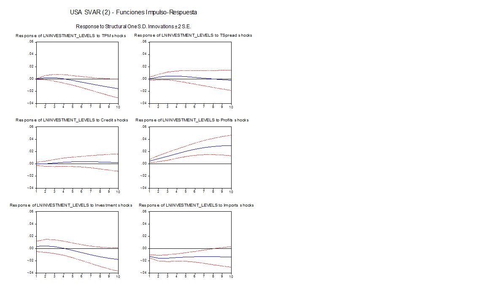
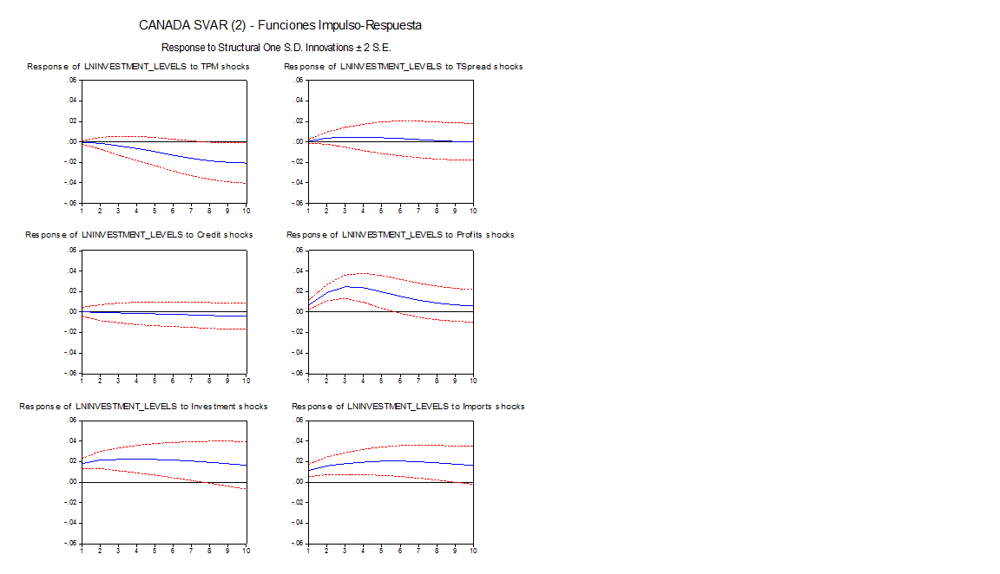
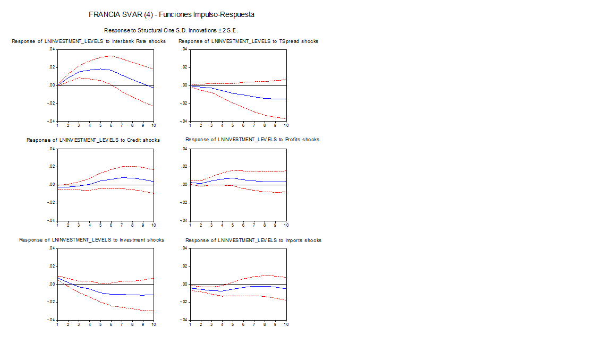
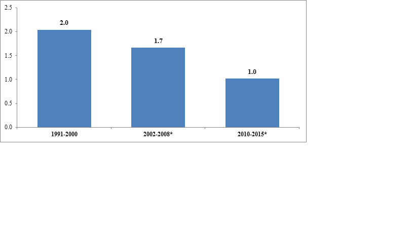
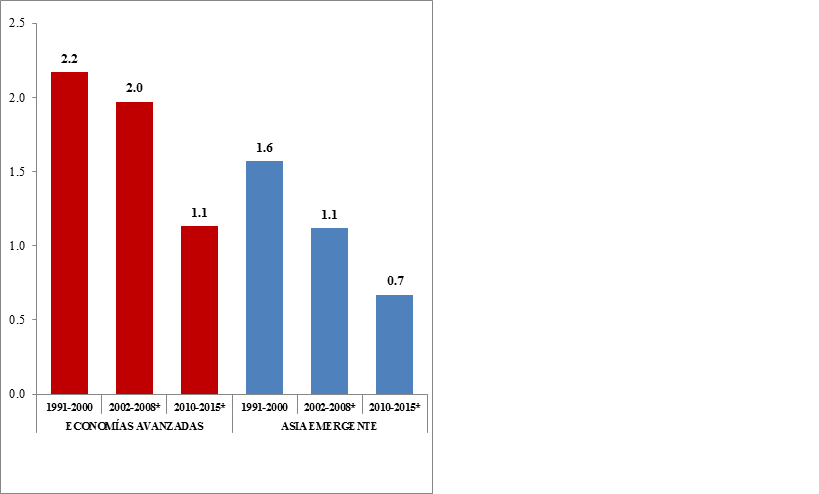
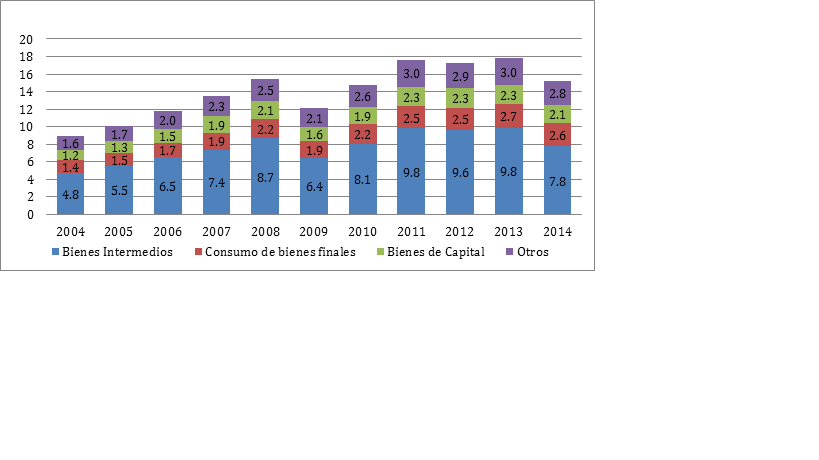

```{r setup, include=FALSE}
knitr::opts_chunk$set(echo = FALSE)
library(printr)
```

```{r, load_libraries, include=FALSE}
library(dplyr) # use dplyr::first and dplyr::last
library(ggplot2)
library(xts) # use xts::first and xts::last
library(tidyr)
library(lubridate)
library(tibble)
library(tidyquant)
library(ggthemes)
library(knitr)
library(kableExtra)
library(countrycode)
library(readxl)


source("../functions/funcs_for_new_normal.R")

```

```{r load_principal_data,  include=FALSE, cache=TRUE}
load("../produced_data/WEOApr2017_cepal_and_others" )

# what variables are available  (not the same for countries and groups of countries!) ad what are their codes

subject_dict_co <- WEOApr2017cepal18_others_long %>% 
  filter(iso == "CHL" & year == 2000) %>% 
  select(-c(value, iso, country, country_series_specific_notes ,
            weo_country_code, estimates_start_after, scale, year))

subject_dict_wo <- WEOApr2017cepal18_others_long  %>% 
  filter(country == "World" & year == 2000) %>% 
  select(-c(value, iso,  country_series_specific_notes,
            weo_country_code, estimates_start_after, scale, year) ) 


load("../produced_data/cepal_18_countries")
load("../produced_data/cepal_33_countries")

weo_country_names_lac_18 <- countrycode(cepal_18_countries[["iso3c"]], "iso3c", "country.name.en")
weo_country_names_lac_18[2] <- "Bolivia"
weo_country_names_lac_18[18] <- "Venezuela"

weo_country_names_lac_17 <- weo_country_names_lac_18[1:17]

weo_country_names_cardm <- c("Costa Rica", "Dominican Republic", "El Salvador" ,"Honduras", "Nicaragua", "Mexico", "Guatemala" , "Panama")

weo_country_names_card <- c("Costa Rica", "Dominican Republic", "El Salvador" ,"Honduras", "Nicaragua",  "Guatemala" , "Panama")

weo_country_names_sa <- c("Argentina", "Bolivia", "Brazil", "Chile",
                           "Colombia", "Ecuador", "Paraguay", "Peru",
                           "Uruguay", "Venezuela")

weo_country_names_sa_notven <- c("Argentina", "Bolivia", "Brazil", "Chile",
                           "Colombia", "Ecuador", "Paraguay", "Peru",
                           "Uruguay") 

cepal_17_countries <- cepal_18_countries %>% 
  filter(iso3c != "VEN")

cardm_countries <- cepal_18_countries %>% 
  filter(iso3c %in% c("CRI", "HND", "MEX", "DOM", "GTM", "SLV", "PAN", "NIC")  )

card_countries <- cepal_18_countries %>% 
  filter(iso3c %in% c("CRI", "HND", "DOM", "GTM", "SLV", "PAN", "NIC")  )

sa_countries <- cepal_18_countries %>% 
  filter(iso3c %in% c("ARG", "BOL", "BRA", "CHL", "COL", "ECU", "PER",
                      "PRY", "URY", "VEN")  )

sa_countries_notven <- cepal_18_countries %>% 
  filter(iso3c != "VEN"  )

load("../produced_data/selected_oecd_vars")
load("../produced_data/ted_productivity_2016_nov")
```


```{r calculate_gdp_gaps_trends, include=FALSE, cache=TRUE}

weo_gdp <- WEOApr2017cepal18_others_long %>% 
  select(iso, country, year, weo_subject_code, value) %>% 
  filter(weo_subject_code %in% c("NGDP_R", "NGDP_RPCH", "NGAP_NPGDP")) 

real_gdp_long <- weo_gdp %>% 
  filter(weo_subject_code %in% c("NGDP_R")) %>% 
  mutate(date =  ymd(paste0(year,  "-12-31"))) 

# foo <- add_ts_filters(real_gdp_long , date_colname = "date", value_colname = "value", country_colname = "iso")

real_gdp_hp <- add_ts_filters(real_gdp_long) %>% arrange(country, date) %>% 
  group_by(country) %>% 
  mutate(trend_growth_pct = 100*(hp_trend / dplyr::lag(hp_trend)-1)) %>% 
  ungroup()

trend_growth_list_all <- real_gdp_hp %>% 
  rename(date_id = date,
         eco_id = country,
         voi = hp_trend) %>% 
  growth_report(end2 = 2016)

trend_growth_list_lac <- real_gdp_hp %>%
  filter(country %in% weo_country_names_lac_18) %>% 
  rename(date_id = date,
         eco_id = country,
         voi = hp_trend) %>% 
  growth_report(end2 = 2016)
trend_growth_list_lac$group_averages["region_name"] <- "LAC-18"


trend_growth_list_lac_17 <- real_gdp_hp %>%
  filter(country %in% weo_country_names_lac_17) %>% 
  rename(date_id = date,
         eco_id = country,
         voi = hp_trend) %>% 
  growth_report(end2 = 2016)
trend_growth_list_lac_17$group_averages["region_name"] <- "LAC-17"

trend_growth_list_cardm <- real_gdp_hp %>%
  filter(country %in% weo_country_names_cardm) %>% 
  rename(date_id = date,
         eco_id = country,
         voi = hp_trend) %>% 
  growth_report(end2 = 2016)
trend_growth_list_cardm$group_averages["region_name"] <- "CARDM"


trend_growth_list_sa <- real_gdp_hp %>%
  filter(country %in% weo_country_names_sa) %>% 
  rename(date_id = date,
         eco_id = country,
         voi = hp_trend) %>% 
  growth_report(end2 = 2016)
trend_growth_list_sa$group_averages["region_name"] <- "South America"

trend_growth_list_sa_notven <- real_gdp_hp %>%
  filter(country %in% weo_country_names_sa_notven) %>% 
  rename(date_id = date,
         eco_id = country,
         voi = hp_trend) %>% 
  growth_report(end2 = 2016)
trend_growth_list_sa_notven$group_averages["region_name"] <- "South America w.o. Ven"

other_weo_economies = c(c("China", "United States"), 
                        c("Major advanced economies (G7)",
                          "Euro area " , "Advanced economies"))

trend_growth_list_other <- real_gdp_hp %>%
  filter(country %in% other_weo_economies) %>% 
  rename(date_id = date,
         eco_id = country,
         voi = hp_trend) %>% 
  growth_report(end2 = 2016)

trend_growth_list_china <- real_gdp_hp %>%
  filter(country == "China") %>% 
  rename(date_id = date,
         eco_id = country,
         voi = hp_trend) %>% 
  growth_report(end2 = 2016)


# real_gdp_country_wide <- real_gdp_long %>% 
#   spread(key = country, value=value)
# 
# real_gdp_growth_long <- weo_gdp %>% 
#   filter(weo_subject_code %in% c("NGDP_RPCH"))

weo_few <- WEOApr2017cepal18_others_long %>% 
  select(iso, country, year, weo_subject_code, value) %>% 
  filter(weo_subject_code %in% c("NGDP_R", "NGDP_RPCH", "NGAP_NPGDP")) 

weo_long_EU_AE_G7_USA <- subset(weo_few , 
                country %in% c("United States", "Major advanced economies (G7)",
                               "Euro area " , "Advanced economies")) %>% 
  select(-iso) %>% arrange(country, year)

weo_cwide_EU_AE_G7_USA <- weo_long_EU_AE_G7_USA %>% spread(weo_subject_code, value) %>% 
  group_by(country) %>% 
  mutate(gross_gap = 1 + NGAP_NPGDP/100,
         gross_rate_gdp = 1 + NGDP_RPCH/100,
         gross_rate_potential_gdp = gross_rate_gdp*dplyr::lag(gross_gap)/gross_gap,
         growth_potential_pct = 100*(gross_rate_potential_gdp-1))

weo_pot_list_EU_AE_G7_USA <- weo_cwide_EU_AE_G7_USA %>%
  mutate(date = ymd(paste0(year,  "-12-31"))) %>% 
    rename(date_id = date,
         eco_id = country,
         voi = gross_rate_potential_gdp) %>% 
  growth_report(input_type = "gross_rates",  end2 = 2016)
  

avgs_china_usa_ez_g7 <- bind_rows(weo_pot_list_EU_AE_G7_USA$avgs_df,
                                  trend_growth_list_china$avgs_df)
```


```{r productivity_gr, cache=TRUE}

oecd_lab_prod_for_report <- selection_oecd_eo_nov_2016 %>% 
  filter(VARIABLE == "PDTY" & FREQUENCY == "A") %>% 
  mutate(date_id = ymd(paste0(obsTime,  "-12-31"))) %>% 
  rename(eco_id = LOCATION, 
         voi = obsValue) %>% 
  select(eco_id, date_id, voi)

#new periods
oecd_lab_prod_avg_03_08_10_15 <- oecd_lab_prod_for_report %>% 
  growth_report(end2 = 2016)

#esteban periods
oecd_lab_prod_avg_90_95_96_00 <- oecd_lab_prod_for_report %>% 
  growth_report(start1 = 1990, end1 = 1995, start2 = 1996, end2 = 2000)

oecd_lab_prod_avg_01_06_07_09 <- oecd_lab_prod_for_report %>% 
  growth_report(start1 = 2001, end1 = 2006, start2 = 2007, end2 = 2009)

oecd_lab_prod_avg_07_09_10_16 <- oecd_lab_prod_for_report %>% 
  growth_report(start1 = 2007, end1 = 2009, start2 = 2010, end2 = 2016)

ted_lab_prod_employed_regions <- ted_nov_2016_regions %>% 
  filter(INDICATOR == "LP_L_g") %>% 
  select(-c(MEASURE, INDICATOR)) %>% 
  gather(key = "year", value = "net_rate", -c(REGION)) %>% 
  mutate(gross_rate_of_growth = net_rate/100 + 1)

ted_prod_regions_for_report <- ted_lab_prod_employed_regions %>% 
  mutate(date_id = ymd(paste0(year,  "-12-31"))) %>% 
  rename(eco_id = REGION, 
         voi = gross_rate_of_growth) %>% 
  select(eco_id, date_id, voi)


ted_lab_prod_employed_countries <- ted_nov_2016_countries %>% 
  filter(INDICATOR == "LP_L_g") %>% 
  select(-c(MEASURE, INDICATOR)) %>% 
  gather(key = "year", value = "net_rate", -c(REGION, COUNTRY)) %>% 
  mutate(gross_rate_of_growth = net_rate/100 + 1)

ted_prod_countries_for_report <- ted_lab_prod_employed_countries %>% 
  mutate(date_id = ymd(paste0(year,  "-12-31"))) %>% 
  rename(eco_id = COUNTRY, 
         voi = gross_rate_of_growth) %>% 
  select(eco_id, date_id, voi)

ted_prod_lac18 <- ted_prod_countries_for_report %>% 
  filter(eco_id %in% weo_country_names_lac_18)
  
ted_prod_lac17 <- ted_prod_countries_for_report %>% 
  filter(eco_id %in% weo_country_names_lac_17)

ted_prod_cardm <- ted_prod_countries_for_report %>% 
  filter(eco_id %in% weo_country_names_cardm)

ted_prod_card <- ted_prod_countries_for_report %>% 
  filter(eco_id %in% weo_country_names_card)

ted_prod_sa <- ted_prod_countries_for_report %>% 
  filter(eco_id %in% weo_country_names_sa)

ted_prod_sa_notven <- ted_prod_countries_for_report %>% 
  filter(eco_id %in% weo_country_names_sa_notven)


ted_emplo_prod_avg_90_95_96_00 <- ted_prod_regions_for_report %>% 
  growth_report(start1 = 1990, end1 = 1995, start2 = 1996, end2 = 2000,
                input_type = "gross_rates")

ted_emplo_prod_avg_01_06_07_09 <- ted_prod_regions_for_report %>% 
  growth_report(start1 = 2001, end1 = 2006, start2 = 2007, end2 = 2009,
                input_type = "gross_rates")

ted_emplo_prod_avg_07_09_10_16 <- ted_prod_regions_for_report %>% 
  growth_report(start1 = 2007, end1 = 2009, start2 = 2010, end2 = 2016,
                input_type = "gross_rates")


ted_emplo_prod_avg_lac18_90_95_96_00 <- ted_prod_lac18 %>% 
  growth_report(start1 = 1990, end1 = 1995, start2 = 1996, end2 = 2000,
                input_type = "gross_rates")
ted_emplo_prod_avg_lac18_90_95_96_00$group_averages["region_name"] <- "LAC-18"

ted_emplo_prod_avg_lac18_01_06_07_09 <- ted_prod_lac18 %>% 
  growth_report(start1 = 2001, end1 = 2006, start2 = 2007, end2 = 2009,
                input_type = "gross_rates")
ted_emplo_prod_avg_lac18_01_06_07_09$group_averages["region_name"] <- "LAC-18"

ted_emplo_prod_avg_lac18_07_09_10_16 <- ted_prod_lac18 %>% 
  growth_report(start1 = 2007, end1 = 2009, start2 = 2010, end2 = 2016,
                input_type = "gross_rates")
ted_emplo_prod_avg_lac18_07_09_10_16$group_averages["region_name"] <- "LAC-18"


ted_emplo_prod_avg_cardm_90_95_96_00 <- ted_prod_cardm %>% 
  growth_report(start1 = 1990, end1 = 1995, start2 = 1996, end2 = 2000,
                input_type = "gross_rates")
ted_emplo_prod_avg_cardm_90_95_96_00$group_averages["region_name"] <- "CARDM"

ted_emplo_prod_avg_cardm_01_06_07_09 <- ted_prod_cardm %>% 
  growth_report(start1 = 2001, end1 = 2006, start2 = 2007, end2 = 2009,
                input_type = "gross_rates")
ted_emplo_prod_avg_cardm_01_06_07_09$group_averages["region_name"] <- "CARDM"

ted_emplo_prod_avg_cardm_07_09_10_16 <- ted_prod_cardm %>% 
  growth_report(start1 = 2007, end1 = 2009, start2 = 2010, end2 = 2016,
                input_type = "gross_rates")
ted_emplo_prod_avg_cardm_07_09_10_16$group_averages["region_name"] <- "CARDM"


ted_emplo_prod_avg_sa_90_95_96_00 <- ted_prod_sa %>% 
  growth_report(start1 = 1990, end1 = 1995, start2 = 1996, end2 = 2000,
                input_type = "gross_rates")
ted_emplo_prod_avg_sa_90_95_96_00$group_averages["region_name"] <- "SA"

ted_emplo_prod_avg_sa_01_06_07_09 <- ted_prod_sa %>% 
  growth_report(start1 = 2001, end1 = 2006, start2 = 2007, end2 = 2009,
                input_type = "gross_rates")
ted_emplo_prod_avg_sa_01_06_07_09$group_averages["region_name"] <- "SA"

ted_emplo_prod_avg_sa_07_09_10_16 <- ted_prod_sa %>% 
  growth_report(start1 = 2007, end1 = 2009, start2 = 2010, end2 = 2016,
                input_type = "gross_rates")
ted_emplo_prod_avg_sa_07_09_10_16$group_averages["region_name"] <- "SA"


```


```{r fbc, warning=FALSE, cache=TRUE}
load("../produced_data/cs_fbcf_ratio_pib")
load("../produced_data/gfcf_wb_data")

weo_gfcf_aspct_gdp <- WEOApr2017cepal18_others_long %>% 
  select(iso, country, year, weo_subject_code, value) %>% 
  filter(weo_subject_code %in% c("NID_NGDP")) %>% 
  mutate(date = ymd(paste0(year,  "-12-31")))


weo_regions_names <- c("World", "Advanced economies", "Emerging market and developing economies",
                       "Other advanced economies (Advanced economies excluding G7 and euro area)",
                       "Major advanced economies (G7)", "Euro area",
                       "Latin America and the Caribbean", "Middle East and North Africa")

weo_gfcf_aspct_gdp_regions <- weo_gfcf_aspct_gdp %>% 
  filter(country %in% weo_regions_names)  %>% 
  select(country, date, value) %>% 
  rename(date_id = date, voi = value, eco_id = country)

weo_gfcf_to_gdp_regions_90_95_96_00 <- weo_gfcf_aspct_gdp_regions %>% 
  growth_report(start1 = 1991, end1 = 1995, start2 = 1996, end2 = 2000)

weo_gfcf_to_gdp_regions_01_06_07_09 <- weo_gfcf_aspct_gdp_regions %>% 
  growth_report(start1 = 2001, end1 = 2006, start2 = 2007, end2 = 2009)

weo_gfcf_to_gdp_regions_07_09_10_16 <- weo_gfcf_aspct_gdp_regions %>% 
  growth_report(start1 = 2007, end1 = 2009, start2 = 2010, end2 = 2016)


weo_gfcf_aspct_gdp_lac18 <- weo_gfcf_aspct_gdp %>% 
  filter(country %in% weo_country_names_lac_18)  %>% 
  select(country, date, value) %>% 
  rename(date_id = date, voi = value, eco_id = country)

weo_gfcf_aspct_gdp_lac17 <- weo_gfcf_aspct_gdp %>% 
  filter(country %in% weo_country_names_lac_17)  %>% 
  select(country, date, value) %>% 
  rename(date_id = date, voi = value, eco_id = country)

weo_gfcf_aspct_gdp_cardm <- weo_gfcf_aspct_gdp %>% 
  filter(country %in% weo_country_names_cardm)  %>% 
  select(country, date, value) %>% 
  rename(date_id = date, voi = value, eco_id = country)

weo_gfcf_aspct_gdp_card <- weo_gfcf_aspct_gdp %>% 
  filter(country %in% weo_country_names_card)  %>% 
  select(country, date, value) %>% 
  rename(date_id = date, voi = value, eco_id = country)

weo_gfcf_aspct_gdp_sa <- weo_gfcf_aspct_gdp %>% 
  filter(country %in% weo_country_names_sa)  %>% 
  select(country, date, value) %>% 
  rename(date_id = date, voi = value, eco_id = country)

weo_gfcf_aspct_gdp_sa_notven <- weo_gfcf_aspct_gdp %>% 
  filter(country %in% weo_country_names_sa_notven)  %>% 
  select(country, date, value) %>% 
  rename(date_id = date, voi = value, eco_id = country)


weo_gfcf_aspct_gdp_lac18_91_95_96_00 <- weo_gfcf_aspct_gdp_lac18 %>% 
  growth_report(start1 = 1991, end1 = 1995, start2 = 1996, end2 = 2000)
weo_gfcf_aspct_gdp_lac18_91_95_96_00$group_averages["region_name"] <- "LAC-18"

weo_gfcf_aspct_gdp_lac18_01_06_07_09 <- weo_gfcf_aspct_gdp_lac18 %>% 
  growth_report(start1 = 2001, end1 = 2006, start2 = 2007, end2 = 2009)
weo_gfcf_aspct_gdp_lac18_01_06_07_09$group_averages["region_name"] <- "LAC-18"

weo_gfcf_aspct_gdp_lac18_07_09_10_16 <- weo_gfcf_aspct_gdp_lac18 %>% 
  growth_report(start1 = 2007, end1 = 2009, start2 = 2010, end2 = 2016)
weo_gfcf_aspct_gdp_lac18_07_09_10_16$group_averages["region_name"] <- "LAC-18"


weo_gfcf_aspct_gdp_cardm_91_95_96_00 <- weo_gfcf_aspct_gdp_cardm %>% 
  growth_report(start1 = 1991, end1 = 1995, start2 = 1996, end2 = 2000)
weo_gfcf_aspct_gdp_cardm_91_95_96_00$group_averages["region_name"] <- "CARDM"

weo_gfcf_aspct_gdp_cardm_01_06_07_09 <- weo_gfcf_aspct_gdp_cardm %>% 
  growth_report(start1 = 2001, end1 = 2006, start2 = 2007, end2 = 2009)
weo_gfcf_aspct_gdp_cardm_01_06_07_09$group_averages["region_name"] <- "CARDM"

weo_gfcf_aspct_gdp_cardm_07_09_10_16 <- weo_gfcf_aspct_gdp_cardm %>% 
  growth_report(start1 = 2007, end1 = 2009, start2 = 2010, end2 = 2016)
weo_gfcf_aspct_gdp_cardm_07_09_10_16$group_averages["region_name"] <- "CARDM"


weo_gfcf_aspct_gdp_sa_91_95_96_00 <- weo_gfcf_aspct_gdp_sa %>% 
  growth_report(start1 = 1991, end1 = 1995, start2 = 1996, end2 = 2000)
weo_gfcf_aspct_gdp_sa_91_95_96_00$group_averages["region_name"] <- "SA"

weo_gfcf_aspct_gdp_sa_01_06_07_09 <- weo_gfcf_aspct_gdp_sa %>% 
  growth_report(start1 = 2001, end1 = 2006, start2 = 2007, end2 = 2009)
weo_gfcf_aspct_gdp_sa_01_06_07_09$group_averages["region_name"] <- "SA"

weo_gfcf_aspct_gdp_sa_07_09_10_16 <- weo_gfcf_aspct_gdp_sa %>% 
  growth_report(start1 = 2007, end1 = 2009, start2 = 2010, end2 = 2016)
weo_gfcf_aspct_gdp_sa_07_09_10_16$group_averages["region_name"] <- "SA"


gfcf_lac_list <- gfcf_to_coLCU %>% 
  filter(iso2c %in% cepal_18_countries[["iso2c"]]) %>% 
  mutate(date =  ymd(paste0(date,  "-12-31"))) %>% 
  rename(eco_id = iso2c,
         date_id = date,
         voi = value) %>% 
  growth_report()

not_cepal_countries <- c("USA", "CHN", "RUS", "JPN", "IND", "DEU", "GBR") 
aggregates_codes <-  c("WLD", "LCN", "OED", "EMU", "EUU", "LAC", "LCN", "LCR", "HIC")
other_iso2c <- countrycode(c(not_cepal_countries,aggregates_codes),
                           "iso3c", "iso2c")


gfcf_other_list <- gfcf_to_coLCU %>% 
  filter(iso2c %in% other_iso2c) %>% 
  mutate(date =  ymd(paste0(date,  "-12-31"))) %>% 
  rename(eco_id = iso2c,
         date_id = date,
         voi = value) %>% 
  growth_report()

cgr <- cs_fbcf_ratio_pib %>% 
  select(iso3c, fbc_gr, fbcf_gr, year)

cf_gr_03_08 <- cgr %>% 
  select(-fbc_gr) %>% 
  filter(year >= 2003 & year <= 2008) %>% 
  group_by(iso3c) %>% 
  summarise(avg_03_08 = mean(fbcf_gr, na.rm = TRUE))

cf_gr_10_16 <- cgr %>% 
  select(-fbc_gr) %>% 
  filter(year >= 2010 & year <= 2016) %>% 
  group_by(iso3c) %>% 
  summarise(avg_10_16 = mean(fbcf_gr, na.rm = TRUE))

fbcf_avg_gr_03_08_10_16 <- left_join(cf_gr_03_08,
                                     cf_gr_10_16,
                                         by = "iso3c" ) %>% 
  mutate(cambio = avg_10_16 - avg_03_08)

```


```{r avg_gr_trade_x_m, include=FALSE, cache=TRUE}

# "TM_RPCH": Volume of imports of goods and services, Percent change 
# "TMG_RPCH": Volume of Imports of goods, Percent change 
# "TX_RPCH": Volume of exports of goods and services Percent change 
# "TXG_RPCH": Volume of exports of goods, Percent change 
# "BCA_NGDPD": Current account balance, Percentage of GDP
# TRADEPCH	World	Trade volume of goods and services		Percent change

weo_trade_pct_ch <- WEOApr2017cepal18_others_long %>% 
  select(country, year, weo_subject_code, value) %>% 
  filter(weo_subject_code %in% c("TRADEPCH")) %>% 
  filter(country == "World") %>% 
  mutate(date_id =  ymd(paste0(year,  "-12-31")),
         gross_gr = value/100 + 1) %>% 
  rename(voi = gross_gr,
         eco_id = country) %>% 
  select(-c(weo_subject_code, value)) 
  

weo_x_pct_ch <- WEOApr2017cepal18_others_long %>% 
  select(country, year, weo_subject_code, value) %>% 
  filter(weo_subject_code %in% c("TX_RPCH")) %>% 
  mutate(date_id =  ymd(paste0(year,  "-12-31")),
         gross_gr = value/100 + 1) %>% 
  rename(voi = gross_gr,
         eco_id = country) %>% 
  select(-c(weo_subject_code, value)) 


weo_m_pct_ch <- WEOApr2017cepal18_others_long %>% 
  select(country, year, weo_subject_code, value) %>% 
  filter(weo_subject_code %in% c("TM_RPCH")) %>% 
  mutate(date_id =  ymd(paste0(year,  "-12-31")),
         gross_gr = value/100 + 1) %>% 
  rename(voi = gross_gr,
         eco_id = country) %>% 
  select(-c(weo_subject_code, value)) 

region_names_desa <- c("United States", "Japan", "Advanced economies",
                  "Other advanced economies (Advanced economies excluding G7 and euro area)")

region_names_emerg <- c("Emerging and developing Asia", 
                        "Emerging market and developing economies" ,
                  "Latin America and the Caribbean", "Middle East and North Africa")


weo_x_pct_ch_world <- weo_x_pct_ch %>% 
  filter(eco_id == "World")

weo_x_pct_ch_desa <- weo_x_pct_ch %>% 
  filter(eco_id %in% region_names_desa)

weo_x_pct_ch_emerg <- weo_x_pct_ch %>% 
  filter(eco_id %in% region_names_emerg)

weo_x_pct_ch_lac18 <- weo_x_pct_ch %>% 
  filter(eco_id %in% weo_country_names_lac_18)

weo_x_pct_ch_lac17 <- weo_x_pct_ch %>% 
  filter(eco_id %in% weo_country_names_lac_17)

weo_x_pct_ch_cardm <- weo_x_pct_ch %>% 
  filter(eco_id %in% weo_country_names_cardm)

weo_x_pct_ch_card <- weo_x_pct_ch %>% 
  filter(eco_id %in% weo_country_names_card)

weo_x_pct_ch_sa <- weo_x_pct_ch %>% 
  filter(eco_id %in% weo_country_names_sa)

weo_x_pct_ch_sa_notven <- weo_x_pct_ch %>% 
  filter(eco_id %in% weo_country_names_sa_notven)

weo_trade_pct_ch_world_92_95_96_00 <-  weo_trade_pct_ch %>% 
  growth_report(input_type = "gross_rates", start1 = 1992, end1 = 1995, start2 = 1996, end2 = 2000)
weo_trade_pct_ch_world_01_07_08_11 <-  weo_trade_pct_ch %>% 
  growth_report(input_type = "gross_rates", start1 = 2001, end1 = 2007, start2 = 2008, end2 = 2011)
weo_trade_pct_ch_world_92_00_01_16 <-  weo_trade_pct_ch %>% 
  growth_report(input_type = "gross_rates", start1 = 1992, end1 = 2000, start2 = 2001, end2 = 2016)


weo_x_pct_ch_world_92_95_96_00 <-  weo_x_pct_ch_world %>% 
  growth_report(input_type = "gross_rates", start1 = 1992, end1 = 1995, start2 = 1996, end2 = 2000)
weo_x_pct_ch_world_01_07_08_11 <-  weo_x_pct_ch_world %>% 
  growth_report(input_type = "gross_rates", start1 = 2001, end1 = 2007, start2 = 2008, end2 = 2011)
weo_x_pct_ch_world_92_00_01_16 <-  weo_x_pct_ch_world %>% 
  growth_report(input_type = "gross_rates", start1 = 1992, end1 = 2000, start2 = 2001, end2 = 2016)


weo_x_pct_ch_desa_92_95_96_00 <-  weo_x_pct_ch_desa %>% 
  growth_report(input_type = "gross_rates", start1 = 1992, end1 = 1995, start2 = 1996, end2 = 2000)
weo_x_pct_ch_desa_01_07_08_11 <-  weo_x_pct_ch_desa %>% 
  growth_report(input_type = "gross_rates", start1 = 2001, end1 = 2007, start2 = 2008, end2 = 2011)
weo_x_pct_ch_desa_92_00_01_16 <-  weo_x_pct_ch_desa %>% 
  growth_report(input_type = "gross_rates", start1 = 1992, end1 = 2000, start2 = 2001, end2 = 2016)


weo_x_pct_ch_emerg_92_95_96_00 <-  weo_x_pct_ch_emerg %>% 
  growth_report(input_type = "gross_rates", start1 = 1992, end1 = 1995, start2 = 1996, end2 = 2000)
weo_x_pct_ch_emerg_01_07_08_11 <-  weo_x_pct_ch_emerg %>% 
  growth_report(input_type = "gross_rates", start1 = 2001, end1 = 2007, start2 = 2008, end2 = 2011)
weo_x_pct_ch_emerg_92_00_01_16 <-  weo_x_pct_ch_emerg %>% 
  growth_report(input_type = "gross_rates", start1 = 1992, end1 = 2000, start2 = 2001, end2 = 2016)


weo_x_pct_ch_lac18_92_95_96_00 <-  weo_x_pct_ch_lac18 %>% 
  growth_report(input_type = "gross_rates", start1 = 1992, end1 = 1995, start2 = 1996, end2 = 2000)
weo_x_pct_ch_lac18_92_95_96_00$group_averages["region_name"] <- "LAC-18"

weo_x_pct_ch_lac18_01_07_08_11 <-  weo_x_pct_ch_lac18 %>% 
  growth_report(input_type = "gross_rates", start1 = 2001, end1 = 2007, start2 = 2008, end2 = 2011)
weo_x_pct_ch_lac18_01_07_08_11$group_averages["region_name"] <- "LAC-18"

weo_x_pct_ch_lac18_92_00_01_16 <-  weo_x_pct_ch_lac18 %>% 
  growth_report(input_type = "gross_rates", start1 = 1992, end1 = 2000, start2 = 2001, end2 = 2016)
weo_x_pct_ch_lac18_92_00_01_16$group_averages["region_name"] <- "LAC-18"


weo_x_pct_ch_lac18_notnic <- weo_x_pct_ch_lac18 %>%
  filter(eco_id != "Nicaragua")
weo_x_pct_ch_lac18_notnic_92_95_96_00 <-  weo_x_pct_ch_lac18_notnic %>% 
  growth_report(input_type = "gross_rates", start1 = 1992, end1 = 1995, start2 = 1996, end2 = 2000)
weo_x_pct_ch_lac18_notnic_92_95_96_00$group_averages["region_name"] <- "LAC-18_notnic"

weo_x_pct_ch_lac18_notnic_01_07_08_11 <-  weo_x_pct_ch_lac18_notnic %>% 
  growth_report(input_type = "gross_rates", start1 = 2001, end1 = 2007, start2 = 2008, end2 = 2011)
weo_x_pct_ch_lac18_notnic_01_07_08_11$group_averages["region_name"] <- "LAC-18_notnic"

weo_x_pct_ch_lac18_notnic_92_00_01_16 <-  weo_x_pct_ch_lac18_notnic %>% 
  growth_report(input_type = "gross_rates", start1 = 1992, end1 = 2000, start2 = 2001, end2 = 2016)
weo_x_pct_ch_lac18_notnic_92_00_01_16$group_averages["region_name"] <- "LAC-18_notnic"


weo_x_pct_ch_cardm_92_95_96_00 <-  weo_x_pct_ch_cardm %>% 
  growth_report(input_type = "gross_rates", start1 = 1993, end1 = 1995, start2 = 1996, end2 = 2000)
weo_x_pct_ch_cardm_92_95_96_00$group_averages["region_name"] <- "CARDM"

weo_x_pct_ch_cardm_01_07_08_11 <-  weo_x_pct_ch_cardm %>% 
  growth_report(input_type = "gross_rates", start1 = 2001, end1 = 2007, start2 = 2008, end2 = 2011)
weo_x_pct_ch_cardm_01_07_08_11$group_averages["region_name"] <- "CARDM"

weo_x_pct_ch_cardm_92_00_01_16 <-  weo_x_pct_ch_cardm %>% 
  growth_report(input_type = "gross_rates", start1 = 1993, end1 = 2000, start2 = 2001, end2 = 2016)
weo_x_pct_ch_cardm_92_00_01_16$group_averages["region_name"] <- "CARDM"


weo_x_pct_ch_cardm_notnic <- weo_x_pct_ch_cardm %>% 
  filter(eco_id != "Nicaragua")
weo_x_pct_ch_cardm_notnic_92_95_96_00 <-  weo_x_pct_ch_cardm_notnic %>% 
  growth_report(input_type = "gross_rates", start1 = 1993, end1 = 1995, start2 = 1996, end2 = 2000)
weo_x_pct_ch_cardm_notnic_92_95_96_00$group_averages["region_name"] <- "CARDM_notNic"

weo_x_pct_ch_cardm_notnic_01_07_08_11 <-  weo_x_pct_ch_cardm_notnic %>% 
  growth_report(input_type = "gross_rates", start1 = 2001, end1 = 2007, start2 = 2008, end2 = 2011)
weo_x_pct_ch_cardm_notnic_01_07_08_11$group_averages["region_name"] <- "CARDM_notNic"

weo_x_pct_ch_cardm_notnic_92_00_01_16 <-  weo_x_pct_ch_cardm_notnic %>% 
  growth_report(input_type = "gross_rates", start1 = 1993, end1 = 2000, start2 = 2001, end2 = 2016)
weo_x_pct_ch_cardm_notnic_92_00_01_16$group_averages["region_name"] <- "CARDM_notNic"


weo_x_pct_ch_sa_92_95_96_00 <-  weo_x_pct_ch_sa %>% 
  growth_report(input_type = "gross_rates", start1 = 1992, end1 = 1995, start2 = 1996, end2 = 2000)
weo_x_pct_ch_sa_92_95_96_00$group_averages["region_name"] <- "South America"

weo_x_pct_ch_sa_01_07_08_11 <-  weo_x_pct_ch_sa %>% 
  growth_report(input_type = "gross_rates", start1 = 2001, end1 = 2007, start2 = 2008, end2 = 2011)
weo_x_pct_ch_sa_01_07_08_11$group_averages["region_name"] <- "South America"

weo_x_pct_ch_sa_92_00_01_16 <-  weo_x_pct_ch_sa %>% 
  growth_report(input_type = "gross_rates", start1 = 1992, end1 = 2000, start2 = 2001, end2 = 2016)
weo_x_pct_ch_sa_92_00_01_16$group_averages["region_name"] <- "South America"

```


## Resumen (reescribir al final)

En este capítulo documentamos los siguientes hecho estilizados: en general, el producto potencial en los países de la región crece más lentamente que en el pasado y eso ha estado acompañado de desaceleraciones correspondientes en el volumen de sus exportaciones, en los precios de los commodities y en la formación bruta de capital fijo. Algo similar ocurre con la productividad media del trabajo, que también ve en algo deteriorado su crecimiento en los años recientes; pero , a diferencia de los otros determinantes mencionados, no tuvo un crecimiento acelerado en el período previo a la crisis financiera global.
Estas condiciones se inscriben dentro de un contexto global de desaceleración de la producción, del comercio y la productividad. Es, en particular, cierto para sus tres principales socios comerciales: China, Estados Unidos y la Unión Europea, siendo el quiebre de tendencia en China mucho más pronunciado que en los dos otros socios.
Aunque esta descripción es pertinente a la gran mayoría de los países de la región (13 a 15 países, dependiendo de la variable examinada, de un total de 18 en nuestra muestra), hay algunas excepciones sistemáticas: México es una economía que si bien estuvo ajeno a buena parte del boom productivo del quinquenio 2003-2008, al menos no ha empeorado su desempeño en el período 2010-2016. Bolivia, Paraguay y Nicaragua, por su parte son las economías que más logran desmarcarse de la tendencia del resto de los países a un desaceleramiento y logran buenas posiciones frente a sus pares en el período post crisis financiera. Finalmente habría que agregar el caso de Panamá, que aunque ve desacelerado su producto potencial y sus exportaciones, son caídas pequeñas desde tasas bastante altas para la región y logra mantener una acelerada expansión del inversión real y aumentar su productividad laboral.
En el polo opuesto a estas excepciones, constituyendo la cara más marcada de estos hechos estilizados, se encuentran Argentina, Brasil y, especialmente, Venezuela. Todas presentan desaceleraciones importantes de su producto potencia y particularmente de la inversión real. En los casos de Argentina y Brasil su desaceleración del volumen exportador es algo más suave y el de la productividad laboral es leve y más o menos en la mediana de la región.


##### Page Brake in Word


## La región enfrenta un contexto externo más restrictivo y más incierto

A partir de la crisis global financiera el contexto internacional se ha vuelto más restrictivo. 
Las tasas de crecimiento de la economía mundial y de los principales socios de América Latina 
y el Caribe han disminuido restringiendo las posibilidades de crecimiento de la región a través del sector externo.

```{r table_avg_tg_others, results=TRUE}

table_avg_tg_others_data <- avgs_china_usa_ez_g7 %>% 
  select(eco_id, geo_mean_gr_per1, geo_mean_gr_per2) %>% 
  filter(!str_detect(eco_id, "Major") )

tg_others_colnames <- c("Región"," 2003-2008 ", " 2010-2016 ")
  
tbl_be_caption = "Tasas de crecimiento de las economías a nivel mundial (% anual del PIB potencial)"
knitr::kable(table_avg_tg_others_data, digits = 1,
             col.names = tg_others_colnames, caption = tbl_be_caption) %>% 
  add_footnote("Fuente: CEPAL sobre datos IMF, WEO, Abril 2017")
```


Si miramos las estimaciones para el PIB de las economías avanzadas y de nuestros principales socios comerciales, vemos que más allá de los ciclos –- con todas las imperfecciones que estas estimaciones pueden tener— la velocidad a la que nuestros principales compradores pueden aumentar sus ingresos y producción es más limitada. 
La evidencia disponible muestra que a la par con la baja tendencial del crecimiento económico y de la inversión el ritmo de crecimiento de la productividad ha tendido a desacelerarse (o estancarse) sobre todo en el mundo desarrollado. 

La tasa de crecimiento de la productividad laboral para el caso de los Estados Unidos aumentó en la década de los noventa. Esta pasó de  1.7% y 3.1% en promedio para 1990-1995 y 1996-2000 para luego disminuir por debajo de 1% en la década de los noventa y mantenerse en torno a 1% entre 2010-2015. Por su parte tanto la Zona Euro como el resto de las economías industrializadas registran una clara disminución en la tasa de crecimiento de la productividad en los noventa (Cuadro  2).

A  nivel más específico del sector manufacturero también se nota una pérdida de productividad en las economías más desarrolladas. La tasa de crecimiento anual del producto por hora para un conjunto de economías desarrolladas baja de 4.8%  a 1.5% entre 1998-2006 y 2010-2014. Una evolución similar se registra para el producto por trabajador: 4.7% y 1.4% para el mismo periodo. 


```{r tbl_productividad_eco_desa, cache=TRUE}
tbl_prod_world_data <- ted_emplo_prod_avg_90_95_96_00$avgs_df %>% 
  select(eco_id, geo_mean_gr_per1, geo_mean_gr_per2) %>% 
  rename("1990-1995" = geo_mean_gr_per1, 
         "1996-2000" = geo_mean_gr_per2) %>% 
  left_join(ted_emplo_prod_avg_01_06_07_09$avgs_df, by = "eco_id") %>% 
  select(1:3, geo_mean_gr_per1, geo_mean_gr_per2) %>% 
  rename("2001-2006" = geo_mean_gr_per1, 
         "2007-2009" = geo_mean_gr_per2) %>% 
  left_join(ted_emplo_prod_avg_07_09_10_16$avgs_df, by = "eco_id") %>% 
  select(1:5,  geo_mean_gr_per2) %>% 
  rename("2010-2016" = geo_mean_gr_per2)

period_esteban_colnames <- c("Región", "1990-1995 ", "1996-2000",
                            "2001-2006", "2007-2009", "2010-2016")

eco_desa_id <- c("Euro Area", "United States", "Other Mature Economies")

tbl_prod_eco_desa_data <- tbl_prod_world_data %>% 
  filter(eco_id %in% eco_desa_id)

tbl_eco_desa_caption = "Crecimiento de la productividad, economías desarrolladas"

tbl_eco_desa <- knitr::kable(tbl_prod_eco_desa_data, digits = 1,
             col.names = period_esteban_colnames , caption = tbl_eco_desa_caption) %>% 
  add_footnote("Fuente: CEPAL sobre datos Conference Board, 2016")

tbl_eco_desa
```


En cambio en el caso de las economías en desarrollo se nota un claro aumento de la productividad entre la década de los noventa y los 2000. Este aumento se explica, en gran medida, por el desempeño de China e India. China e India más que duplicaron el crecimiento de la productividad entre la segunda mitad de la década de los noventa y los 2000. Por su parte Asia en desarrollo (sin China e India), Medio Oriente y Africa del Norte y América Latina mostraron un estancamiento en el crecimiento de la productividad.


```{r tbl_productividad_eco_emerg}
eco_emerg_id <- c("China", "India", "Emerging Markets and Developing Economies",
                  "Latin America", "Other Developing Asia",
                  "Middle East & North Africa" , "Sub-Saharan Africa",
                  "Russia, Central Asia and Southeast Europe")

tbl_prod_eco_emerg_data <- tbl_prod_world_data %>% 
  filter(eco_id %in% eco_emerg_id)

tbl_eco_emerg_caption = "Crecimiento de la productividad, economías emergentes"
tbl_eco_emerg <- knitr::kable(tbl_prod_eco_emerg_data, digits = 1,
             col.names = period_esteban_colnames , caption = tbl_eco_emerg_caption) %>% 
  add_footnote("Fuente: CEPAL sobre datos Conference Board, 2016")

tbl_eco_emerg
```


### La formacion de capital está estancada

Por otro lado, la inversión real a nivel mundial muestra un desempeño enlentecido. En un contexto de bajo crecimiento del producto, la razón Inversión/Producto apenas aumenta 0,5% al año en este nuevo período, prácticamente la mitad de lo que aumentó en el quinquenio 2001-2006, fenómeno que se repite en el conjunto de las economías avanzadas. Lo anterior se verifica de modo más agudo en  la zona del Euro, América Latina y el Caribe y el Medio Oriente, que no han podido mantener los niveles de inversión del comienzo de la post-crisis.


```{r tbl_weo_gfcf_gr_regions}

tbl_weo_gfcf_gr_regions_data <- weo_gfcf_to_gdp_regions_90_95_96_00$avgs_df %>% 
  select(eco_id, geo_mean_gr_per1, geo_mean_gr_per2) %>% 
  rename("1991-1995" = geo_mean_gr_per1, 
         "1996-2000" = geo_mean_gr_per2) %>% 
  left_join(weo_gfcf_to_gdp_regions_01_06_07_09$avgs_df, by = "eco_id") %>% 
  select(1:3, geo_mean_gr_per1, geo_mean_gr_per2) %>% 
  rename("2001-2006" = geo_mean_gr_per1, 
         "2007-2009" = geo_mean_gr_per2) %>% 
  left_join(weo_gfcf_to_gdp_regions_07_09_10_16$avgs_df, by = "eco_id") %>% 
  select(1:5,  geo_mean_gr_per2) %>% 
  rename("2010-2016" = geo_mean_gr_per2)

weo_gfcf_regions_colnames <- c("Región", "1991-1995 ", "1996-2000",
                            "2001-2006", "2007-2009", "2010-2016")

weo_gfcf_regions_caption = "Tasa de crecimiento anual de Formación de capital/PIB"

table_weo_gfcf_gr_regions <- knitr::kable(tbl_weo_gfcf_gr_regions_data , digits = 1,
             col.names = weo_gfcf_regions_colnames,
             caption = weo_gfcf_regions_caption) %>% 
  add_footnote("Fuente: IMF, Abril, 2017")

table_weo_gfcf_gr_regions

```

Como se discute en el Box.1 los beneficios económicos juegan un papel clave en el corto plazo y más hetorogeneamente en el largo plazo, con mayor intensidad al efecto que puedan tener las políticas moetarias que influencian la tasa de interés real.


```{r gfcf_notlac_table}

colnames_fbcf_table <- c("", "2003-2008", "2010-2015", "Cambio")

gfcf_notlac_table_data <- gfcf_other_list$avgs_df %>% 
  select(eco_id, geo_mean_gr_per1, geo_mean_gr_per2, change_geo)

tbl_fbcf_gr_caption_notlac = "Growth Gross Fixed Cap formation, other economies (%)"

wb_notlac_tbl <- knitr::kable(gfcf_notlac_table_data , digits = 1,
             col.names = colnames_fbcf_table,
             caption = tbl_fbcf_gr_caption_notlac) %>% 
  add_footnote("Source: WB")

```


#### Box 1. Determinantes de la inversión real: el papel de los beneficios

Este ejercicio empírico estima el impacto de distintas variables macro-económicas sobre la inversión en Estados Unidos, Francia y Canadá, utilizando  vectores auto-regresivos estructurales sobre datos trimestrales expresados en logaritmo ^[Las variables de tasas de interés se dejaron expresadas como porcentaje y las importaciones de bienes de capital se dejaron como índice (2009=100).] . Adicionalmente, se estimó la relación de causalidad a largo plazo entre inversión y beneficios mediante un modelo de corrección de errores. Dada la restricción que impone la disponibilidad de información, la presente estimación comprende el periodo que va desde el primer trimestre de 1990 (1990-Q1) al cuarto trimestre de 2014 (2014-Q4) para Estados Unidos, desde el tercer trimestre de 1992 (1992-Q3) al segundo trimestre de 2016 (2016-Q2) para Canadá, y desde el primer trimestre de 1999 (1999-Q1) al primer trimestre de 2015 (2015-Q1) para Francia.

Las variables utilizadas en el modelo fueron seis, cuatro de ellas (‘’Term Spread’’ (diferencial entre tasas cortas y largas), ‘’Investment’’ (formación bruta de capital fijo no residencial), ‘’Profits’’ (beneficios operacionales no financieros) y ‘’Credit’’ (crédito total a entidades no financieras)) siguen la estructura del paper de Banjeree et. al (2015), mientras que las otras dos (Tasa de política monetaria (TPM) – Tasa de interés interbancaria para el caso de Francia – e importación de bienes de capital (Imports)) son adiciones de la presente estimación. Para Estados Unidos, estas dos últimas fueron obtenidas del International Finance Statistics (IMF) y el Federal Reserve Bank of St. Louis ^[Para Estados Unidos, las importaciones consideradas son bienes de capital (excepto del sector automotor) – de acuerdo al criterio del FRED; expresados en un índice – no en logaritmo – donde 2009 = 100. La serie es trimestral y desestacionalizada.] , respectivamente. Para Canadá, la importación de bienes de capital se construyó consultando a Statistics Canada ^[Para Canadá, las importaciones que se consideraron como bienes de capital fueron obtenidas del sistema de clasificación NAPCS (North American Product Classification System), en valores reales. Lamentablemente no se encontró la tabla BEC que realiza la separación directa entre bienes de capital y consumo, al menos no para datos trimestrales ni mensuales. Tampoco se encontraron tablas de equivalencia entre el sistema BEC y NAPCS, sin embargo, se utilizó la equivalencia BEC - HS para aproximarse a dicha separación y realizarla manualmente en base al sistema NAPCS.] , y para Francia, la Federal Reserve Bank of St. Louis (FRED) y Eurostat  ^[Para Francia, las importaciones consideradas son bienes de capital y bienes intermedios – de acuerdo al criterio de Eurostat (NACE rev. 2); expresados en un índice – no en logaritmo – donde 2010 = 100. La serie original es mensual y no desestacionalizada, por lo que se tomó el promedio simple de cada tres meses para transformarla a una serie trimestral. ] se utilizaron como fuentes para ambas variables. 

Guiándonos por las funciones de impulso-respuesta, encontramos –para los tres pasíses analizados-- un impacto positivo de las utilidades sobre el nivel de inversión. Por el contrario, la política monetaria, por medio de la Tasa de Política Monetaria o la diferencia entre las tasas cortas y largas (‘’Term Spread’’), al igual que el acceso al crédito, no encuentran un efecto estadísticamente significativo sobre los niveles de inversión. Francia, por su parte, muestra un resultado contra intuitivo, en el que la tasa de interés interbancaria es la única variable de tasa de interés que parece influir sobre la inversión, pero de forma positiva y recién desde el segundo periodo ^[Una posible explicación es que el modelo SVAR no logre distinguir la doble causalidad entre ambas variables.] .

Finalmente, encontramos un efecto negativo de los shocks a las importaciones de bienes de capital sobre la inversión para el caso de Estados Unidos y Francia, pero positivo para Canadá.  

En cuanto a la relación entre inversión y beneficios a largo plazo, observamos que el modelo de vector de corrección de errores nos entrega una relación de causalidad temporal unidireccional, desde beneficios hacia inversión para Estados Unidos, mientras que para el caso de Francia y Canadá la relación causal de largo plazo es inversa: esta va de inversión a beneficios. 

En conclusión, la evidencia se inclina por un efecto positivo y significativo por parte de los beneficios sobre la inversión, al menos en el corto plazo. Las variables de política monetaria y el acceso al crédito, por otro lado, no presentan un impacto significativo sobre la inversión, al menos no para el periodo analizado. Finalmente, dado el efecto negativo de las importaciones sobre la inversión para los casos de Estados Unidos y Francia, podríamos pensar que la importación de bienes de capital sustituye a la inversión bruta de capital fijo en estos países, mientras que en Canadá podría darse el caso de una posible complementariedad entre ambas.

USA:



Canadá:



Francia:



```{r correlation_matrices_from_esteban}

cor_tasas_crec_usa = data.frame( inversion = c(1, 0.275365029), 
                                 beneficios = c(0.275365029, 1), 
                                 row.names = c("inversion", "beneficios") )

cor_tasas_crec_canada = data.frame( inversion = c(1, 0.414469), 
                                 beneficios = c(0.414469, 1), 
                                 row.names = c("inversion", "beneficios") )


cor_tasas_crec_francia = data.frame( inversion = c(1, 0.73079889), 
                                 beneficios = c(0.73079889, 1), 
                                 row.names = c("inversion", "beneficios") )

cor_tasas_crec_usa
cor_tasas_crec_canada
cor_tasas_crec_francia
```


### A partir de esta década se ha sumado una desaceleración del comercio

**A los efectos que ha tenido el comportamiento de la inversión y la productividad en el PIB tendencial hay que sumar la desaceleración del comercio que se produce a partir de la década de los 2000.**


A diferencia del declive tendencial que muestra la tasa de crecimiento del producto y de la inversión a partir de la década de los setenta, el comercio mantuvo hasta el inicio de la Crisis Global Financiera (2007-2009) un elevado dinamismo.   No obstante desde entonces también ha mostrado señales de desaceleración. La evidencia disponible desde 1990 hasta  2016 muestra que la tasa de crecimiento del comercio a nivel mundial pasó, en promedio, de  7.3% en la década de los noventa a  4.5% en los 2000. 


La desaceleración del comercio afecta sobre todo a las economías avanzadas y en menor medida al mundo en desarrollo. En su conjunto las exportaciones para las economías industrializadas han disminuido en promedio de 6%-7% en la década de los 90 a  menos de 4% en la década de los 2000. La desaceleración del comercio afecta con una intensidad similar a la mayor parte de las economías avanzadas.


Contrariamente, en el caso de las economías en desarrollo la intensidad de la deceleración es heterogénea. La desaceleración del comercio se concentra en América Latina y el Caribe y Africa y Medio Oriente más que en Asia y Europa del Este y Asia Central  (me falta el dato de Europa del Este y Asia Central) (Cuadro 5)


```{r tbl_trade_x_eco_desa}

tbl_trade_gr_data_world <- weo_trade_pct_ch_world_92_95_96_00$avgs_df %>% 
  select(eco_id, geo_mean_gr_per1, geo_mean_gr_per2) %>% 
  rename("1992-1995" = geo_mean_gr_per1, 
         "1996-2000" = geo_mean_gr_per2) %>% 
  left_join(weo_trade_pct_ch_world_01_07_08_11$avgs_df, by = "eco_id") %>% 
  select(1:3, geo_mean_gr_per1, geo_mean_gr_per2) %>% 
  rename("2001-2007" = geo_mean_gr_per1, 
         "2008-2011" = geo_mean_gr_per2) %>% 
  left_join(weo_trade_pct_ch_world_92_00_01_16$avgs_df, by = "eco_id") %>% 
  select(1:5, geo_mean_gr_per1, geo_mean_gr_per2) %>% 
  rename("1992-2000" = geo_mean_gr_per1, 
         "2001-2016" = geo_mean_gr_per2) %>% 
  mutate(eco_id = recode(eco_id, "World" = "Comercio mundial"))


tbl_x_gr_data_world <- weo_x_pct_ch_world_92_95_96_00$avgs_df %>% 
  select(eco_id, geo_mean_gr_per1, geo_mean_gr_per2) %>% 
  rename("1992-1995" = geo_mean_gr_per1, 
         "1996-2000" = geo_mean_gr_per2) %>% 
  left_join(weo_x_pct_ch_world_01_07_08_11$avgs_df, by = "eco_id") %>% 
  select(1:3, geo_mean_gr_per1, geo_mean_gr_per2) %>% 
  rename("2001-2007" = geo_mean_gr_per1, 
         "2008-2011" = geo_mean_gr_per2) %>% 
  left_join(weo_x_pct_ch_world_92_00_01_16$avgs_df, by = "eco_id") %>% 
  select(1:5, geo_mean_gr_per1, geo_mean_gr_per2) %>% 
  rename("1992-2000" = geo_mean_gr_per1, 
         "2001-2016" = geo_mean_gr_per2) %>% 
  mutate(eco_id = recode(eco_id, "World" = "Exportaciones mundiales"))


tbl_x_gr_data_eco_desa <- weo_x_pct_ch_desa_92_95_96_00$avgs_df %>% 
  select(eco_id, geo_mean_gr_per1, geo_mean_gr_per2) %>% 
  rename("1992-1995" = geo_mean_gr_per1, 
         "1996-2000" = geo_mean_gr_per2) %>% 
  left_join(weo_x_pct_ch_desa_01_07_08_11$avgs_df, by = "eco_id") %>% 
  select(1:3, geo_mean_gr_per1, geo_mean_gr_per2) %>% 
  rename("2001-2007" = geo_mean_gr_per1, 
         "2008-2011" = geo_mean_gr_per2) %>% 
  left_join(weo_x_pct_ch_desa_92_00_01_16$avgs_df, by = "eco_id") %>% 
  select(1:5, geo_mean_gr_per1, geo_mean_gr_per2) %>% 
  rename("1992-2000" = geo_mean_gr_per1, 
         "2001-2016" = geo_mean_gr_per2) %>% 
  mutate(eco_id = recode(eco_id, 
                         "Japan" = "Japón",
                         "Advanced economies" = "Economías avanzadas",
                         "United States" = "Estados Unidos",
                         "Other advanced economies (Advanced economies excluding G7 and euro area)" = "Otras economías avanzadas"))


tbl_x_gr_data_eco_emerg <- weo_x_pct_ch_emerg_92_95_96_00$avgs_df %>% 
  select(eco_id, geo_mean_gr_per1, geo_mean_gr_per2) %>% 
  rename("1992-1995" = geo_mean_gr_per1, 
         "1996-2000" = geo_mean_gr_per2) %>% 
  left_join(weo_x_pct_ch_emerg_01_07_08_11$avgs_df, by = "eco_id") %>% 
  select(1:3, geo_mean_gr_per1, geo_mean_gr_per2) %>% 
  rename("2001-2007" = geo_mean_gr_per1, 
         "2008-2011" = geo_mean_gr_per2) %>% 
  left_join(weo_x_pct_ch_emerg_92_00_01_16$avgs_df, by = "eco_id") %>% 
  select(1:5, geo_mean_gr_per1, geo_mean_gr_per2) %>% 
  rename("1992-2000" = geo_mean_gr_per1, 
         "2001-2016" = geo_mean_gr_per2) %>% 
  mutate(eco_id = recode(eco_id, 
                         "Latin America and the Caribbean" = "América Latina y el Caribe",
                         "Emerging market and developing economies" = "Economías emergentes y en desarrollo",
                         "Emerging and developing Asia" = "Asia emergente y en desarrollo",
                         "Middle East and North Africa" = "Medio Oriente y Norte de África"))

big_trade_x_table_data <- tbl_trade_gr_data_world %>% 
  bind_rows(tbl_x_gr_data_world) %>% 
  bind_rows(tbl_x_gr_data_eco_desa) %>% 
  bind_rows(tbl_x_gr_data_eco_emerg)
  
trade_x_colnames <- c("", "1992-1995", "1996-2000", "2001-2007", "2008-2011", "1992-2000", "2001-2016")

tbl_trade_x_caption = "Crecimiento del comercio y las exportacioens, mundial y por región"

tbl_trade_x <- knitr::kable(big_trade_x_table_data, digits = 1,
             col.names = trade_x_colnames , caption = tbl_trade_x_caption) %>% 
  add_footnote("Fuente: CEPAL sobre datos IMF, Abril, 2017")

tbl_trade_x 

```

La desaceleración del comercio responde en parte a factores de carácter cíclico pero también se explica por razones de carácter estructural tal y como lo indica el hecho que el comercio se ha vuelto menos sensible a los cambios en el ingreso. Esto se ejemplifica la disminución de la elasticidad de largo plazo de las exportaciones global con respecto a la producción mundial. 

La evidencia disponible para el periodo 1990-2015 muestra que la elasticidad de largo plazo del índice de volumen de las exportaciones respecto a la producción industrial del mundo disminuyó de 2 entre 1991-2000 a 1.7 entre 2002-2008 a 1.0 entre el 2010 y el 2015 (Figura 7). A nivel regional se produce el mismo fenómeno. Las estimaciones para la elasticidad ingreso de las exportaciones de América Latina con respecto al ingreso de las economías avanzadas y Asia emergente también muestra una disminución en el periodo 1991-2015.

Estimaciones de la descomposición de la elasticidad a nivel de grupos de producto muestra que la caída de la elasticidad se explica por la disminución de la elasticidad de manufacturas. La elasticidad de importaciones de largo plazo para las manufacturas disminuyó de 2.6 entre 1986-2000 a 0.8 para el periodo 2001-2013 ^[Nota: Las elasticidades del volumen de importaciones y exportaciones respecto al índice de producción industrial ponderado por producción fueron obtenidas mediante el test de cointegración de Johansen, siendo las series mencionadas integradas del mismo orden.  La fuente de los datos fueron las series trimestralizadas de CPB World Trade Monitor (incluyendo dato de abril 2015).  Los números de rezagos óptimos de los modelos fueron escogidos en función de los criterios de información Akaike y Schwarz. .* Datos al primer trimestre.
Fuente: CEPAL en base a CPB World Trade Monitor		
]

Figura: XYZ



Figura: XYZ2


La caída de la elasticidad del comercio con respecto al ingreso responde a dos conjuntos de factores. En primer lugar, cabe destacar el cambio en la composición de la demanda agregada mundial y los determinantes del crecimiento global. Los distintos componentes de la demanda agregada mundial tienen distintas intensidades comerciales. Tanto en cuanto la disminución de la tasa de crecimiento a nivel mundial se explica por los componentes de la demanda agregada con un mayor contenido de comercio como es el caso de la inversión, una baja en el PIB mundial tendrá un mayor efecto en el comercio que una baja en el los componentes de la demanda agregada que son menos intensivos en comercio. 


En segundo lugar se ha producido una ralentización del crecimiento de las cadenas de valor a nivel mundial. La evidencia disponible muestra que la razón del valor añadido externo al valor añadido interno para las exportaciones mundiales aumentó en 8.4 puntos porcentuales entre 1995-2005 y en sólo 2.5 puntos porcentuales para el periodo 2005-2012.  Una forma alternativa de medir esto es a través del crecimiento del comercio de bienes intermedios que según las últimas estimaciones disponibles se ha estancado (Figura 11).




Dado que la elasticidad de nuestras exportaciones ante cambios en el  producto mundial no ha aumentado y que  el crecimiento externo potencial se visto notablemente enlentecido, un aumento veloz del producto regional vía exportaciones, aparece como improbable en esta nueva normalidad.


#### Precios de commodities disminuyen varianza pero crecen lentamente


```{r compute_commodity_price, include=FALSE, cache=TRUE}

# PMETAW, World, Commodity Metals Price Index includes Copper, Alumin, Index, 2005=100
# PCOPP, World, Copper, grade A cathode, LME spot price, CIF European ... in U.S. dollars 
# PALLFNFW, World, Commodity Price Index includes both Fuel and Non-Fuel Price Indices, Index, 2005=100
# POILAPSPW, World, Crude Oil (petroleum), Price index simple average of three spot prices (APSP); Dated Brent, West Texas Intermediate, and the Dubai Fateh, Index, 2005=100
# 
# PCOFFW, World, Commodity Coffee Price Index includes Other Mild Arabicas and Robusta,Index, 2005=100
# PNGASW, World, Commodity Natural Gas Price Index includes European, Japanese, and American Natural Gas Price Indices, Index, 2005=100
# PNRGW, World, Commodity Fuel (energy) Index includes Crude oil (petroleum), Natural Gas, and Coal Price Indices, Index, 2005=100
# PVOILW, World, Commodity Vegetable Oil Index includes Soybean, Soybean Meal, Soybean Oil, Rapeseed Oil, Palm Oil, Sunflower Oil, Olive Oil, Fishmeal, and Groundnut Price Indices, Index, 2005=100
# PFOODW, World, Commodity Food Price Index includes Cereal, Vegetable Oils, Meat, Seafood, Sugar, Bananas, and Oranges Price Indices Index, 2005=100


weo_commo <- WEOApr2017cepal18_others_long %>% 
  filter(country == "World") %>% select(weo_subject_code, year, value) %>% 
  filter(weo_subject_code %in% c("PMETAW", "PCOPP", "PALLFNFW",
                                 "POILAPSPW", "PCOFFW", "PNGASW",
                                 "PNRGW", "PVOILW", "PFOODW")) %>% 
  arrange(weo_subject_code, year) %>%   
  group_by(weo_subject_code) %>% 
  mutate(gross_growth = simple_gross_growth(value),
         date =  ymd(paste0(year,  "-12-31"))) 


weo_commo_gr_list <- weo_commo %>% 
  rename(eco_id = weo_subject_code,
         date_id = date,
         voi = value) %>% 
  growth_report(end2 = 2016)

```

En cuanto al precio de los commodities, si bien es cierto que en todos los grupos de bienes 
se observa un quiebre en sus trayectorias pre y post 2009 --pasan de crecer vigorosamente a tasas de crecimiento pequeñas o simplemente decrecen-- es en el caso de los hidrocarburos y los metales, donde el freno ha sido más fuerte: mientras que el grupo de los alimentos pasa de crecer desde  11.6% anual a una leve caída anual de 1.6% en el segundo período, para los metales e hidrocarburos la caída es desde tasas de crecimiento 25% promedio anual  a tasas de decrecimeinto cercanas al 7% y 8% promedio al año. 


```{r table_comm_price_gr_avg}

selected_comm <- c("PMETAW", "POILAPSPW", "PNGASW", "PFOODW")

table_comm_price_gr_avg_data <- weo_commo_gr_list$avgs_df %>% 
  filter(eco_id %in% selected_comm) %>% 
  select(eco_id, geo_mean_gr_per1, geo_mean_gr_per2, change_geo)

colnames_comm_table <- c("Commodity", "2003-2008", "2010-2016", "Cambio")


table_comm_price_gr_avg_data[ , 1] <- c("Food", "Gas", "Metals", "Oil")

tbl_comm_gr_caption = "Growth commodity price indexes (%)"

knitr::kable(table_comm_price_gr_avg_data, digits = 1,
             col.names = colnames_comm_table, caption = tbl_comm_gr_caption) %>% 
  add_footnote("Source: Price indexes (2005=100) for each year, from WEO April 2017")

```

##### Page Brake in Word


### Ambiente financiero


```{r credit_gdp_levels_and_gr}

load("../produced_data/wb_credit_to_gdp_dfs")
load("../produced_data/bis_tidy")

not_lac_country_names <- c("World", "Euro area", "China", "United States",
                           "Middle East & North Africa", "Middle East & North Africa", "Japan")

wb_privcred2gdp_not_lac <- dom_credit_to_priv_sec_to_gdp %>% 
  filter((country %in% not_lac_country_names) & date >= 1989 ) %>% 
   mutate(date =  ymd(paste0(date,  "-12-31"))) 

wb_privcred2gdp_regions <- wb_privcred2gdp_not_lac   %>% 
  select(country, date, value) %>% 
  rename(date_id = date, voi = value, eco_id = country)

wb_privcred2gdp_regions_90_99_00_06 <- wb_privcred2gdp_regions %>% 
  growth_report(start1 = 1990, end1 = 1999, start2 = 2000, end2 = 2006)

wb_privcred2gdp_regions_07_09_10_15 <- wb_privcred2gdp_regions %>% 
  growth_report(start1 = 2007, end1 = 2009, start2 = 2010, end2 = 2015)
                                                                                     

                                     

# Q:CL:P:A:M:770:A
bis_pri_nfs_alls_gdp <- tc_qs_long %>% 
  filter(str_detect(code, ":P:A:M:770:A"))

bis_not_lac_country_names <- c("euro_area", "advanced_economies", "G20", "emerging_markets",
                               "China", "United States of America" , "Japan", 
                               "all_reporting_economies")

bis_pri_nfs_alls_gdp_region <- bis_pri_nfs_alls_gdp %>% 
  filter(country_name %in% bis_not_lac_country_names) %>% 
  select(country_name, date, value) %>% 
  rename(date_id = date, voi = value, eco_id = country_name)

# demonios, son trimestrales
# wb_prinfs2gdp_regions_90_99_00_06 <- bis_pri_nfs_alls_gdp_region %>% 
#   growth_report(start1 = 1990, end1 = 1999, start2 = 2000, end2 = 2006)
# 
# wb_prinfs2gdp_regions_07_09_10_15 <- bis_pri_nfs_alls_gdp_region %>% 
#   growth_report(start1 = 2007, end1 = 2009, start2 = 2010, end2 = 2015)

bis_gap_other_country_names <- c("euro_area", "China", "United States of America" , "Japan", 
                               "United Kingdom of Great Britain and Northern Ireland")

bis_credit_gdp_gap_notlac <- cr_gap_bis_gapval %>% 
  filter(country_name %in% bis_gap_other_country_names) %>% 
  select(-code) %>% 
  rename(date_id = date, voi = value, eco_id = country_name)

bis_cr_gap_notlac_avg_lvl_90_99_00_06 <- bis_credit_gdp_gap_notlac %>% 
   means_report(start1 = 1990, end1 = 1999, start2 = 2000, end2 = 2006)
  
bis_cr_gap_notlac_avg_lvl_07_09_10_15 <- bis_credit_gdp_gap_notlac %>% 
   means_report(start1 = 2007, end1 = 2009, start2 = 2010, end2 = 2015)

```


```{r tbl_privcred2gdp}
tbl_privcred2gdp_data <- wb_privcred2gdp_regions_90_99_00_06$avgs_df %>%
  select(eco_id, geo_mean_gr_per1, geo_mean_gr_per2) %>% 
  rename("1990-1999" = geo_mean_gr_per1, 
         "2000-2005" = geo_mean_gr_per2) %>% 
  left_join(wb_privcred2gdp_regions_07_09_10_15$avgs_df, by = "eco_id") %>% 
  select(1:3, geo_mean_gr_per1, geo_mean_gr_per2) %>% 
  rename("2007-2009" = geo_mean_gr_per1, 
         "2010-2015" = geo_mean_gr_per2)
  

wb_privcred2gdp_regions_colnames <- c("Región", "1990-1999 ", "2000-2006",
                            "2007-2009", "2010-2015")

wb_privcred2gdp_regions_caption = "Tasa de crecimiento anual de Credito/PIB"

wb_privcred2gdp_regions_tbl <- knitr::kable(tbl_privcred2gdp_data , digits = 1,
             col.names = wb_privcred2gdp_regions_colnames,
             caption = wb_privcred2gdp_regions_caption) %>% 
  add_footnote("Source: WB")

wb_privcred2gdp_regions_tbl

```


```{r tbl_creditgap}
tbl_creditgap_data <- bis_cr_gap_notlac_avg_lvl_90_99_00_06$avgs_df %>%
  select(eco_id, mean_per1, mean_per2) %>% 
  rename("1990-1999" = mean_per1, 
         "2000-2006" = mean_per2) %>% 
  left_join(bis_cr_gap_notlac_avg_lvl_07_09_10_15$avgs_df, by = "eco_id") %>% 
  select(1:3, mean_per1, mean_per2) %>% 
  rename("2007-2009" = mean_per1, 
         "2010-2015" = mean_per2)
  

bis_cr_gap_notlac_regions_colnames <- c("Región", "1990-1999 ", "2000-2006",
                            "2007-2009", "2010-2015")

bis_cr_gap_notlac_regions_caption = "Componente ciclico de Credito/PIB (% del valor de tendencia)"

bis_cr_gap_notlac_regions_tbl <- knitr::kable(tbl_creditgap_data , digits = 1,
             col.names = bis_cr_gap_notlac_regions_colnames,
             caption = bis_cr_gap_notlac_regions_caption) %>% 
  add_footnote("Source: BIS")

bis_cr_gap_notlac_regions_tbl

```
### Flujos financieros


**Las condiciones financieras externas se han estabilizado, la liquidez crece a un ritmo moderado pero su precio aumentará  en el mediano plazo **


A la par con estos cambios en el sector real también se han registrado cambios significativos en la institucionalidad del sistema financiero lo cual ha generado cambios en los ciclos de liquidez a nivel mundial.  Por un lado, los avances en la implementación de los acuerdos de tercera generación de Basilea, junto a los grandes buffers de reservas internacionales oficiales acumulados por las economías emergentes desde la década anterior, han influido en la mayor estabilidad a los flujos de capitales hacia las economías emergentes. En la próxima sección analizaremos con más detalle esta mayor estabilidad respecto de los flujos de capitales hacia y desde la región.  Por el momento, baste señalar lo siguiente: la composición de los flujos (tanto netos como brutos i.e. por residentes y por ambos) es  notoriamente más variada en este nuevo escenario que el período 2003-2008, donde la IED era abrumadoramente mayoritaria. El único año pre-crisis financiera que se parece al nuestro nuevo escenario es el año 2007, donde la composición de gross inflows aparece más balanceada entre de cartera, directa y otra. Segundo, los años 2015 y 2016 parecen desmarcarse de los anteriores, porque el volumen total de gross inflows a la región disminuye notablemente en el caso de cartera y otros, coincidiendo con la paulatina alza de las tasas de interés en Estados Unidos.


```{r non_resident_flows}
load("../produced_data/fin_flows_lac")

gross_inflows_cols <- c("year", "inversion_directa_en_la_economia_declarante",
                        "pasivos_de_inversion_de_cartera", "pasivos_de_otra_inversion")

gross_inflows_lac17_by_type_y <- fin_flows_long_lac_17_yearly %>% 
  gather(key = inflow, value = value, -year) %>% 
  filter(inflow %in% gross_inflows_cols) %>% 
  group_by(year) 

gross_inflows_lac18_by_type_y <- fin_flows_long_lac_18_yearly %>% 
  gather(key = inflow, value = value, -year) %>% 
  filter(inflow %in% gross_inflows_cols) %>%  
  group_by(year) 

gross_inflows_lac17_by_type_q <- fin_flows_long_lac_17%>% 
  gather(key = inflow, value = value, -date) %>% 
  filter(inflow %in% gross_inflows_cols) %>%  
  group_by(date) 

gross_inflows_lac18_by_type_q <- fin_flows_long_lac_18 %>% 
  gather(key = inflow, value = value, -date) %>% 
  filter(inflow %in% gross_inflows_cols) %>% 
  group_by(date)   

yearly_gross_inflows = ggplot(data = gross_inflows_lac17_by_type_y,
       aes(x = year, y=value, fill = inflow)) + geom_bar(stat = "identity")+ 
  ggtitle("Flujos de capitales, no-residentes, LAC-17")

quarterly_gross_inflows = ggplot(data = gross_inflows_lac17_by_type_q,
       aes(x = date, y=value, fill = inflow)) + geom_bar(stat = "identity") + 
  ggtitle("Flujos de capitales, no-residentes, LAC-17, trimestral")

```

```{r resident_flows}
load("../produced_data/fin_flows_lac")

net_inflows_cols <- c("year", "net_fdi",
                        "net_portfolio", "net_other_inversion", "net_other")

net_inflows_lac17_by_type_y <- fin_flows_long_lac_17_yearly %>% 
  gather(key = inflow, value = value, -year) %>% 
  filter(inflow %in% net_inflows_cols) %>% 
  group_by(year) 

net_inflows_lac18_by_type_y <- fin_flows_long_lac_18_yearly %>% 
  gather(key = inflow, value = value, -year) %>% 
  filter(inflow %in% net_inflows_cols) %>%  
  group_by(year) 

net_inflows_lac17_by_type_q <- fin_flows_long_lac_17%>% 
  gather(key = inflow, value = value, -date) %>% 
  filter(inflow %in% net_inflows_cols) %>%  
  group_by(date) 

net_inflows_lac18_by_type_q <- fin_flows_long_lac_18 %>% 
  gather(key = inflow, value = value, -date) %>% 
  filter(inflow %in% net_inflows_cols) %>% 
  group_by(date)   

yearly_net_inflows = ggplot(data = net_inflows_lac17_by_type_y,
       aes(x = year, y=value, fill = inflow)) + geom_bar(stat = "identity")+ 
  ggtitle("Flujos netos por tipo de capital, LAC-17, anual")

quarterly_net_inflows = ggplot(data = net_inflows_lac17_by_type_q,
       aes(x = date, y=value, fill = inflow)) + geom_bar(stat = "identity") + 
  ggtitle("Flujos netos por tipo de capital, LAC-17, trimestral")

```


Flujos netos y flujos brutos:

```{r plot_gross_inflows_by_type}

yearly_gross_inflows + scale_fill_discrete(labels = c("IED", "Otra", "Cartera"))

```


```{r plot_net_inflows_by_type}

yearly_net_inflows + scale_fill_discrete(labels = c("IED", "Otra", "Cartera"))

```


Otro hecho estilizado de este nuevo período es cierta estabilidad de los flujos financieros a la región, donde los episodios extremos de incrementos en las entradas o salidas, netas o brutas,  se han vuelto menos frecuentes. Por ejemplo, en términos de gross inflows y gross outflows, la región exhibe menos episodios extremos  comparados con los años 90s --relativamente generosos en sudden stops-- o con el sexenio previo a la crisis finaciera global, donde los inflow surges fueron más frecuentes. También es cierto si miramos las entradas y salidas etas de capitales: hay menos episodios extremos de salida e igual cantidad de entradas.


Concretamente, usando datos de CEPAL sobre flujos *brutos* entrantes y salientes (gross inflows and gross outflows) para Brasil, 
México, Colombia, Chile y Perú -- que representan el 80% de los flujos financieros de la región) [poner referencia] **encuentra solamente un episodio de sudden stop**, específicamente en Colombia entre 2015Q2 y 2015Q4. Ese único caso se puede comparar con los 5 que encontramos en los 2000s previo a la crisis financiera y a los 7 episodios durante los 90s. 

Por lado de los flujos de entrada positivo, después del 2009 vemos sólo dos inflow surges, versus tres en los 90s y siete en los 2000s previos a la crisis financiera global.

Aquí hay un cuadro que resume la situación:

```{r gross_ff_episodes_resumen}
extreme_episodes_by_period <- read_excel("../raw_data/extreme_episodes_by_period.xlsx")
ee_table_data <- extreme_episodes_by_period %>% select(-`prom anual`)
names(ee_table_data) <- c("Period", "Sudden Stops", "Surges", "Flights", "Retrenchment", "Total")
tbl_ee_caption <- "Gross Financial flows: Number of extreme episodos"
  
knitr::kable(ee_table_data , digits = 1, caption = tbl_ee_caption) %>% 
  add_footnote("Considers episodes for Brasil, Chile, Colombia, Mexico and Peru")
```

```{r}
net_extreme_episodes_by_period <- read_excel("../raw_data/extreme_episodes_by_period.xlsx", 
                                             sheet = "net_data_ee_by_period")
net_ee_table_data <- net_extreme_episodes_by_period %>% select(-`prom anual`)
names(net_ee_table_data) <- c("Period", "Sudden Stops", "Surges", "Total")
net_tbl_ee_caption <- "Net Financial flows: Number of extreme episodos"
  
knitr::kable(net_ee_table_data , digits = 1, caption = net_tbl_ee_caption) %>% 
  add_footnote("Considers episodes for Brasil, Chile, Colombia, Mexico and Peru")
```


##### Page break in Word

### Box: Determinantes de la inversión en economías avanzadas


##### Page break in Word

## Desempeño de la región en este nuevo normal


#### Evolución tendencial del producto (borrar?)

Después de la gran crisis financiera global (2007-2008) y el posterior derrumbe de los precios de los commodities (2009) y su rápido rebote, la región retomó tasas positivas de crecimiento pero a un ritmo notablemente menor que en el quinquenio 2003-2008. Un cálculo de los PIB tendenciales y su tasa de crecimiento, muestra que prácticamente para todos los países de ALC, la realidad post-2009 involucra tasas de crecimeinto tendencial o potencial bastante menores al mundo pre-crisis, particularmente agudo en los casos de Venezuela, Argentina y Brasil, con pocas pero notables excepciones como Bolivia, Nicaragua y Paraguay.  


En nuestra muestra, sólo en 3 de 18 países, el PIB potencial exhibe mayor dinamismo en el período post-2009. Casi en la mitad de los países (8 de 18)  el PIB potencial pierde en promedio 100 o más puntos base de crecimiento cada año.


El caso de México es interesante porque exhibe tasas de crecimiento del PIB potencial esencialmente iguales (y modestas) en ambos períodos, probablemente debido a que sus exportaciones están concentradas en manufacturas y no en commodities y también debido a que la desaceleración de Estados Unidos, su principal socio comercial por lejos,  no es tan pronunciada como la desaceleración de China, que tiende a tener un mayor peso en la exportaciones de los países América del Sur.


```{r table_avg_tg_lac,  include=FALSE}
lac_tbl_caption = "Average growth of potential output, LAC"
uno_colnames = c("país"," 2003-2008 ", " 2010-2016 ", " cambio ")
table_data_pot_lac <- trend_growth_list_lac$avgs_df %>% 
  select(eco_id, geo_mean_gr_per1, geo_mean_gr_per2, change_geo)

knitr::kable(table_data_pot_lac , digits = 1,
             col.names = uno_colnames, caption = lac_tbl_caption) %>% 
  add_footnote("Source: Real GDP growth and out gap from WEO April 2017.  Potential GDP growth, authors' calculations")
```


```{r table_avg_tg_lacavg_aes,  results=TRUE}
lac_aes_tbl_caption = "Average growth of potential output"
uno_colnames = c("Región"," 2003-2008 ", " 2010-2016 ", " cambio ")
table_data_pot_lac <- trend_growth_list_lac$group_averages %>% 
  mutate(eco_id = "LAC") %>% 
  select(eco_id, geo_mean_gr_per1, geo_mean_gr_per2, change_geo)

table_avg_tg_aes_data <- avgs_china_usa_ez_g7 %>% 
  select(eco_id, geo_mean_gr_per1, geo_mean_gr_per2, change_geo) %>% 
  filter(!str_detect(eco_id, "Major") )

table_avg_tg_lac_aes_data <- bind_rows(table_data_pot_lac, table_avg_tg_aes_data)

knitr::kable(table_avg_tg_lac_aes_data  , digits = 1,
             col.names = uno_colnames, caption = lac_aes_tbl_caption) %>% 
  add_footnote("Source: Real GDP growth and out gap from WEO April 2017.  Potential GDP growth, authors' calculations")
```

Esta nueva realidad que enfrenta la región no es, por supuesto, un mal endémico: es parte de un contexto interacional de desaceleración, tal como puede verse en el segundo cuadro: Estados Unidos, China, la zona del euro (sus tres principales socios comerciales) y el conjunto de las economías avanzadas (IMF classification) también exhiben menores tasa de crecimiento de sus PIB tendeciales en igual período. Es cierto aún para los Estado Unidos, donde incluímos el año 2008 en el primer período, cuando la crisis ya golpeaba al sector real. Los dos números que resumen este panorama son los de las Economías Avanzadas  y China. En el caso del las economías avanzadas pasamos de un crecimiento potencial de 2.1% promedio a 1.4% y China que pasa de 11.2% a 8%.


##### Page break in Word

### Exportaciones e Importaciones

```{r calcultate_avg_gr_trade_related, include=FALSE}

# "TM_RPCH": Volume of imports of goods and services, Percent change 
# "TMG_RPCH": Volume of Imports of goods, Percent change 
# "TX_RPCH": Volume of exports of goods and services Percent change 
# "TXG_RPCH": Volume of exports of goods, Percent change 
# "BCA_NGDPD": Current account balance, Percentage of GDP
# TRADEPCH	World	Trade volume of goods and services		Percent change


weo_trade <- WEOApr2017cepal18_others_long %>% 
  select(iso, country, year, weo_subject_code, value) %>% 
  filter(weo_subject_code %in% c("TRADEPCH","TM_RPCH", "TMG_RPCH", "TX_RPCH", "TXG_RPCH",
                                 "BCA_NGDPD")) %>% 
  mutate(date =  ymd(paste0(year,  "-12-31"))) %>% 
  arrange(country, year, weo_subject_code)

weo_x_growth_lac <- weo_trade %>% 
  filter(weo_subject_code == "TX_RPCH") %>% 
  filter(country %in% weo_country_names_lac_18) %>% 
  mutate(x_gross_gr = value/100 + 1) %>% 
  rename(voi = x_gross_gr, eco_id = country, date_id = date) %>% 
  growth_report(end2 = 2016, input_type = "gross_rates")

weo_m_growth_lac <- weo_trade %>% 
  filter(weo_subject_code == "TM_RPCH") %>% 
  filter(country %in% weo_country_names_lac_18) %>% 
  mutate(m_gross_gr = value/100 + 1) %>% 
  rename(voi = m_gross_gr, eco_id = country, date_id = date) %>% 
  growth_report(end2 = 2016, input_type = "gross_rates")


weo_trade_growth_other <- weo_trade %>% 
  filter(weo_subject_code == "TRADEPCH") %>% 
  filter(country %in% c("World")) %>% 
  mutate(x_gross_gr = value/100 + 1) %>% 
  rename(voi = x_gross_gr, eco_id = country, date_id = date) %>% 
  growth_report(end2 = 2016, input_type = "gross_rates")


weo_x_growth_other <- weo_trade %>% 
  filter(weo_subject_code == "TX_RPCH") %>% 
  filter(country %in% c("World", "China", "United States", 
                        "Euro area", "Advanced economies")) %>% 
  mutate(x_gross_gr = value/100 + 1) %>% 
  rename(voi = x_gross_gr, eco_id = country, date_id = date) %>% 
  growth_report(end2 = 2016, input_type = "gross_rates")


weo_m_growth_other <- weo_trade %>% 
  filter(weo_subject_code == "TM_RPCH") %>% 
  filter(country %in% c("World", "China", "United States",
                        "Euro area", "Advanced economies")) %>% 
  mutate(m_gross_gr = value/100 + 1) %>% 
  rename(voi = m_gross_gr, eco_id = country, date_id = date) %>% 
  growth_report(end2 = 2016, input_type = "gross_rates")

load("../produced_data/total_trade_wb")

openess_lac_list <- trade_wb %>% 
  filter(iso2c %in% cepal_18_countries[["iso2c"]]) %>% 
  mutate(date =  ymd(paste0(date,  "-12-31"))) %>% 
  rename(eco_id = iso2c,
         date_id = date,
         voi = value) %>% 
  growth_report()


not_cepal_countries <- c("USA", "CHN", "RUS", "JPN", "IND", "DEU", "GBR") 
aggregates_codes <-  c("WLD", "LCN", "OED", "EMU", "EUU", "LAC", "LCN", "LCR", "HIC")
other_iso2c <- countrycode(c(not_cepal_countries,aggregates_codes),
                           "iso3c", "iso2c")

openess_other_list <- trade_wb %>% 
  filter(iso2c %in% other_iso2c) %>% 
  mutate(date =  ymd(paste0(date,  "-12-31"))) %>% 
  rename(eco_id = iso2c,
         date_id = date,
         voi = value) %>% 
  growth_report()
```


```{r tbl_trade_x_lac_aggs}

tbl_trade_x_lac18_aggs_data <- weo_x_pct_ch_lac18_92_95_96_00$group_averages %>% 
  select(region_name, geo_mean_gr_per1, geo_mean_gr_per2) %>% 
  rename("1992-1995" = geo_mean_gr_per1, 
         "1996-2000" = geo_mean_gr_per2) %>% 
  left_join(weo_x_pct_ch_lac18_01_07_08_11$group_averages, by = "region_name") %>% 
  select(1:3, geo_mean_gr_per1, geo_mean_gr_per2) %>% 
  rename("2001-2007" = geo_mean_gr_per1, 
         "2008-2011" = geo_mean_gr_per2) %>% 
  left_join(weo_x_pct_ch_lac18_92_00_01_16$group_averages, by = "region_name") %>% 
  select(1:5, geo_mean_gr_per1, geo_mean_gr_per2) %>% 
  rename("1992-2000" = geo_mean_gr_per1, 
         "2001-2016" = geo_mean_gr_per2) 


tbl_trade_x_cardm_aggs_data <- weo_x_pct_ch_cardm_92_95_96_00$group_averages %>% 
  select(region_name, geo_mean_gr_per1, geo_mean_gr_per2) %>% 
  rename("1992-1995" = geo_mean_gr_per1, 
         "1996-2000" = geo_mean_gr_per2) %>% 
  left_join(weo_x_pct_ch_cardm_01_07_08_11$group_averages, by = "region_name") %>% 
  select(1:3, geo_mean_gr_per1, geo_mean_gr_per2) %>% 
  rename("2001-2007" = geo_mean_gr_per1, 
         "2008-2011" = geo_mean_gr_per2) %>% 
  left_join(weo_x_pct_ch_cardm_92_00_01_16$group_averages, by = "region_name") %>% 
  select(1:5, geo_mean_gr_per1, geo_mean_gr_per2) %>% 
  rename("1992-2000" = geo_mean_gr_per1, 
         "2001-2016" = geo_mean_gr_per2) 

tbl_trade_x_sa_aggs_data <- weo_x_pct_ch_sa_92_95_96_00$group_averages %>% 
  select(region_name, geo_mean_gr_per1, geo_mean_gr_per2) %>% 
  rename("1992-1995" = geo_mean_gr_per1, 
         "1996-2000" = geo_mean_gr_per2) %>% 
  left_join(weo_x_pct_ch_sa_01_07_08_11$group_averages, by = "region_name") %>% 
  select(1:3, geo_mean_gr_per1, geo_mean_gr_per2) %>% 
  rename("2001-2007" = geo_mean_gr_per1, 
         "2008-2011" = geo_mean_gr_per2) %>% 
  left_join(weo_x_pct_ch_sa_92_00_01_16$group_averages, by = "region_name") %>% 
  select(1:5, geo_mean_gr_per1, geo_mean_gr_per2) %>% 
  rename("1992-2000" = geo_mean_gr_per1, 
         "2001-2016" = geo_mean_gr_per2) 

joined_lacaggs_trade_x_table_data <- tbl_trade_x_lac18_aggs_data %>% 
  bind_rows(tbl_trade_x_cardm_aggs_data) %>% 
  bind_rows(tbl_trade_x_sa_aggs_data) 
  
trade_x_colnames <- c("", "1992-1995", "1996-2000", "2001-2007", "2008-2011", "1992-2000", "2001-2016")

tbl_trade_x_caption = "Crecimiento del comercio y las exportacioens, LAC-18 y subregiones"

tbl_trade_x_lacaggs <- knitr::kable(joined_lacaggs_trade_x_table_data, digits = 1,
             col.names = trade_x_colnames , caption = tbl_trade_x_caption) %>% 
  add_footnote("Fuente: CEPAL sobre datos IMF, Abril, 2017")

tbl_trade_x_lacaggs 

```


```{r tbl_trade_x_lac_aggs_notnic}

tbl_trade_x_lac18_notnic_aggs_data <- weo_x_pct_ch_lac18_notnic_92_95_96_00$group_averages %>% 
  select(region_name, geo_mean_gr_per1, geo_mean_gr_per2) %>% 
  rename("1992-1995" = geo_mean_gr_per1, 
         "1996-2000" = geo_mean_gr_per2) %>% 
  left_join(weo_x_pct_ch_lac18_notnic_01_07_08_11$group_averages, by = "region_name") %>% 
  select(1:3, geo_mean_gr_per1, geo_mean_gr_per2) %>% 
  rename("2001-2007" = geo_mean_gr_per1, 
         "2008-2011" = geo_mean_gr_per2) %>% 
  left_join(weo_x_pct_ch_lac18_notnic_92_00_01_16$group_averages, by = "region_name") %>% 
  select(1:5, geo_mean_gr_per1, geo_mean_gr_per2) %>% 
  rename("1992-2000" = geo_mean_gr_per1, 
         "2001-2016" = geo_mean_gr_per2) 


tbl_trade_x_cardm_notnic_aggs_data <- weo_x_pct_ch_cardm_notnic_92_95_96_00$group_averages %>% 
  select(region_name, geo_mean_gr_per1, geo_mean_gr_per2) %>% 
  rename("1992-1995" = geo_mean_gr_per1, 
         "1996-2000" = geo_mean_gr_per2) %>% 
  left_join(weo_x_pct_ch_cardm_notnic_01_07_08_11$group_averages, by = "region_name") %>% 
  select(1:3, geo_mean_gr_per1, geo_mean_gr_per2) %>% 
  rename("2001-2007" = geo_mean_gr_per1, 
         "2008-2011" = geo_mean_gr_per2) %>% 
  left_join(weo_x_pct_ch_cardm_notnic_92_00_01_16$group_averages, by = "region_name") %>% 
  select(1:5, geo_mean_gr_per1, geo_mean_gr_per2) %>% 
  rename("1992-2000" = geo_mean_gr_per1, 
         "2001-2016" = geo_mean_gr_per2) 

tbl_trade_x_sa_aggs_data <- weo_x_pct_ch_sa_92_95_96_00$group_averages %>% 
  select(region_name, geo_mean_gr_per1, geo_mean_gr_per2) %>% 
  rename("1992-1995" = geo_mean_gr_per1, 
         "1996-2000" = geo_mean_gr_per2) %>% 
  left_join(weo_x_pct_ch_sa_01_07_08_11$group_averages, by = "region_name") %>% 
  select(1:3, geo_mean_gr_per1, geo_mean_gr_per2) %>% 
  rename("2001-2007" = geo_mean_gr_per1, 
         "2008-2011" = geo_mean_gr_per2) %>% 
  left_join(weo_x_pct_ch_sa_92_00_01_16$group_averages, by = "region_name") %>% 
  select(1:5, geo_mean_gr_per1, geo_mean_gr_per2) %>% 
  rename("1992-2000" = geo_mean_gr_per1, 
         "2001-2016" = geo_mean_gr_per2) 

joined_lacaggs_notnic_trade_x_table_data <- tbl_trade_x_lac18_notnic_aggs_data %>% 
  bind_rows(tbl_trade_x_cardm_notnic_aggs_data) %>% 
  bind_rows(tbl_trade_x_sa_aggs_data) 
  
trade_x_colnames <- c("", "1992-1995", "1996-2000", "2001-2007", "2008-2011", "1992-2000", "2001-2016")

tbl_trade_x_caption = "Crecimiento de las exportacioens, LAC-18 (w.o. NIC) y subregiones"

tbl_trade_x_lacaggs_notnic <- knitr::kable(joined_lacaggs_notnic_trade_x_table_data, digits = 1,
             col.names = trade_x_colnames , caption = tbl_trade_x_caption) %>% 
  add_footnote("Fuente: CEPAL sobre datos IMF, Abril, 2017")

tbl_trade_x_lacaggs_notnic 

```


```{r table_avg_x_g_lac, echo=FALSE, results=TRUE}
table_avg_x_g_lac_data <- weo_x_growth_lac$avgs_df %>% 
  select(eco_id, geo_mean_gr_per1, geo_mean_gr_per2, change_geo)

xm_gg_colnames = c(" ", "Exports 2003-2008", "Exports 2010-2016", "Cambio")

tbl_gg_lac_caption = "Volume of exports, average period growth (LAC-18)"
knitr::kable(table_avg_x_g_lac_data, digits = 1,
             col.names = xm_gg_colnames, caption = tbl_gg_lac_caption) %>% 
  add_footnote("Source: growth rates for each year from WEO April 2017")
```

En casi todas las economías de la región, vemos una considerable desaceleración de sus exportaciones 
(medidas por el volumen de exportación) respecto del período 2003-2008. En el período más reciente sólo 5 de las 18 economías lograron expandir sus exportaciones a un promedio mayor al 5% anual y ninguna alcanza crecimientos promedios de dos dígitos, mientras que durante el quinquenio pre-crisis seis de ellas crecían por sobre el 10% anual y 11 de ellas crecen cómodamente más de 5% al año. Y aquellas que mejoran su desempeño en el segundo período, vienen de desempeños m+as bien modestos durante 2003-2008.

Todas las excepciones se encuentran fuera de América del Sur, pero el panorama está lejos de ser homogéneo, pues junto a los casos de México, Honduras, Guatemala y notablemente Republica Dominicana --que pasa de una contracción promedio a una ráida expansión promedio-- que lograron incrementar la velocidad de expansión de sus exportaciones, están también los casos de Nicaragua, Costa Rica, Panamá y EL Salvador que sufrieron un freno importante en su sector exportador. Después de República Dominicana, es México quien presenta el caso más interesante: tiene un sólido incremento de la tasa de crecimiento de sus exportaciones y se ubica en esta nueva etapa como la segunda economía más dinámica 

En el caso de la importaciones tenemos una situación muy similar a las de las exportaciones: las única economías que han logrado aumentar la tasa de expansión de sus importaciones son las mismas que lograron acelerar su sector exportador, menos Honduras, que se suma en este caso al grupo mayoritario de países que desaceleran.

Esta tendencia general de América Latina, se inscribe en un contexto donde el comercio mundial, como fracción del producto, también se desaceleró: en el período post crisis financiera creció a un 4,9% promedio anual, menor al 7,5% promedio anual del quinquenio 2003-2008, con un final de período poco auspiciosoÑ se estima que el 2016 el volumen de comercio mundial creció tan sólo un 2,2%, su cifra más baja desde el 2009 (WEO April 2017). El comportamiento de las exportaciones en la mayoría de los países de LAC encuentra su contraparte en la desaceleración de las importaciones en   China y Estados Unidos y en la suma de las economías avanzadas. El que la reducción del crecimiento de las importaciones de USA haya sido leve de 4,7% aual a 4,5% anual) ayuda a explicar por qué  México, Honduras )y hasta cierto punto Costa Rica) frenaron menos o aceleraron sus exportaciones. Sin embargo, el cambio más importante para el producto pontencial de AL y especialemente de los exportadores de commodities es la ralentización de las importaciones chinas, que pasaron de crecer en promedio 17% al año a un 8.4% en el segundo período. 


```{r table_avg_trade_g_world, message=FALSE, warning=FALSE,  include=FALSE}
table_avg_trade_g_world_data <- weo_trade_growth_other$avgs_df %>% 
  select(eco_id, geo_mean_gr_per1, geo_mean_gr_per2, change_geo)

xm_gg_colnames = c(" ", "Imports 2003-2008", "Imports 2010-2016", "Cambio")

tbl_gg_other_caption = "Volume of imports, average period growth, World"
knitr::kable(table_avg_trade_g_world_data, digits = 1,
             col.names = xm_gg_colnames, caption = tbl_gg_other_caption) %>% 
  add_footnote("Source: growth rates for each year from WEO April 2017")
```


```{r table_avg_m_g_other, results=TRUE}
table_avg_m_g_other_data <- weo_m_growth_other$avgs_df %>% 
  select(eco_id, geo_mean_gr_per1, geo_mean_gr_per2, change_geo)

xm_gg_colnames = c(" ", "Imports 2003-2008", "Imports 2010-2016", "Cambio")

tbl_gg_other_caption = "Volume of imports, average period growth (major economies)"
knitr::kable(table_avg_m_g_other_data, digits = 1,
             col.names = xm_gg_colnames, caption = tbl_gg_other_caption) %>% 
  add_footnote("Source: growth rates for each year from WEO April 2017")
```


```{r table_avg_x_g_other, message=FALSE, warning=FALSE, include=FALSE}
table_avg_x_g_other_data <- weo_x_growth_other$avgs_df %>% 
  select(eco_id, geo_mean_gr_per1, geo_mean_gr_per2, change_geo)

xm_gg_colnames = c(" ", "Exports 2003-2008", "Exports 2010-2016", "Cambio")

tbl_gg_other_caption = "Volume of exports, average period growth (major economies)"
knitr::kable(table_avg_x_g_other_data, digits = 1,
             col.names = xm_gg_colnames, caption = tbl_gg_other_caption) %>% 
  add_footnote("Source: growth rates for each year from WEO April 2017")
```


```{r trade_to_gdp_lac}
trade_to_gdp_lac_data <- openess_lac_list$avgs_df %>% 
  select(eco_id, geo_mean_gr_per1, geo_mean_gr_per2, change_geo)

xm_gg_colnames = c(" ", "2003-2008", "2010-2016", "Cambio")

tbl_gg_other_caption = "Growth of trade/gdp (LAC-18)"
knitr::kable(trade_to_gdp_lac_data, digits = 1,
             col.names = xm_gg_colnames, caption = tbl_gg_other_caption) %>% 
  add_footnote("Source: WB")
```


```{r trade_to_gdp_other}
trade_to_gdp_other_data <- openess_other_list$avgs_df %>% 
  select(eco_id, geo_mean_gr_per1, geo_mean_gr_per2, change_geo)

xm_gg_colnames = c(" ", "2003-2008", "2010-2016", "Cambio")

tbl_gg_other_caption = "Growth of trade/gdp (other economies)"
knitr::kable(trade_to_gdp_other_data, digits = 1,
             col.names = xm_gg_colnames, caption = tbl_gg_other_caption) %>% 
  add_footnote("Source: WB")
```


##### Page brake in Word


##### Page break

### Formación de capital

La gran mayoría -- 13 de 18-- de los países de la región en nuestra muestra vieron una 
desaceleración de la inversión real (medida por el gasto real en formación 
de capital fijo) en este segundo período. De las cinco excepciones, sólo dos de ellas --Panamá y Bolivia--  mejoran de tasas de crecimiento que ya eran altas y sólo Nicaragua presenta un salto absoluto significativo, (de 5,5% en el primer período a 10,9% en el segundo).

Dentro de la mayoría de los países donde la inversión se frena durante el segundo período, destacan las desaceleracioes de Argentina, Brasil, Chile y Perú. En el caso de estos dos últimos países, se trata de exportadores de metales, grupo de commodities que, como ya vimos, se caracterizó por una notoria caída en sus precios y son sectores de la economía que explican un buena parte de la inversión en dichos países.


```{r table_avg_gfcf_lacaggs, results=TRUE}

tbl_gfcf_lac18_aggs_data <- weo_gfcf_aspct_gdp_lac18_91_95_96_00$group_averages %>% 
  select(region_name, geo_mean_gr_per1, geo_mean_gr_per2) %>% 
  rename("1991-1995" = geo_mean_gr_per1, 
         "1996-2000" = geo_mean_gr_per2) %>% 
  left_join(weo_gfcf_aspct_gdp_lac18_01_06_07_09$group_averages, by = "region_name") %>% 
  select(1:3, geo_mean_gr_per1, geo_mean_gr_per2) %>% 
  rename("2001-2006" = geo_mean_gr_per1, 
         "2007-2009" = geo_mean_gr_per2) %>% 
  left_join(weo_gfcf_aspct_gdp_lac18_07_09_10_16$group_averages, by = "region_name") %>% 
  select(1:5, geo_mean_gr_per1, geo_mean_gr_per2) %>% 
  rename("2007-2009" = geo_mean_gr_per1, 
         "2010-2016" = geo_mean_gr_per2) 

tbl_gfcf_cardm_aggs_data <- weo_gfcf_aspct_gdp_cardm_91_95_96_00$group_averages %>% 
  select(region_name, geo_mean_gr_per1, geo_mean_gr_per2) %>% 
  rename("1991-1995" = geo_mean_gr_per1, 
         "1996-2000" = geo_mean_gr_per2) %>% 
  left_join(weo_gfcf_aspct_gdp_cardm_01_06_07_09$group_averages, by = "region_name") %>% 
  select(1:3, geo_mean_gr_per1, geo_mean_gr_per2) %>% 
  rename("2001-2006" = geo_mean_gr_per1, 
         "2007-2009" = geo_mean_gr_per2) %>% 
  left_join(weo_gfcf_aspct_gdp_cardm_07_09_10_16$group_averages, by = "region_name") %>% 
  select(1:5, geo_mean_gr_per1, geo_mean_gr_per2) %>% 
  rename("2007-2009" = geo_mean_gr_per1, 
         "2010-2016" = geo_mean_gr_per2) 

tbl_gfcf_sa_aggs_data <- weo_gfcf_aspct_gdp_sa_91_95_96_00$group_averages %>% 
  select(region_name, geo_mean_gr_per1, geo_mean_gr_per2) %>% 
  rename("1991-1995" = geo_mean_gr_per1, 
         "1996-2000" = geo_mean_gr_per2) %>% 
  left_join(weo_gfcf_aspct_gdp_sa_01_06_07_09$group_averages, by = "region_name") %>% 
  select(1:3, geo_mean_gr_per1, geo_mean_gr_per2) %>% 
  rename("2001-2006" = geo_mean_gr_per1, 
         "2007-2009" = geo_mean_gr_per2) %>% 
  left_join(weo_gfcf_aspct_gdp_sa_07_09_10_16$group_averages, by = "region_name") %>% 
  select(1:5, geo_mean_gr_per1, geo_mean_gr_per2) %>% 
  rename("2007-2009" = geo_mean_gr_per1, 
         "2010-2016" = geo_mean_gr_per2)  

joined_lacaggs_gfcf_table_data <- tbl_gfcf_lac18_aggs_data %>% 
  bind_rows(tbl_gfcf_cardm_aggs_data) %>% 
  bind_rows(tbl_gfcf_sa_aggs_data) 
  
prod_x_colnames <- c("", "1991-1995", "1996-2000", "2001-2006", "2007-2009", "2010-2016")

tbl_gfcf_caption = "GFCG/PIB, tasa de crecimiento, LAC-18 y subregiones"

tbl_gfcf_lacaggs <- knitr::kable(joined_lacaggs_gfcf_table_data, digits = 1,
             col.names = prod_x_colnames , caption = tbl_gfcf_caption) %>% 
  add_footnote("Fuente: CEPAL sobre datos IMF, Abril, 2017")

tbl_gfcf_lacaggs 

```

```{r gfcf_lac_table}

colnames_fbcf_table <- c("", "2003-2008", "2010-2015", "Cambio")

gfcf_lac_table_data <- gfcf_lac_list$avgs_df %>% 
  select(eco_id, geo_mean_gr_per1, geo_mean_gr_per2, change_geo)


tbl_fbcf_gr_caption = "Growth Gross Fixed Cap formation, lac 18 (%)"

knitr::kable(gfcf_lac_table_data , digits = 1,
             col.names = colnames_fbcf_table, caption = tbl_fbcf_gr_caption) %>% 
  add_footnote("Source: WB")

```


##### Page break in Word

### Productivity


```{r table_avg_prod_lac_agg, results=TRUE}

tbl_prod_lac18_aggs_data <- ted_emplo_prod_avg_lac18_90_95_96_00$group_averages %>% 
  select(region_name, geo_mean_gr_per1, geo_mean_gr_per2) %>% 
  rename("1990-1995" = geo_mean_gr_per1, 
         "1996-2000" = geo_mean_gr_per2) %>% 
  left_join(ted_emplo_prod_avg_lac18_01_06_07_09$group_averages, by = "region_name") %>% 
  select(1:3, geo_mean_gr_per1, geo_mean_gr_per2) %>% 
  rename("2001-2006" = geo_mean_gr_per1, 
         "2007-2009" = geo_mean_gr_per2) %>% 
  left_join(ted_emplo_prod_avg_lac18_07_09_10_16$group_averages, by = "region_name") %>% 
  select(1:5, geo_mean_gr_per1, geo_mean_gr_per2) %>% 
  rename("2007-2009" = geo_mean_gr_per1, 
         "2010-2016" = geo_mean_gr_per2) 


tbl_prod_cardm_aggs_data <- ted_emplo_prod_avg_cardm_90_95_96_00$group_averages %>% 
  select(region_name, geo_mean_gr_per1, geo_mean_gr_per2) %>% 
  rename("1990-1995" = geo_mean_gr_per1, 
         "1996-2000" = geo_mean_gr_per2) %>% 
  left_join(ted_emplo_prod_avg_cardm_01_06_07_09$group_averages, by = "region_name") %>% 
  select(1:3, geo_mean_gr_per1, geo_mean_gr_per2) %>% 
  rename("2001-2006" = geo_mean_gr_per1, 
         "2007-2009" = geo_mean_gr_per2) %>% 
  left_join(ted_emplo_prod_avg_cardm_07_09_10_16$group_averages, by = "region_name") %>% 
  select(1:5, geo_mean_gr_per1, geo_mean_gr_per2) %>% 
  rename("2007-2009" = geo_mean_gr_per1, 
         "2010-2016" = geo_mean_gr_per2) 

tbl_prod_sa_aggs_data <- ted_emplo_prod_avg_sa_90_95_96_00$group_averages %>% 
  select(region_name, geo_mean_gr_per1, geo_mean_gr_per2) %>% 
  rename("1990-1995" = geo_mean_gr_per1, 
         "1996-2000" = geo_mean_gr_per2) %>% 
  left_join(ted_emplo_prod_avg_sa_01_06_07_09$group_averages, by = "region_name") %>% 
  select(1:3, geo_mean_gr_per1, geo_mean_gr_per2) %>% 
  rename("2001-2006" = geo_mean_gr_per1, 
         "2007-2009" = geo_mean_gr_per2) %>% 
  left_join(ted_emplo_prod_avg_sa_07_09_10_16$group_averages, by = "region_name") %>% 
  select(1:5, geo_mean_gr_per1, geo_mean_gr_per2) %>% 
  rename("2007-2009" = geo_mean_gr_per1, 
         "2010-2016" = geo_mean_gr_per2) 

joined_lacaggs_prod_table_data <- tbl_prod_lac18_aggs_data %>% 
  bind_rows(tbl_prod_cardm_aggs_data) %>% 
  bind_rows(tbl_prod_sa_aggs_data) 
  
prod_x_colnames <- c("", "1990-1995", "1996-2000", "2001-2006", "2007-2009", "2010-2016")

tbl_prod_caption = "Crecimiento de la productividad laboral, LAC-18 y subregiones"

tbl_prod_lacaggs <- knitr::kable(joined_lacaggs_prod_table_data, digits = 1,
             col.names = prod_x_colnames , caption = tbl_prod_caption) %>% 
  add_footnote("Fuente: CEPAL sobre datos IMF, Abril, 2017")

tbl_prod_lacaggs 


```

```{r table_avg_tg_lac_agg, results=TRUE}

table_avg_tg_lac_agg_data <- trend_growth_list_lac$group_averages %>% 
  bind_rows(trend_growth_list_cardm$group_averages) %>% 
  bind_rows(trend_growth_list_sa$group_averages) %>% 
  select(region_name, geo_mean_gr_per1, geo_mean_gr_per2) %>% 
  rename("2003-2008" = geo_mean_gr_per1, 
         "2010-2016" = geo_mean_gr_per2) 

table_avg_tg_lac_agg_notven_data <- trend_growth_list_lac_17$group_averages %>% 
  bind_rows(trend_growth_list_cardm$group_averages) %>% 
  bind_rows(trend_growth_list_sa_notven$group_averages) %>% 
  select(region_name, geo_mean_gr_per1, geo_mean_gr_per2) %>% 
  rename("2003-2008" = geo_mean_gr_per1, 
         "2010-2016" = geo_mean_gr_per2) 


tg_lacagg_colnames <- c("Región"," 2003-2008 ", " 2010-2016 ")
  
tbl_lacagg_caption = "Tasas de crecimiento en LAC-18 (% anual del PIB potencial)"

table_tg_lacagg <- knitr::kable(table_avg_tg_lac_agg_data, digits = 1,
             col.names = tg_lacagg_colnames, caption = tbl_be_caption) %>% 
  add_footnote("Fuente: CEPAL sobre datos IMF, WEO, Abril 2017")

tbl_lacagg_caption_notven = "Tasas de crecimiento en LAC-17 (% anual del PIB potencial)"

table_tg_lacagg_notven <- knitr::kable(table_avg_tg_lac_agg_notven_data, digits = 1,
             col.names = tg_lacagg_colnames, caption = tbl_lacagg_caption_notven) %>% 
  add_footnote("Fuente: CEPAL sobre datos IMF, WEO, Abril 2017")

table_tg_lacagg
table_tg_lacagg_notven
```


```{r labor_produc_dfs}

load("../produced_data/gdp_employ_pop_wb_pwt_ted")
gdp_hrs_worked_ppp_oecd <- read_excel("../raw_data/gdp_hrs_worked_ppp_oecd.xlsx")


not_cepal_countries <- c("USA", "CHN", "RUS", "JPN", "IND", "DEU", "GBR") 
aggregates_codes <-  c("WLD", "LCN", "OED", "EMU", "EUU", "LAC", "LCN", "LCR", "HIC")
this_selection_18 <- c(cepal_18_countries[["iso3c"]], not_cepal_countries, aggregates_codes)

wb_agg_cnames = c("World", "High Income", "OECD members", "Euro area", 
                  "Latin America & Caribbean" )

gdp_emp_lac_list <- pwt_gdp_per_employed %>% 
  select(isocode, country, year, gdp_to_emp_pwt) %>% 
  filter(isocode %in% cepal_18_countries[["iso3c"]]) %>% 
  mutate(date =  ymd(paste0(year,  "-12-31"))) %>% 
  rename(eco_id = isocode,
         date_id = date,
         voi = gdp_to_emp_pwt) %>% 
  growth_report()

  
gdp_emp_other_list <- pwt_gdp_per_employed %>% 
  select(isocode, country, year, gdp_to_emp_pwt) %>% 
  filter(isocode %in% c(not_cepal_countries, aggregates_codes)) %>% 
  mutate(date =  ymd(paste0(year,  "-12-31"))) %>% 
  rename(eco_id = isocode,
         date_id = date,
         voi = gdp_to_emp_pwt) %>% 
  growth_report()

from_wb <- gdp_per_employed %>% 
  ungroup() %>% 
  select(iso3c, country, date, growth_gdp_per_pop, growth_gdp_per_emp) %>% 
  rename(year = date) %>% 
  mutate(iso3c = factor(iso3c),
         year = as.integer(year)) %>% 
  filter(year >= 1990)

from_ted <- ted_gracc_data

```


Mirando a la región, el caso de la productividad del trabajo es un tanto distinto a las variables que hemos descrito hasta aquí. Comparte, por un lado, el de hecho de emperar en el período post crisis pero a diferencia de las otras, las tasas de crecimeinto son modestas en *ambos* períodos. No hubo un boom de productividad del trabajo junto con el boom de producción, inversión y exportación.

Aquellos paises que lograron acelerar un poco su productividad laboral en el segundo perìodo son Bolivia, Ecuador, Nicargua, Panamá, Paraguay y Uruguay

La anterior se sostiene tanto si consideramos los precios con o sin ajuste por PPP, pero en este último caso, los países que mejoraron su posición tienen a aparecer con mejoras más modestas que sin el ajuste por paridad de poder de compra. Los únicos casos donde es de alguna relevancia esta distinciòn son Perù y Colombia, que revierten una modesta caídad (Colombia) o un modesto aumento (Perù) si se mide su producciòn usando precios PPP.

Estos números están basado en el producto promedio por *persona empleada*. Sólo tenemos datos comparables de producto por *hora trabajada* en el caso de los dos países de LAC que son miembros de la OECD (México y Chile) y en ambos casos, 
la desaceleración de la prductividad del trabajo se hace más pronunciada, cuando medimos las horas trabajadas en vez de simplemente la cantidad de personas empleadas.

También es cierto, que la producividad o se estancó o se ralentizó en la mayoría de las economías más avanzadas o más importantes (China, USA, Alemania, UK) y donde a excepción de China, la desaceleracion de la productividad es un poco mayor si se mide en producto por hora trabajada.
  
  
```{r table_lac_lab_prod_pwt}
table_lac_lab_prod_pwt_data <- gdp_emp_lac_list$avgs_df %>% 
  select(eco_id, geo_mean_gr_per1, geo_mean_gr_per2, change_geo) 

colnames_lac_lp_wb_table <- c("", "2003-2008", "2010-2015", "Cambio")

tbl_lp_wb_caption = "Growth of labor productivity (GDP per employed)"

knitr::kable(table_lac_lab_prod_pwt_data, digits = 1,
             col.names = colnames_lac_lp_wb_table , caption = tbl_lp_wb_caption) %>% 
  add_footnote("Source: PWT 9.0")
  
```


```{r table_other_lab_prod_pwt}
table_other_lab_prod_pwt_data <- gdp_emp_other_list$avgs_df %>% 
  select(eco_id, geo_mean_gr_per1, geo_mean_gr_per2, change_geo) 

colnames_lac_lp_wb_table <- c("", "2003-2008", "2010-2015", "Cambio")

tbl_lp_wb_caption = "Growth of labor productivity (GDP per employed)"

knitr::kable(table_other_lab_prod_pwt_data, digits = 1,
             col.names = colnames_lac_lp_wb_table , caption = tbl_lp_wb_caption) %>% 
  add_footnote("Source: PWT 9.0")
  
```

 


 
```{r table_oecd_hours_prod}
lp_oecd_table_data <- gdp_hrs_worked_ppp_oecd  

colnames_lp_oecd_table <- c("", "2003-2008", "2010-2015", "Cambio")

tbl_lp_oecd_caption = "Growth of labor productivity (GDP per hours worked (2011 PPP prices))"

knitr::kable(lp_oecd_table_data , digits = 1,
             col.names = colnames_lp_oecd_table , caption = tbl_lp_oecd_caption) %>% 
  add_footnote("Source: OECD")
  
```


## Anexos

